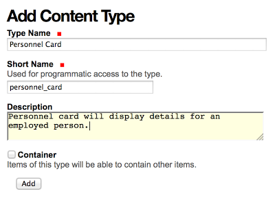
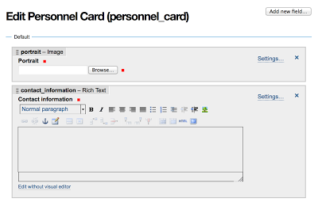
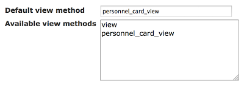
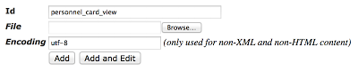
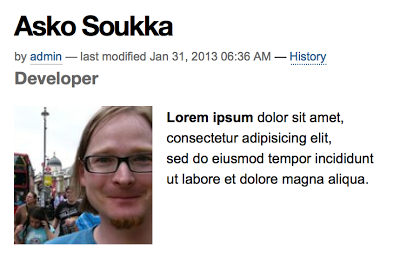

[Plone 4.3](http://plone.org/products/plone/releases/4.3) will ship with
[Dexterity](http://pypi.python.org/pypi/plone.app.dexterity), the new
content type framework of Plone. One of the many great features in
Dexterity is the schema editor, which makes it possible to create new
content types completely through-the-web (TTW) \-- no coding, no
packaging, no buildout, no restarts.

But once you have the new types, you\'ll need to be able to write custom
views for them. Dexterity was supposed to be shipped next to a thing
called **Deco Layout Editor**, but because it\'s not yet here, there\'s
no **official** way for defining custom views TTW.

Of course, because Plone adds the current content type name as a class
name into HTML body tag, you can apply CSS and Diazo
([plone.app.theming](http://pypi.python.org/pypi/plone.app.theming))
rules for the built-in default view.

With some old friends, however, you can get much further.

**Disclaimer: This method has not been tested yet with Plone 4.3, but
only with Plone 4.2.x and Dexterity 1.x -series.**

Create a new content type
-------------------------

Creating a new Dexterity based content type is almost as easy as it
could get. Well, once you have successfully included
[plone.app.dexterity](http://pypi.python.org/pypi/plone.app.dexterity)
into your buildout and started started your site with it.

1.  Activate **Dexterity Content Types** form **Add-ons** panel under
    **Site Setup**.

2.  Click **Add New Content Type\...** on **Dexterity Content Types**
    -panel under **Site Setup**.

3.  Enter required details for the new type.

    

4.  Click **Add** to create it.

5.  Click your newly created type on **Dexterity Content Types** -panel.

6.  Add the fields your data requires.

    

Note, that every new type will be created with **Dublin Core** -behavior
enabled. It means that every type will have the usual Plone metadata
fields automatically (including title and description), and you only
need to add your custom data fields.

While creating the new type, write down the following technical details:

-   **Short Name** for your content type (selected during the 3rd step).
-   **Short Name** for every custom field of your content type (created
    during the last step).

As soon as you have created a content type, it\'s addable from the **Add
new\...** -menu everywhere in your site.

Define a custom default view
----------------------------

Currently, defining a custom view for your content type (TTW) requires
visiting some older parts of Plone:

1.  Enter to ZMI (**Zope Management Interface**) from **Site Setup**.

2.  Open a tool called `portal_types`.

3.  Scroll to the bottom of the displayed content type list.

4.  Open the link with the name of your new content type to open the
    type information form of your new type.

5.  Locate fields **Default view method** and **Available view
    methods**.

6.  Just below the default value `view` in **Available view methods**,
    enter a new line with a filename-like name of your new custom view,
    e.g. `shortnameofmytype_view`.

    > It\'s important that no other type have used the same name before.
    > Usually you are safe by prefixing the view name with the **short
    > name** of your type.
    >
    > (You can remove the default line `view` later to drop the option
    > to show content with the built-in default view.)

7.  Replace the value of **Default view method** with the new view name
    you entered into **Available view methods** (e.g.
    `shortnameofmytype_view`).

    

8.  **Save Changes** at the bottom of the form.

With these steps you\'ve told Plone to use a custom view of your own as
the default view of your content type. But because that view doesn\'t
really exist yet, Plone would raise an error when trying view a content
of the new type, until a matching page template has been written.

Write a template for the view
-----------------------------

To write a page template to work as you newly defined custom default
view for you new content type, you have to re-enter ZMI:

1.  Enter to ZMI (**Zope Management Interface**) from **Site Setup**.

2.  Open a tool called `portal_skins`.

3.  Open a folder named `custom`.

4.  Select **Page Template** from the **Add**-list.

5.  Click **Add** (only if **Add Page Template** -form didn\'t open
    already).

6.  Enter the name of your view as the id of the new page template (e.g.
    `shortnameofmytype_view`).

    

7.  Click **Add and Edit**.

Now you should be able to:

1.  Enter a title for your new view (title may be visible for the
    content editors in content item\'s **Display**-menu).

2.  Type in a template for your view:

    ```xml
    <html xmlns="http://www.w3.org/1999/xhtml" xml:lang="en"
          xmlns:tal="http://xml.zope.org/namespaces/tal"
          xmlns:metal="http://xml.zope.org/namespaces/metal"
          xmlns:i18n="http://xml.zope.org/namespaces/i18n"
          lang="en"
          metal:use-macro="context/main_template/macros/master"
          i18n:domain="plone">

    <metal:css fill-slot="style_slot">
    <style type="text/css">
        <!-- Replace this with your views' custom CSS -->
    </style>
    </metal:css>

    <metal:javascript fill-slot="javascript_head_slot">
    <script type="text/javascript">
    jQuery(function($) {
        // Replace this with your view's custom onLoad-jQuery-code.
    });
    </script>
    </metal:javascript>

    <body>

    <metal:content-core fill-slot="content-core">
        <metal:content-core define-macro="content-core"
                            tal:define="widgets nocall:context/@@view">

           <!-- Replace this with the HTML layouf of your custom view.

           The widgets-variable, which is defined above, gives you access
           to the field widgets of your custom fields through the built-in
           default view included in Dexterity (but only for the fields that
           are visible in the built-in default view, excluding e.g. widgets
           for Dublin Core metadata fields).

           It's crucial to use the available widgets for rendering
           RichText-fields, but widgets also do some special formatting for
           numeric fields, at least. In general, it's a good practice to
           use the widget for rendering the field value.

           You can render a field widget (e.g. for **Rich Text** -field or
           **File Upload** -field) with the following TAL-syntax:

           <div tal:replace="structure widgets/++widget++shortnameofmyfield/render">
                This will be replaced with the rendered content of the field.
           </div>

           Widgets for fields of activated behaviors are prefixed with the
           interface of the behavior:

           <div tal:replace="structure widgets/++widget++IMyBehavior.fieldname/render">
                This will be replaced with the rendered content of the field.
           </div>

           Images are best rendred with plone.app.imaging-tags, like:

           

           You can define the available sizes (e.g. **thumb**) in **Site
           Setup**.

           Finally, you can always get and render values manually, like
           required for hidden Dublin Core -fields:

           <p>Last updated:
           <span tal:define="modification_date context/modification_date"
                 tal:content="python:modification_date.strftime('%Y-%m-%d')">
           YYYY-MM-DD</span></p>

           -->

        </metal:content-core>
    </metal:content-core>

    </body>
    </html>
    ```

An example of a template
------------------------



```xml
<html xmlns="http://www.w3.org/1999/xhtml" xml:lang="en"
      xmlns:tal="http://xml.zope.org/namespaces/tal"
      xmlns:metal="http://xml.zope.org/namespaces/metal"

