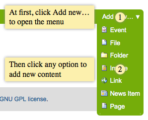

Greetings from Sorrento, from [Plone Open Garden
2013](http://www.abstract.it/en/abstract/initiative/plog-2013/). The
symposium/sprint was amazing, with the greatest possible venue, the
nicest community out there and my most productive sprint days so far.
Thanks a lot to [Maurizio Delmonte](https://twitter.com/miziodel) and
[Abstract IT](http://abstract.it/) folks for organizing the event. Also,
thanks to my employer, [University of Jyväskylä](https://www.jyu.fi/en/)
for allowing and sponsoring me to participate the sprint. I believe, it
was worth it\...

plone.app.robotframework
------------------------

During the sprint I released a package called
[plone.app.robotframework](http://pypi.python.org/pypi/plone.app.robotframework)
to ease writing of Robot Framework tests for Plone and add-ons.
**plone.act** is dead, long live plone.app.robotframework. It contains
everything in **plone.act** (the same code from the same authors), but
also much much more:

-   Common variables and keywords to open Selenium test browsers so that
    the same tests can be run locally, on CI, with Selenium grid and
    even with Sauce Labs (with or without Travis-CI) without modifying
    the tests themselves.
-   Sauce Labs -integration keywords, which allow not only run tests on
    locally or at Travis-CI with Sauce Labs\' browsers, but also send
    build-numbers, test names, test tags to Sauce Labs.
-   Helper library for logging users automatically into Plone so that we
    can skip login forms and save a lot of time in tests.
-   Helper library base for implementing database dependent test setup
    keywords in Python to save even more time in tests.
-   Keywords for annotating open pages and cropping captured images so
    that Robot Framework test can be used to both make screencasts and
    illustrate Sphinx documentation (and keep both of them up to date
    with the current code.

Read the new tutorial about writing Robot Framework tests with
plone.app.robotframework at [Plone Developer
Documentation](http://developer.plone.org/reference_manuals/external/plone.app.robotframework).

But there\'s one specific new feature, I\'d like to rise above others:

Generating screenshots
----------------------

We know that this would be possible, but we thought that it would be
much harder. Read from [Guido\'s PloneSocial PLOG2013 Sprint
Report](http://cosent.nl/en/blog/plonesocial-plog2013), how we
implemented the base for functional testing with Robot Framework,
Selenium, Travis-CI and Sauce Labs for
[PloneSocial-suite](http://pypi.python.org/pypi/plonesocial.suite/), and
wondered about the possibility of creating screencasts with Robot
Framework.

One thing led to another, and just a day later I had the initial
implementations of screen annotation keywords and screenshot cropping
keywords ready.

You can see everything in action with this minimal example:

### bootstrap.py

```shell
$ curl -O http://downloads.buildout.org/2/bootstrap.py
```

### buildout.cfg

```properties
[buildout]
extends = http://dist.plone.org/release/4.3-latest/versions.cfg
parts = pybot

[pybot]
recipe = zc.recipe.egg
eggs =
    Pillow
    plone.app.robotframework
scripts = pybot
```

### docs.robot

```robotframework
*** Settings ***

Resource  plone/app/robotframework/server.robot
Resource  plone/app/robotframework/annotate.robot

Suite Setup  Setup
Suite Teardown  Teardown

*** Keywords ***

Setup
    Setup Plone site  plone.app.robotframework.testing.AUTOLOGIN_ROBOT_TESTING
    Import library  Remote  ${PLONE_URL}/RobotRemote

Teardown
    Teardown Plone Site

*** Test Cases ***

Portal factory add menu

    Enable autologin as  Contributor
    Set autologin username  John Doe
    Go to  ${PLONE_URL}

    Click link  css=#plone-contentmenu-factories dt a
    Element should be visible
    ...    css=#plone-contentmenu-factories dd.actionMenuContent

    ${dot1} =  Add dot
    ...    css=#plone-contentmenu-factories dt a  1

    ${note1} =  Add note
    ...    css=#plone-contentmenu-factories
    ...    At first, click Add new… to open the menu
    ...    width=180  position=left

    ${dot2} =  Add dot
    ...    css=#plone-contentmenu-factories dd.actionMenuContent  2
    ${note2} =  Add note
    ...    css=#plone-contentmenu-factories dd.actionMenuContent
    ...    Then click any option to add new content
    ...    width=180  position=left

    Align elements horizontally  ${dot2}  ${dot1}
    Align elements horizontally  ${note2}  ${note1}

    Capture and crop page screenshot  add-new-menu.png
    ...    contentActionMenus
    ...    css=#plone-contentmenu-factories dd.actionMenuContent
    ...    ${dot1}  ${note1}  ${dot2}  ${note2}

    Remove elements  ${dot1}  ${note1}  ${dot2}  ${note2}
```

### Running

```shell
$ python bootstrap.py
$ bin/buildout
$ mkdir -p docs/source/images
$ bin/pybot -d docs/source/images -r NONE -l NONE -o NONE docs.robot
```

### Results

This all should result the next nicely annotated and cropped screenshot
as `docs/source/images/add-new-menu.png`:



Just think about having that `bin/pybot`-line in the next
Sphinx-makefile\...

\... and, of course, those annotation keywords will work for creating
screencasts too. Actually, those keywords are not even Plone specific,
but they do rely on jQuery being found on the captured page.

PS. You may wonder, how pybot can start Plone for capturing screenshots.
For that, I have to thank Godefroid Chapell for writing the original
robot keywords in plone.app.robotframework for setting up and tearing
down test layers without zope.testrunner (see the keywords **Setup Plone
site** and **Teardown Plone site**).
