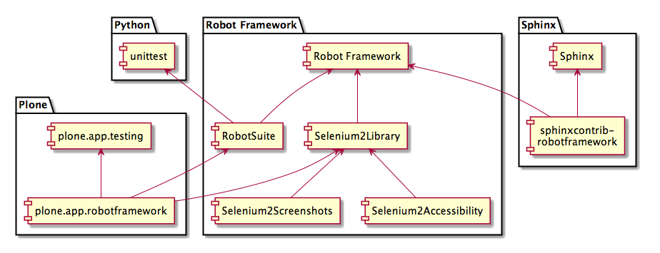

I only need to go two years back in time, and I had never really tried
[Selenium](http://docs.seleniumhq.org/) nor heard
about [Robot Framework](http://robotframework.org/) before. Then I attended my first Plone Conference in San
Francisco in 2011.

Originally, I was planning to sprint on Deco in San Francisco conference
sprints, because I had spent the previous winter in developing [a tile
based in-house e-Portfolio management
app](http://www.youtube.com/watch?v=Bib1RA3nEVc)
([in
Finnish](https://m3.jyu.fi/jyumv/ohjelmat/erillis/thk/thkplone/world-plone-day-ja-moniviestin-10-vuotta-24.4.2013/world-plone-day-ilona-laakkonen)) for my [employer](https://jyu.fi/en/).
Little did I know. I didn\'t get my employer\'s disclaimer for Plone
contributor agreement in time, could not really get involved in the
Deco-sprint, and ended up being completely side-tracked into the world
of acceptance testing.

I can thank [Ed Manlove](https://github.com/emanlove) for teaching me how to setup and run Selenium during the San
Francisco conference. I also attended [Godefroid
Chapelle](https://github.com/gotcha)\'s session
about how we could make Selenium testing easy with [Robot
Framework](http://robotframework.org/) and its
[Selenium RC
-library](http://pypi.python.org/pypi/robotframework-seleniumlibrary). Back then, writing and running robot tests for Plone was not
as convenient as it is today, but it was still inspiring enough to get
us where we are now.

During the last two years we have written and contributed to many robot
related packages. Now, it\'s more than time to summarize, what all these
robot packages are and what they can do for us:

[Robot Framework](http://robotframework.org/) (core)
--------------------------------------------------------------------------

[Robot Framework](http://robotframework.org/) is a
well documented standalone generic test automation framework for
acceptance testing and acceptance test-driven development. It\'s written
in Python and has no other dependencies. It has active core development
team, and development of the core framework is supported by Nokia
Siemens Networks.

**To make it clear:** Robot Framework has no ties to Plone. Also, it can
be used completely without Selenium (as most of its users have always
done).

The first Plone-related contribution to Robot Framework that I\'m aware
of, is Plone Foundation\'s [GSOC 2013 project to update Robot
Framework\'s ReST
parser](https://www.google-melange.com/gsoc/project/google/gsoc2013/vivekkodu/16001) to support so called space separated Robot Framework test
syntax, (that\'s our favourite robot syntax). This should be included in
Robot Framework 2.8.2 and later.

[RobotSuite](http://pypi.python.org/pypi/robotsuite)
--------------------------------------------------------------------------

[RobotSuite](http://pypi.python.org/pypi/robotsuite), authored by me, provides helpers for wrapping any Robot
Framework test suite into `robotsuite.RobotTestSuite`{.docutils
.literal}, which makes any robot test suite compatible with Python
standard unittest-library\'s `unittest.TestSuite`.

RobotSuite makes it possible to run Robot Framework tests using
unittest-compatible test runners, like
[zope.testrunner](http://pypi.python.org/pypi/zope.testrunner).

[robotframework-selenium2library](http://pypi.python.org/pypi/robotframework-selenium2library)
--------------------------------------------------------------------------------------------------------------------

[Selenium2Library](http://pypi.python.org/pypi/robotframework-selenium2library) is a web testing library for Robot Framework that leverages
the Selenium 2 (WebDriver) libraries. It\'s a rewrite of the original
[Selenium RC
-library](http://pypi.python.org/pypi/robotframework-seleniumlibrary). [Ed Manlove](https://github.com/emanlove), a member of our Plone community, is one of its current
maintainers.

While Robot Framework and Selenium2Library are enough to run robot
browser tests for Plone, RobotSuite makes it possible to run the tests
with zope.testrunner. And that makes it possible to run tests properly
against volatile
[plone.app.testing](http://pypi.python.org/pypi/plone.app.robotframework)-sandboxed Plone, with our custom test fixtures, so that each
test is run in isolation.

[plone.app.robotframework](http://pypi.python.org/pypi/plone.app.robotframework)
------------------------------------------------------------------------------------------------------

[plone.app.robotframework](http://pypi.python.org/pypi/plone.app.robotframework), authored by me and a lot of contributors from [Godefroid
Chapelle](https://github.com/gotcha)\'s original
work for plone.act, is our dedicated robot testing integration library
for Plone. It is not required to test Plone with robot, but it provides
conventions and a lot of convenient helpers, including:

-   variables for writing test suites, which support Selenium grids
-   variables and keywords for writing SauceLabs-compatible test suites
-   remote keyword framework for writing fast test setup keywords in
    Python
-   autologin remote library to skip login forms in Selenium tests
-   Zope2Server-library for writing and running robot tests based on
    [plone.app.testing](http://pypi.python.org/pypi/plone.app.robotframework){.reference
    .external}-fixtures with just pure Robot Framework, completely
    without
    [robotsuite](http://pypi.python.org/pypi/robotsuite){.reference
    .external} and
    [zope.testrunner](http://pypi.python.org/pypi/zope.testrunner){.reference
    .external}
-   `robot-server`-script for running volatile
    Plone-server with given
    [plone.app.testing](http://pypi.python.org/pypi/plone.app.robotframework){.reference
    .external}-fixture
-   code-reloading `robot-server` to support test
    fixture driven development in
    [sauna.reload](http://pypi.python.org/pypi/sauna.reload){.reference
    .external}-style
-   optional SpeakJS-integration, which can make your Plone talk in
    screencasts
-   shared Plone-keyword library for robot (still in development).

[robotframework-selenium2screenshots](http://pypi.python.org/pypi/robotframework-selenium2screenshots)
----------------------------------------------------------------------------------------------------------------------------

[Selenium2Screenshots](http://pypi.python.org/pypi/robotframework-selenium2screenshots), authored by me, is a Robot Framework keyword library for
annotating and cropping capturing screenshots with Selenium2Library and
jQuery.

It\'s a fun tool for creating screencasts with robot or screenshots for
documentation purposes. The package has no dependencies on Plone so it
can be used also with other projects.

[robotframework-selenium2accessibility](http://pypi.python.org/pypi/robotframework-selenium2accessibility)
--------------------------------------------------------------------------------------------------------------------------------

[Selenium2Accessibility](http://pypi.python.org/pypi/robotframework-selenium2accessibility), authored by me (from Paul Roeland\'s idea), is a highly
experimental Robot Framework library for automating accessibility
regression tests using Selenium. It bundles a special Firefox-profile
with [WebAim\'s WAVE
Toolbar](http://wave.webaim.org/toolbar/) Firefox
extension, [WCAG Contrast
checker](https://addons.mozilla.org/en-US/firefox/addon/wcag-contrast-checker/) Firefox extension and a custom Firefox extension to provide
JavaScript-bridge between robot and those Firefox extensions.

It is not proven yet, but the library may help preventing new
accessibility issues being introduced.

[sphinxcontrib-robotframework](http://pypi.python.org/pypi/sphinxcontrib-robotframework)
--------------------------------------------------------------------------------------------------------------

Finally, [Robot Framework -integration for
Sphinx](http://pypi.python.org/pypi/sphinxcontrib-robotframework), authored with a [GSOC 2013
-project](https://www.google-melange.com/gsoc/project/google/gsoc2013/vivekkodu/16001), executes embedded Robot Framework tests when
[Sphinx](http://sphinx-doc.org/)-based
documentation is being built. This makes it possible to embed such Robot
Framework tests into documentation that just building the documentation
would generate all the screenshots that the documentation needs. For an
example, see <http://elvenmagic.pandala.org/> and its
[source](https://github.com/datakurre/elvenmagic/blob/gh-pages/2013/09/22/collective-listingviews.rst).

Of course, it\'s time consuming to write tests just for generating
screenshots. But once those tests have been written, they can keep the
screenshots always up-to-date. And if the tests are written well, those
tests can be used to generate screenshots for different languages (or
maybe even for different themes) for free.

The most difficult part in acceptance testing, in general, is to decide
what to test. And that\'s even more important for Selenium tests, which
are slow to write and slow to run.

The original idea for robot tests for Plone was to test all the
JavaScript-based features. Now, when those are already being testes with
unit tests (with speed and in more detail) in [the
mockup-project](https://github.com/plone/mockup).
This Sphinx-integration for robot tests, could give us the new answer:

If a feature is documented in user documentation, it should be tested
with acceptance test. And now those test could be embedded in the same
documentation, and they would pay for themselves by creating screenshots
for the documentation.

I\'m quite exited of this robot family we have created together.

*P.S. Yes, I\'m sorry for not being able to attend the Plone Conference
this year.*
