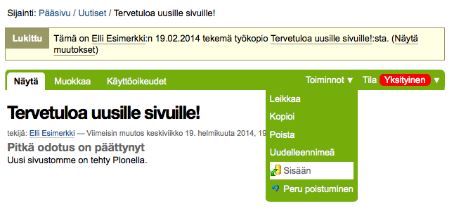
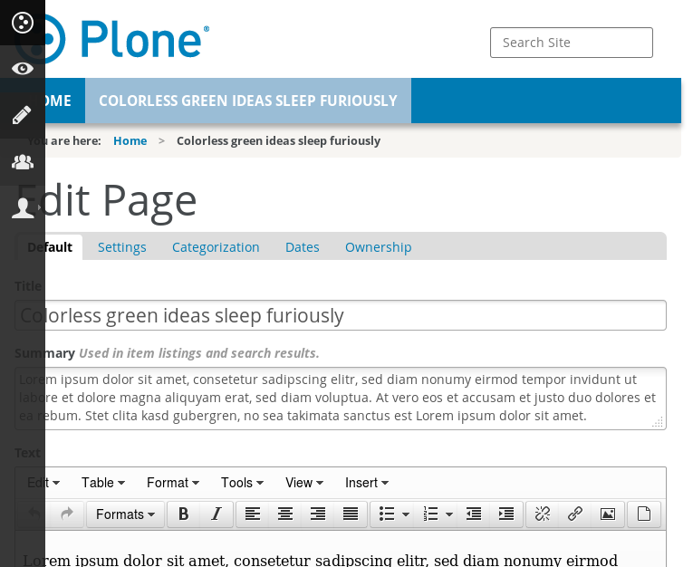

I\'m a bit late, but yes, I had a great time at last week\'s
[Plone](http://plone.org/) sprints. At first I flew to Amsterdam
[Stroopwafel
Sprint](http://www.coactivate.org/projects/stroopwafel-sprint/project-home)
for the weekend, and then continued by train to Cologne [Cathedral
Sprint
2014](http://www.coactivate.org/projects/cathedral-sprint-2014/project-home)
for the week. Met old friends, got new ones, eat well and code a quite
lot. Special thanks go to [Sven](https://github.com/svx/) for both
organizing the Amsterdam sprint and hosting me there, [Clean Clothes
Campaign](http://www.cleanclothes.org/) for providing the sprint
facilities, [Timo](http://timostollenwerk.net/) for organizing the
Cologne sprint, [GFU Cyrus AG](http://www.gfu.net/) for hosting the
sprint and, of course, my employer, [University of
Jyväskylä](https://www.jyu.fi/en/), for allowing me to attend the
sprints.

There\'s already a lot of sprint reports out there: [Paul has summarized
the Amsterdam
sprint](http://polyrambling.tumblr.com/post/76124851260/stroopwafels-cake-driven-documentation-for-plone)
while
[Ramon](http://bloc.jardigrec.cat/2013/11/plone-5-theme-plonethemebarceloneta.html),
[Bo](http://bo.geekworld.dk/my-first-sprint-the-cathedral-sprint-2014/),
[Johannes](http://bluedynamics.com/articles/johannes/back-from-the-cathedralsprint-2014?)
and
[Victor](http://flawedlogic.eu/post/76994150196/cathedral-sprint-2014-plone-org-team-report)
have all reported a good part the huge amount of work done at the
Cologne sprint.

My week can be summarized shortly with two small subprojects:
[papyrus](#papyrus) and [plone.themepreview](#plone.themepreview):

Papyrus
-------

For the Sunday at [Stroopwafel
Sprint](http://www.coactivate.org/projects/stroopwafel-sprint/project-home)
I paired with [Giacomo](https://github.com/giacomos/) to combine his
work for making our end user and developer documentation translatable
using [Transifex](https://www.transifex.com/) with mine for translating
also the screenshots. We ended up with a special buildout named
[papyrus](#papyrus).

So, **Papyrus** is a buildout for translating Plone-specific
documentation into multiple languages. It\'s simple a buildout and a
makefile to:

-   Build [Sphinx](http://sphinx-doc.org/)-documentation with embedded
    [Robot Framework](http://robotframework.org/)-scripted
    [Selenium](http://docs.seleniumhq.org/)-powered screenshots in
    multiple languages.
-   Extract translatable strings to
    [gettext](http://www.gnu.org/software/gettext/)-POT-files for both
    translating Sphinx-documentation and embedded screenshots.
-   Push translatable files to [Transifex](https://www.transifex.com/)
    and pull the translations form to build the local documentation.

Papyrus is a buildout for now, but it could be refactored into a recipe
later. Anyway, it\'s designed to be separate tool bundle from the actual
documentation to make it reusable by any Plone-related documentation
later.

Currently, there\'s an example
[Travis-CI-configuration](blob/91d4bee7491f89bd2b5e7d19b50e0287f1af44e8/.travis.yml)
to build the current
[collective.usermanual](https://github.com/collective/collective.usermanual/tree/sources-only)
in
[English](http://plone-papyrus.s3-website-us-east-1.amazonaws.com/artifacts/15/15.1/en/managing-content/working-copy.html)
and
[Italian](http://plone-papyrus.s3-website-us-east-1.amazonaws.com/artifacts/15/15.1/it/managing-content/working-copy.html).
Unfortunately, there\'s not much translated yet, so there\'s sure a lot
of work left for the next documentation sprints.

plone.themepreview
------------------

During [Cathedral Sprint
2014](http://www.coactivate.org/projects/cathedral-sprint-2014/project-home)
I spent a lot of time to help the other sprinters with various Robot
Framework and acceptance testing, but also made a small contribution for
Theme and QA teams by recycling [Timo](http://timostollenwerk.net/)\'s
old theme screenshot suite into a reusable
[Sphinx](http://sphinx-doc.org/)-documentation called
[plone.themepreview](#plone.themepreview).

**plone.themepreview** is a pre-written, [Robot
Framework](http://robotframework.org/) and
[Selenium](http://docs.seleniumhq.org/) -powered, Sphinx-documentation
with a lot of scripted screenshots for a Plone site with some client
specific configuration -- usually just a custom theme.

In other words, [plone.themepreview](#plone.themepreview) comes with a
Sphinx-scripts, which should should be able to launch a Plone sandbox
with your theme and make a preview out of it to make it easier to
evaluate if all the normal Plone use-cases have been covered by your
brand new theme.

The [README](https://github.com/plone/plone.themepreview) links to a
couple of example configurations for using themepreview with Travis-CI.
I guess, you all have seen
[plonetheme.sunburst](http://plone.themepreview.s3-website-us-east-1.amazonaws.com/latest/),
but how about
[diazotheme.bootstrap](http://diazotheme.bootstrap.s3-website-us-east-1.amazonaws.com/latest/)
or
[plonetheme.onegov](http://plonetheme.onegov.s3-website-us-east-1.amazonaws.com/latest/)?

Of course, the current set of screenshots is not perfect, but if you
think so, please, contribute! Just fork the project, do a pull request,
and Travis-CI tell me if the changes are safe to merge. And if you have
any questions, just file new
[issues](https://github.com/plone/plone.themepreview/issues)!

Probably, also [plone.themepreview](#plone.themepreview) could somehow
be turned into a recipe at the end, but for now it seems to be easiest
to just clone it and its build with theme specific configuration.

Happy theming!
