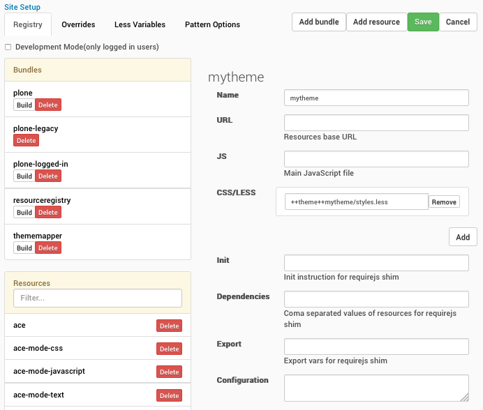
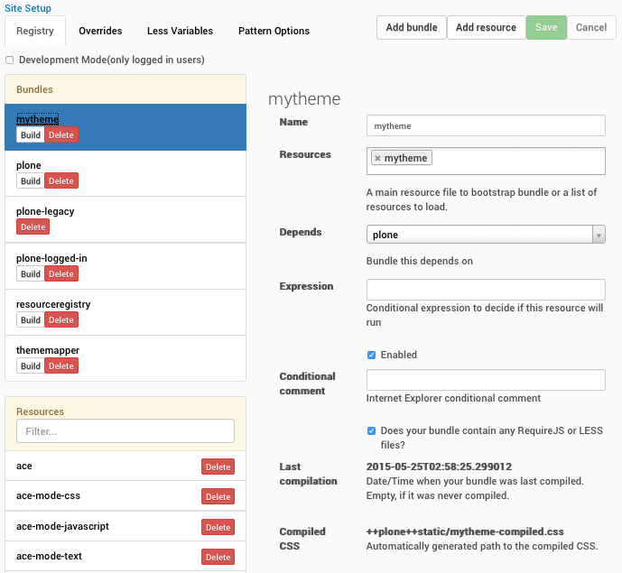
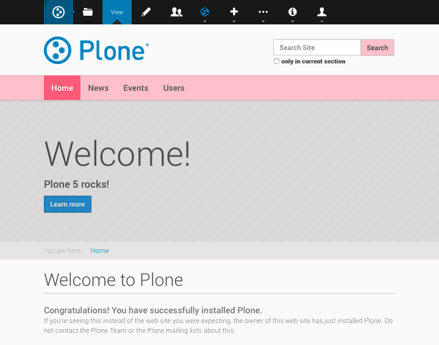

When I recently wrote about, how to reintroduce [ploneCustom for
Plone5](http://datakurre.pandala.org/2015/05/plonecustom-for-plone-5.html)
TTW (through the web) by yourself, I got some feedback that *it was the
wrong thing to do*. And the correct way would always be to create your
custom theme.

If you are ready to let the precious *ploneCustom* go, here\'s how to
currently customize the default Barceloneta theme on the fly by creating
a new custom theme.

Inherit a new theme from Barceloneta
------------------------------------

So, let\'s customize a brand new Plone 5 site by creating a new theme,
which inherits everything from Barceloneta theme, yet allows us to add
additional rules and styles:

1.  Open **Site Setup** and **Theming** control panel.

2.  Create **New theme**, not yet activated, with title *mytheme* (or
    your own title, once you get the concept)

3.  In the opened theme editor, replace the contents of *rules.xml* with
    the following code:

    ```xml
    <?xml version="1.0" encoding="UTF-8"?>
    <rules
        xmlns="http://namespaces.plone.org/diazo"
        xmlns:css="http://namespaces.plone.org/diazo/css"
        xmlns:xsl="http://www.w3.org/1999/XSL/Transform"
        xmlns:xi="http://www.w3.org/2001/XInclude">

      <!-- Import Barceloneta rules -->
      <xi:include href="++theme++barceloneta/rules.xml" />

      <rules css:if-content="#visual-portal-wrapper">
        <!-- Placeholder for your own additional rules -->
      </rules>

    </rules>
    ```

4.  Still in the theme editor, add **New file** with name *styles.less*
    and edit and **Save** it with the following content:

    ```css
    /* Import Barceloneta styles */
    @import "++theme++barceloneta/less/barceloneta.plone.less";

    /* Customize navbar color */
    @plone-sitenav-bg: pink;
    @plone-sitenav-link-hover-bg: darken(pink, 20%);

    /* Customize navbar text color */
    .plone-nav > li > a {
      color: @plone-text-color;
    }

    /* Customize search button */
    #searchGadget_form .searchButton {
      /* Re-use mixin from Barceloneta */
      .button-variant(@plone-text-color, pink, @plone-gray-lighter);
    }

    /* Inspect Barceloneta theme (and its less-folder) for more... */
    ```

But before activating the new theme, there\'s one more manual step to
do\...

Register and build a new LESS bundle
------------------------------------

We just created a new LESS file, which would import the main Barceloneta
LESS file at first, and then add our own additional styles with using
some features from LESS syntax. To actually make that LESS file into a
usable CSS (through the browser), we need register a new bundle for it,
and build it:

1.  Open **Site Setup** and **Resource Registries** control panel.

2.  **Add resource** with name *mytheme* and a single CSS/LESS file with
    path *++theme++mytheme/styles.less* to locate the file we just added
    into our theme:

    

3.  **Save**.

4.  **Add bundle** with name *mytheme*, requiring *mytheme* resoure,
    which we just created and *Does your bundle contain any RequireJS or
    LESS files?* checked:

    

5.  **Save**.

6.  **Build** *mytheme* bundle.

Now you should be ready to return back to **Theming** control panel,
activate the theme, and see the gorgeous pink navigation bar:



**Note:** To really be a good citizen and follow the rules, there\'s a
few additional steps:

1.  Add *production-css* setting into your theme\'s *manifest.cfg* to
    point to the compiled CSS bundle:

    ```properties
    [theme]
    title = mytheme
    description = 
    production-css = /++plone++static/mytheme-compiled.css
    ```

2.  In Resource Registries, disable *mytheme* bundle by unchecking its
    *Enabled* checkbox and clicking *Save*.

3.  Deactivate and activate the theme once.

Technically this changes the CSS bundle to be registered as a so called
*Diazo bundle* instead of a regular bundle. The difference is that Diazo
bundle is always rendered last and can therefore override any CSS rule
introduced the other enabled bundles. Also, as a Diazo bundle it get
disabled and enabled properly when the active gets changed.
