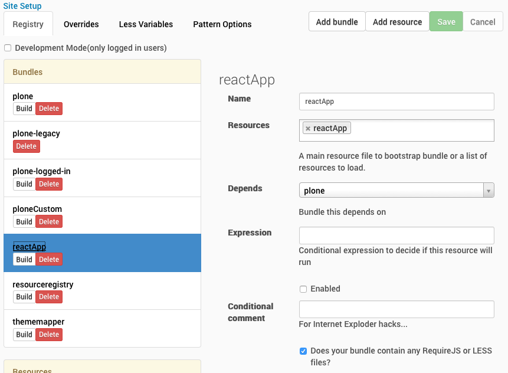

**No more custom** skins folder with infamous **ploneCustom** in Plone
5, they said.

Well, they can take away the skins folder, but **they cannot take away
our ploneCustom**. I know, that the recommended way of customizing Plone
5 is via a custom theme through the Theming control panel from Site
Setup. Still, sometimes you only need to add a few custom rules on top
of an existing theme and creating a completely new theme would feel like
an overkill.

Meet the new resource registry
------------------------------

One of the many big changes in Plone 5 is the completely new way how CSS
and JavaScript resources are managed. Plone 5 introduces a completely
new **Resource Registries** control panel and two new concepts to manage
CSS ja JavaScipt there: **resources** and **resource bundles**.

**Resource** is a single CSS / LESS file, a single JavaScript file, or
one of both, to provide some named feature for Plone 5. For example, a
new embedded JavaScript based applet could be defined as a resource
containing both its JavaScript code and required CSS /LESS stylesheet.
In addition to those single files, JavaScript-files can depend on named
requirejs modules provided by the other resources. Also LESS files can
include any amount of available other LESS files. *(LESS is superset of
CSS with some optional superpowers like hierarchical directives,
variables or optimized includes.)*

**Resource Bundle** is a composition of named **resources**, which is
eventually built into a single JavaScript and/or CSS file to be linked
with each rendered page. When the page is rendered, bundles are linked
(using either script-tags or stylesheet link-tags) in an order depending
on their mutual dependencies. Bundles can be disabled and they can have
conditions, so bundles are somewhat comparable to the legacy resource
registry registrations in Plone 4 and earlier.


width="780px"}

Now that you should be familiar with the concepts, you can bring our
precious **ploneCustom** back to life.

Defining the next generation ploneCustom
----------------------------------------

These steps will define a new **ploneCustom** bundle, which provides
both a custom CSS (with LESS) and a custom JavaScript file to allow
arbitrary site customizations without introducing a new theme.

### Creating and editing

At first, you need to add the actual LESS and JavaScript files. Instead
of the deprecated skins custom folder you can add them into your Plone 5
site by using the old friend, ZMI (Zope Management Interface).

If you are running evelopment site, please, open the following url:
*http://localhost:8080/Plone/portal\_resources/manage\_main*


This **portal\_resources** is the new database (ZODB) based storage for
any kind of custom resources (introduced with the new Theming control
panel in Plone 4.3). Its functionality is based on
[plone.resource](https://pypi.python.org/pypi/plone.resource), but right
now you only need to know how to use it with Plone 5 resource
registries.

1.  So, in **portal\_resources**, **add** a new **BTreeFolder2** with
    name *plone*:

    

2.  Then navigate into that folder (select *plone* and press *Edit*
    button) and **add** an another **BTreeFolder2** with name *custom*
    and navigate into that folder until you are at
    *portal\_resources/plone/custom*:

    

3.  Now **Add** a new **File** named *ploneCustom.js* and another named
    *ploneCustom.less*:

    

4.  And, finally, you can navigate into those files (select and press
    *Edit* button) to edit and save them with your CSS and JavaScript:

    

    The example JavaScript above would only annoy to to tell that it
    works:

    ```js
    jQuery(function($) {
        alert("Hello World!");
    });
    ```

    

    The example CSS above would replace the portal logo with a custom
    text:

    ```css
    #portal-logo:before {
      display: inline-block;
      content: "My Plone Site";
      font-size: 300%;
    }
    #portal-logo img {
      display: none;
    }
    ```

    In addition to that, you could add a little bit extra to learn more.
    These following lines would re-use button classes from Bootstrap 3
    resources shipped with with Plone 5 (beta). This is an example of
    how to use LESS to cherry pick just a few special CSS rules from
    Bootstrap 3 framework and apply them next to the currently active
    theme:

    ```css
    @import (reference) "../++plone++static/components/bootstrap/less/bootstrap.less";
    #searchGadget_form .searchButton {
      &:extend(.btn);
      &:extend(.btn-success);
    }
    ```

### Registering and enabling

To register the resource and add it into a bundle (or create a new one),
go to **Resource Registries** control panel (e.g. at
*http://localhost:8080/@\@resourceregistry-controlpanel*). Click **Add
resource** to show the add resource form and fill it like in the
screenshot below:


Note that the strings *++plone++custom/ploneCustom.js* and
*++plone++custom/ploneCustom.less* are actually relative (public) URLs
for the resources you just added into **portal\_resources**.

After saving the resoure by clicking **Save**, click **Add bundle** to
create a new bundle for your *ploneCustom*-resource. Fill-in the opened
form as follows:


Note that the bundle depends on *Plone* bundle. That makes it getting
loaded only after *Plone* bundle, which includes jQuery, which our
custom JavaScript code depends on. *(Later you may wonder, why jQuery
was not required with requirejs. That would also work and is recommended
for other libraries, but currently you can rely on jQuery being globally
available after Plone bundle has been loaded.)*

When you have saved the new *ploneCustom* resource bundle, it will
appear into the **Bundles** list on the left. The final step is to click
the **Build** button below the *ploneCustom* bundle label in that list.
That will open a popup model to overview the build progress.


Once the build is done, you can click **Close** and reload the page to
see your new *ploneCustom* bundle being applied for your site:


Note how the Plone logo has been replaced with a custom text and the
Search button has been style after Bootstrap 3 button styles. (Also, you
should now have seen an annoying alert popup from your ploneCustom
JavasScript.)

To modify your ploneCustom bundle, just go to edit the file and and
return to *Resource Registries* control panel to click the Build button
again.

**Now you have your ploneCustom back in Plone 5. Congratulations!**

P.S. Don\'t forget that you can also tweak (at least the default) Plone
theme a lot from the **Resource Registries** control panel without
*ploneCustom* bundle simply by changing theme\'s LESS variables and
building *Plone* bundle.

EXTRA: TTW ReactJS App in Plone
-------------------------------

The new **Resource Registries** may feel complex to begin with, but once
you get used to them, they are blessing. Just define dependencies
properly, and never again you need to order Plone CSS and JavaScript
resources manually, and never again (well, once add-ons get update into
this new configuration) should add-ons break your site by re-registering
resources into broken order.

As an example, let\'s implement a ReactJS Hello World for Plone TTW
using the new resource registry:

At first, you need to register ReactJS library as a resource. You could
upload the library into *portal\_resources*, but for a quick experiment
you can also refer to a cloud hosted version
(*https://fb.me/react-0.13.3.js*). So, go to **Resource Registries**
control panel and **Add resource** with the following details:


Note how the library is defined to be wrapped for requirejs with name
*react013*. *(Plone 5 actually ships with ReactJS library, but because
the version in the first beta is just 0.10, we need to add newer version
with a version specific name.)*

Next, go to *portal\_resources/plone/custom/manage\_main* as before and
add a new file called *reactApp.js* with the following ReactJS Hello
World as its contents:

```js
define([
  'react013',
], function(React) {

'use strict';

var ExampleApplication = React.createClass({
  render: function() {
    var elapsed = Math.round(this.props.elapsed  / 100);
    var seconds = elapsed / 10 + (elapsed % 10 ? '' : '.0' );
    var message = 'React has been successfully running for ' + seconds + ' seconds.';
    return React.createElement("p", null, message);
  }
});

var start = new Date().getTime();

setInterval(function() {
  React.render(
    React.createElement(ExampleApplication, {elapsed: new Date().getTime() - start}),
    document.getElementById('portal-logo')
  );
}, 50);

return ExampleApplication;

});

jQuery(function($) {
  require(['reactApp']);
});
```

Note how ReactJS is required as *react013*, and how the example
application is required as *reactApp* at the bottom (using jQuery onLoad
convention).

Of course, also *reactApp* must be defined as a new resource at
**Resource Registries** control panel. It should depend on previously
added resource *react013* being wrapped for requirejs and export itself
for requirejs as *reactApp*:


Finally, you can **Add bundle** for this example *reactApp*:



And after **Save**, **Build** the bundle from the button below the new
bundle name in *Bundles list*:


Note that, because the cloud hosted ReactJS library was used, the new
bundle contains only the code from *reactApp.js* and requirejs will
require ReactJS from the cloud on-demand. If you would have added the
library into *portal\_resources*, it would have been included in the
resulting bundle.

After page reload, your ReactJS Hello World should be alive:


