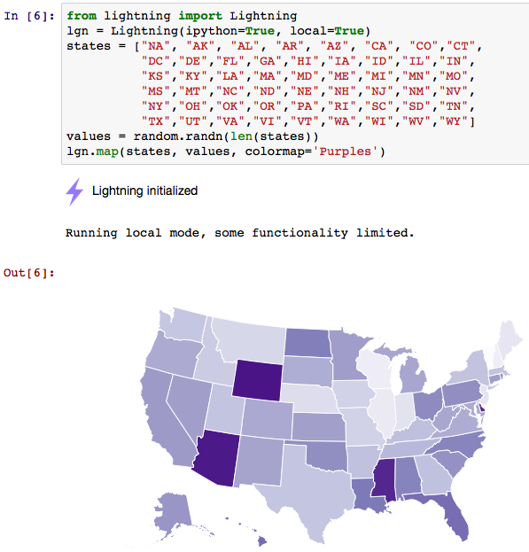

[Jupyter](http://jupyter.org/) is the new name and brand for an awesome
interactive data science programming scratchpad previously known as
iPython Notebook. While there are plenty of pre-built [Docker
images](https://github.com/jupyter/docker-demo-images)
[available](https://github.com/jupyter/docker-stacks) for Jupyter, for
customized images, I\'m tempted to use [Nix](https://nixos.org/nix/).

Here I describe approach for the following gists creating

-   [R-kernel Jupyter notebook environment and Docker container with
    Nix](https://gist.github.com/datakurre/49b6fbc4bafdef029183)
-   [Multi-kernel Jupyter notebook environment and Docker container with
    Nix](https://gist.github.com/datakurre/a26e0d173fb67d9bb145).

**Note:** Because these Jupyter notebook configurations are build with
Nix, their configuration is immutable and it\'s not possible for the
user to install any additional packages directly from a notebook.



Usage
-----

With `nix-shell` (unless you are on a mac):

```sh
$ git clone https://gist.github.com/datakurre/49b6fbc4bafdef029183
$ cd 49b6fbc4bafdef029183
$ nix-shell --run "jupyter notebook"
```

With [Docker](https://docker.com/) (works also on a mac):

```sh
$ git clone https://gist.github.com/datakurre/49b6fbc4bafdef029183
$ cd 49b6fbc4bafdef029183
$ make run
```

Now, if you are on a mac, you need to figure out the IP and port where
notebook is running with:

```shell
$ docker-machine ip default
$ docker ps
```

Explanation
-----------

At first, both of my Jupyter gists are based on my [recipe for building
Docker containers with
Nix](https://github.com/datakurre/nix-build-pack-docker).

It builds a Docker image with Nix installation to build your Nix
expressions, creates a nix store data container to store and share built
Nix expressions between builds, and creates a Docker ready tarball from
a built nix closure.

Then a few picks from the expressions:

```nix
with import <nixpkgs> {};
let dependencies = rec {
  # ...
  jupyter = python35Packages.notebook.override {
    postInstall = with python35Packages; ''
      mkdir -p $out/bin
      ln -s ${jupyter_core}/bin/jupyter $out/bin
      wrapProgram $out/bin/jupyter \
        --prefix PYTHONPATH : "${notebook}/lib/python3.5/site-packages:$PYTHONPATH" \
        --prefix PATH : "${notebook}/bin:$PATH"
    '';
  };
# ...
}
```

To be able to run Jupyter notebook, I want to use the normal `jupyter`
command, but a problem is that the base command is defined in a python
package [jupyter\_core](https://pypi.python.org/pypi/jupyter_core),
which does not include
[notebook](https://pypi.python.org/pypi/notebook)-package, which
includes the actual Jupyter notebook program and its `jyputer notebook`
subcommand. The Nix solution is to install
[notebook](https://pypi.python.org/pypi/notebook) package, but enhance
its install with a custom postinstall, whick links the command from
[jupyter\_core](https://pypi.python.org/pypi/jupyter_core) and wraps the
command to be aware of [notebook](https://pypi.python.org/pypi/notebook)
and itse dependencies.

```nix
with import <nixpkgs> {};
let dependencies = rec {
  builder = builtins.toFile "builder.sh" ''
    source $stdenv/setup
    mkdir -p $out
    cat > $out/kernel.json << EOF
    $json
    EOF
  '';
  # ...
  python34 = pkgs.python34.buildEnv.override {
    extraLibs = with python34Packages; [
      # Kernel
      ipykernel
      ipywidgets
      # Custom packages
      lightning
      # ...
    ];
  };
  python34_kernel = stdenv.mkDerivation rec {
    name = "python34";
    buildInputs = [ python34 ];
    json = builtins.toJSON {
      argv = [ "${python34}/bin/python3.4"
               "-m" "ipykernel" "-f" "{connection_file}" ];
      display_name = "Python 3.4";
      language = "python";
      env = { PYTHONPATH = ""; };
    };
    inherit builder;
  };
# ...
}
```

Next I want to be able to define and configure as many Jupyter kernels
as I need in my notebook. This pattern first defines the kernel
environment. Above that is Python 3.4 with the mandatory iPython
packages and then any amount of Python packages I want to provide for
the notebook.

The second part of the pattern just defines an iPython kernel
configuration (usually created using `jupyter kernelspec` in mutable
Jupyter installations) so that the kernel uses our previously defined
Python 3.4 environment. The builder for actually creating the
configuration file is defined an upper level of the expression so that
it can easily be re-used with `inherit builder;`.

With this approach, is possible to have as many different and
differently configured kernels as you want. It\'s possible to have both
Python 3.4 and 3.5 or many different configurations for the same
version. For example, when there\'s a major upgrade in some package,
it\'s possible to have one kernel with the old version and another with
the new version.

The example gists also include similarly configurable kernel
configuration for [R](https://www.r-project.org/).

```nix
with import <nixpkgs> {};
let dependencies = rec {
  # ...
  jupyter_config_dir = stdenv.mkDerivation {
    name = "jupyter";
    buildInputs = [
      python34_kernel
      R_kernel
    ];
    builder = writeText "builder.sh" ''
      source $stdenv/setup
      mkdir -p $out/etc/jupyter/kernels $out/etc/jupyter/migrated
      ln -s ${python34_kernel} $out/etc/jupyter/kernels/${python34_kernel.name}
      ln -s ${R_kernel} $out/etc/jupyter/kernels/${R_kernel.name}
      cat > $out/etc/jupyter/jupyter_notebook_config.py << EOF
      import os
      c.KernelSpecManager.whitelist = {
        '${python34_kernel.name}',
        '${R_kernel.name}'
      }
      c.NotebookApp.ip = os.environ.get('JUPYTER_NOTEBOOK_IP', 'localhost')
      EOF
    '';
  };
  # ...
};
```

The next most important part is the expression to compose all the
defined kernels into a compelete and immutable Jupyter configuration
directory. Whitelisting kernels in configuration is required to hide the
Python environment running the Jupyter notebook (because it only has the
notebook dependencies and is missing all the interesting libraries). The
line with `c.NotebookApp.ip` allows Docker to configure notebook to
allow connections outside the container.

```nix
with import <nixpkgs> {};
let dependencies = rec {
  # ...
};
in with dependencies;
stdenv.mkDerivation rec {
  name = "jupyter";
  env = buildEnv { name = name; paths = buildInputs; };
  builder = builtins.toFile "builder.sh" ''
    source $stdenv/setup; ln -s $env $out
  '';
  buildInputs = [
    jupyter
    jupyter_config_dir
  ] ++ stdenv.lib.optionals stdenv.isLinux [ bash fontconfig tini ];
  shellHook = ''
    mkdir -p $PWD/.jupyter
    export JUPYTER_CONFIG_DIR=${jupyter_config_dir}/etc/jupyter
    export JUPYTER_PATH=${jupyter_config_dir}/etc/jupyter
    export JUPYTER_DATA_DIR=$PWD/.jupyter
    export JUPYTER_RUNTIME_DIR=$PWD/.jupyter
  '';
}
```

Finally, we define an buildable environment installation, which mainly
includes Jupyter (command) and its configuration. On Linux a few extra
dependencies are added to make Jupyter run in a Docker container. For
`nix-shell` command the expression configures Jupyter to look
configuration from the Nix built configuration directory and store
volatile runtime files under the current working directory.

Environment variables are also the way to configure Jupyter to run
properly in a Docker container. My Dockerfile configures Jupyter to look
configuration from the directory created by my [recipe for building
Docker containers with
Nix](https://github.com/datakurre/nix-build-pack-docker), and store
volatile runtime files under the host directory mounted as `/mnt`. In my
example Makefile that\'s configured to be the current working directory,
which is also used shown as the notebook home directory.

```Dockerfile
FROM scratch
ADD default.nix.tar.gz /
ENV FONTCONFIG_FILE="/etc/fonts/fonts.conf" \
    JUPYTER_NOTEBOOK_IP="*" \
    JUPYTER_CONFIG_DIR="/etc/jupyter" \
    JUPYTER_PATH="/etc/jupyter" \
    JUPYTER_DATA_DIR="/mnt/.jupyter" \
    JUPYTER_RUNTIME_DIR="/mnt/.jupyter"
EXPOSE 8888
ENTRYPOINT ["/bin/tini", "--", "/bin/jupyter"]
```

**Note:** Running Jupyter notebook in Docker container may require
[tini](https://github.com/krallin/tini) (or
[supervisor](https://pypi.python.org/pypi/supervisor)) to allow Jupyter
spawn all the kernel processes it needs within the container.
