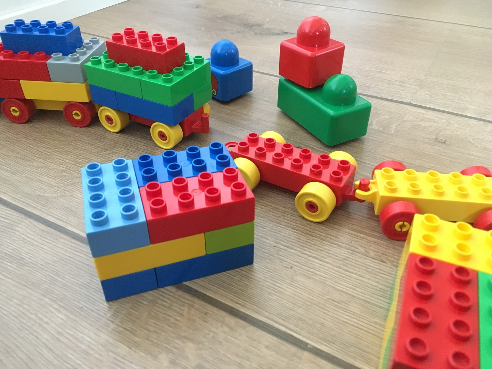

It\'s hard to move to [GitLab](https://gitlab.com/) and resist the
temptation of its integrated [GitLab
CI](https://about.gitlab.om/gitlab-ci/). And with GitLab CI, it\'s just
natural to run all CI jobs in [Docker](https://www.docker.com/)
containers. Yet, to avoid vendor lock of its integrated Docker support,
we choosed to keep our `.gitlab-ci.yml` configurations minimal and do
all Docker calls with [GNU make](https://www.gnu.org/software/make/)
instead. This also ensured, that all of our CI tasks remain locally
reproducible. In addition, we wanted to use *official* upstream Docker
images from the official hub as far as possible.



As always with make, it it\'s a danger that Makefiles themselves become
projects of their own. So, let\'s begin with a completely hypothetical
`Makefile`:

```make
all: test

test:
 karma test

.PHONY: all test
```

Separation of concerns
----------------------

At first, we want to keep all Docker related commands separate from the
actual project specific commands. This lead us to have two separate
Makefiles. A traditional default one, which expects all the build tools
and other dependencies to exist in the running system, and a Docker
specific one. We named them `Makefile` (as already seen above) and
`Makefile.docker` (below):

```make
all: test

test:
 docker run --rm -v $PWD:/build -w /build node:5 make test

.PHONY: all test
```

So, we simply run a Docker container of required upstream language image
(here Node 5), mount our project into the container and run make for the
default Makefile inside the container.

```shell
$ make -f Makefile.docker
```

Of course, the logical next step is to abstract that Docker call into a
function to make it trivial to wrap also other make targets to be run in
Docker:

```make
make = docker run --rm -v $PWD:/build -w /build node:5 make $1

all: test

test:
 $(call make,test)

.PHONY: all test
```

Docker specific steps in the main Makefile
------------------------------------------

In the beginning, I mentioned, that we try to use the official upstream
Docker images whenever possible, to keep our Docker dependencies fresh
and supported. Yet, what if we need just minor modifications to them,
like installation of a couple of extra packages\...

Because our `Makefile.docker` mostly just wraps the make call for the
default Makefile into a auto-removed Docker container run
(`docker run --rm`), we cannot easily install extra packages into the
container in `Makefile.docker`. This is the exception, when we add
Docker-related commands into the default `Makefile`.

There are probably many ways to detect the run in Docker container, but
my favourite is testing the existence of `/.dockerenv` file. So, any
Docker container specific command in `Makefile` is wrapped with test for
that file, as in:

```make
all: test

test:
 [ -f /.dockerenv ] && npm -g i karma || true
 karma test

.PHONY: all test
```

Getting rid of the filesystem side-effects
------------------------------------------

Unfortunately, one does not simply mount a source directory from the
host into a container and run arbitrary commands with arbitrary users
with that mount in place. (Unless one wants to play to game of having
matching user ids inside and outside the container.)

To avoid all issues related to Docker possibly trying to (and sometimes
succeeding in) creating files into mounted host file system, we may run
Docker without host mount at all, by piping project sources into the
container:

```make
make = git archive HEAD | \
       docker run -i --rm -v /build -w /build node:5 \
       bash -c "tar x --warning=all && make $1"

all: test

test: bin/test
 $(call make,test)

.PHONY: all test
```

-   `git archive HEAD` writes tarball of the project git repository HEAD
    (latest commit) into stdout.
-   `-i` in `docker run` enables stdin in Docker.
-   `-v /build` in `docker run` ensures `/build` to exist in container
    (as a temporary volume).
-   `bash -c "tar x --warning=all && make $1"` is the single command to
    be run in the container (`bash` with arguments). It extracts the
    piped tarball from stdin into the current working directory in
    container (`/build`) and then executes given make target from the
    extracted tarball contents\' `Makefile`.

Caching dependencies
--------------------

One well known issue with Docker based builds is the amount of language
specific dependencies required by your project on top of the official
language image. We\'ve solved this by creating a persistent data volume
for those dependencies, and share that volume from build to build.

For example, defining a persistent NPM cache in our `Makefile.docker`
would look like this:

```make
CACHE_VOLUME = npm-cache

make = git archive HEAD | \
       docker run -i --rm -v $(CACHE_VOLUME):/cache \
       -v /build -w /build node:5 \
       bash -c "tar x --warning=all && make \
       NPM_INSTALL_ARGS='--cache /cache --cache-min 604800' $1"

all: test

test: bin/test
 $(INIT_CACHE)
 $(call make,test)

.PHONY: all test

INIT_CACHE = \
    docker volume ls | grep $(CACHE_VOLUME) || \
    docker create --name $(CACHE_VOLUME) -v $(CACHE_VOLUME):/cache node:5
```

-   `CACHE_VOLUME` variable holds the fixed name for the shared volume
    and the dummy container keeping the volume from being garbage
    collected by `docker run --rm`.
-   `INIT_CACHE` ensures that the cache volume is always present (so
    that it can simply be removed if its state goes bad).
-   `-v $(CACHE_VOLUME:/cache` in `docker run` mounts the cache volume
    into test container.
-   `NPM_INSTALL_ARGS='--cache /cache --cache-min 604800'` in
    `docker run` sets a make variable `NPM_INSTALL_ARGS` with arguments
    to configure cache location for NPM. That variable, of course,
    should be explicitly defined and used in the default `Makefile`:

```make
NPM_INSTALL_ARGS =

all: test

test:
 @[ -f /.dockerenv ] && npm -g $(NPM_INSTALL_ARGS) i karma || true
 karma test

.PHONY: all test
```

Cache volume, of course, adds state between the builds and may cause
issues that require resetting the cache containers when that hapens.
Still, most of the time, these have been working very well for us,
significantly reducing the required build time.

Retrieving the build artifacts
------------------------------

The downside of running Docker without mounting anything from the host
is that it\'s a bit harder to get build artifacts (e.g. test reports)
out of the container. We\'ve tried both stdout and `docker cp` for this.
At the end we ended up using dedicated build data volume and `docker cp`
in `Makefile.docker`:

```make
CACHE_VOLUME = npm-cache
DOCKER_RUN_ARGS =

make = git archive HEAD | \
       docker run -i --rm -v $(CACHE_VOLUME):/cache \
       -v /build -w /build $(DOCKER_RUN_ARGS) node:5 \
       bash -c "tar x --warning=all && make \
       NPM_INSTALL_ARGS='--cache /cache --cache-min 604800' $1"

all: test

test: DOCKER_RUN_ARGS = --volumes-from=$(BUILD)
test: bin/test
 $(INIT_CACHE)
 $(call make,test); \
   status=$$?; \
   docker cp $(BUILD):/build .; \
   docker rm -f -v $(BUILD); \
   exit $$status

.PHONY: all test

INIT_CACHE = \
    docker volume ls | grep $(CACHE_VOLUME) || \
    docker create --name $(CACHE_VOLUME) -v $(CACHE_VOLUME):/cache node:5

# http://cakoose.com/wiki/gnu_make_thunks
BUILD_GEN = $(shell docker create -v /build node:5
BUILD = $(eval BUILD := $(BUILD_GEN))$(BUILD)
```

A few powerful make patterns here:

-   `DOCKER_RUN_ARGS =` sets a placeholder variable for injecting make
    target specific options into `docker run`.
-   `test: DOCKER_RUN_ARGS = --volumes-from=$(BUILD)` sets a make target
    local value for `DOCKER_RUN_ARGS`. Here it adds volumes from a
    container uuid defined in variable `BUILD`.
-   `BUILD` is a lazily evaluated Make variable (created with [GNU make
    thunk -pattern](http://cakoose.com/wiki/gnu_make_thunks)). It gets
    its value when it\'s used for the first time. Here it is set to an
    id of a new container with a shareable volume at `/build` so that
    `docker run` ends up writing all its build artifacts into that
    volume.
-   Because make would stop its execution after the first failing
    command, we must wrap the `make test` call of `docker run` so that
    we
    1)  capture the original return value with `status=$$?`
    2)  copy the artifacts to host using `docker cp`
    3)  delete the build container
    4)  finally return the captured status with `exit $$status`.

This pattern may look a bit complex at first, but it has been powerful
enough to start any number of temporary containers and link or mount
them with the actual test container (similarly to `docker-compose`, but
directly in Makefile). For example, we use this to start and link
Selenium web driver containers to be able run Selenium based acceptance
tests in the test container on top of upstream language base image, and
then retrieve the test reports from the build container volume.
