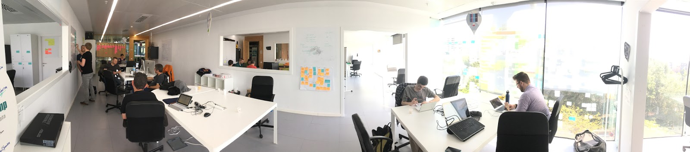

For the last week, I was lucky enough to be allowed to participate
[Plone](https://plone.com/) [community](https://plone.org/) [sprint at
Barcelona](https://plone.org/events/sprints/barcelona-strategic-sprint-2016).
The print was about polishing the new RESTful API for Plone, and
experimenting with new front end and backend ideas, to prepare Plone for
the next decade (as visioned in its
[roadmap](https://plone.org/roadmap/plone-2020)). And once again, the
community proved the power of its deeply rooted sprinting culture
([adopted from the Zope
community](https://en.wikipedia.org/wiki/Sprint_(software_development)#In_open_source)
in the early 2000).

Just think about this: You need to get some new features for your
sophisticated software framework, but you don\'t have resources to do it
on your own. So, you set up a community sprint: reserve the dates and
the venue, choose the topics for the sprint, advertise it or invite the
people you want, and get a dozen of experienced developers to
enthusiastically work on your topics for more for a full week, mostly at
their own cost. It\'s a crazy bargain. More than too good to be true.
Yet, that\'s just what seems to happen in the Plone community, over and
over again.

<iframe width="560" height="315"
src="https://www.youtube.com/embed/NZN0A0U6ysg" frameborder="0"
allowfullscreen></iframe>

To summarize, the sprint had three tracks: At first there was the
completion of [plone.restapi](https://github.com/plone/plone.restapi) --
a high quality and fully documented RESTful hypermedia API for all of
the currently supported Plone versions. And after this productive
sprint, the first official release for that should be out at any time
now.

Then there was the research and prototyping of a completely new REST API
based user interface for Plone 5 and 6: An extensible Angular 2 based
app, which does all its interaction with Plone backend through the new
RESTful API, and would universally support both server side and browser
side rendering for fast response time, SEO and accessibility. Also these
goals were reached, all the major blockers were resolved, and the chosen
technologies were proven to be working together. To pick of my favorite
sideproduct from that track: [Albert Casado, the designer of Plone 5
default theme in LESS, appeared to migrate the theme to
SASS](https://github.com/plone/plonetheme.barceloneta/tree/less2sass).

Finally, there was our small backend moonshot team: Ramon and Aleix from
[Iskra](http://iskra.cat) / [Intranetum](http://www.intranetum.net)
(Catalonia), Eric from [AMP Sport](https://ampsport.com) (U.S.), Nathan
from [Wildcard](https://www.wildcardcorp.com) (U.S.) and yours truly
from [University of Jyväskylä](https://jyu.fi/en) (Finland). Our goal
was to start with an alternative lightweight REST backend for the new
experimental frontend, re-using the best parts of the current Plone
stack when possible. Eventually, to meet our goals within the given time
constraints, we agreed on the following stack:
[aiohttp](http://aiohttp.readthedocs.io) based HTTP server, the Plone
[Dexterity content-type
framework](https://pypi.python.org/pypi/plone.dexterity) (without any
HTML views or forms) built around [Zope
Toolkit](http://docs.zope.org/zopetoolkit), and
[ZODB](http://www.zodb.org) as our database, all on Python 3.5 or
greater. Yet, [Pyramid](http://docs.pylonsproject.org/projects/pyramid)
remains as a possible alternative for
[ZTK](http://docs.zope.org/zopetoolkit) later.

I was responsible for preparing the backend track in advance, and got us
started with a [a simple aiohttp based HTTP backend with experimental
ZODB connection supporting multiple concurrent transaction (when handled
with
care)](https://github.com/plone/plone.server/blob/49461997a7f39e187d31c209c7a45ee590359ce6/sandbox.py).
Most of my actual sprint time went into upgrading Plone Dexterity
content-type framework (and its tests) [to support Python
3.5](https://travis-ci.org/pyrenees). That also resulted in backwards
compatible fixes and pull requests for Python 3.5 support for all its
dependencies in `plone.*` namespace.

Ramon took the lead in integrating ZTK into the new backend, implemented
a content-negotiation and content-language aware traversal, and kept us
motivated by rising the sprint goal once features started clicking
together. Aleix implemented an example [docker-compose
-setup](https://github.com/pyrenees/docker) for everything being
developd at the sprint, and open-sourced their in-house OAuth-server as
[plone.oauth](https://github.com/pyrenees/plone.oauth). Nathan worked
originally in the frontend-team, but joined us for the last third of the
sprint for pytest-based test setup and asyncio-integrated Elasticsearch
integration. Eric replaced Zope2-remains in our Dexterity fork with ZTK
equivalents, and researched all the available options in integrating
content serialization of
[plone.restapi](https://github.com/plone/plone.restapi) into our
independent backend, eventually leading into a new package called
[plone.jsonserializer](https://github.com/pyrenees/plone.jsonserializer).

The status of our [backend
experiment](https://github.com/plone/plone.server) after the sprint?
Surprisingly good. We got far enough, that it\'s almost easier to point
the missing and incomplete pieces that still remain on our to do:

-   We ported all Plone Dexterity content-type framework dependencies to
    Python 3.5. We only had to fork the main
    [plone.dexterity](https://github.com/pyrenees/plone.dexterity)-package,
    which still has some details in its ZTK integration to do and tests
    to be fixed. Also special fields (namely files, richtext and maybe
    relations) are still to be done.
-   Deserialization from JSON to Dexterity was left incomplete, because
    we were not able to fully re-use the existing
    [plone.restapi](https://github.com/plone/plone.restapi)-code (it
    depends on z3c.form-deserializers, which we cannot depend on).
-   We got a basic aiohttp-based Python 3.5 asyncio server running with
    ZODB and asynchronous traverse, permissions, REST-service mapping
    and JSON-serialization of Dexterity content. Integration with the
    new [plone.oauth](https://github.com/pyrenees/plone.oauth) and
    [zope.security](https://github.com/zopefoundation/zope.security) was
    also almost done, and Ramon promised to continue to work on that to
    get the server ready for their in-house projects.
-   Workflows and their integration are to be done. We planned to try
    [repoze.worklfow]{.title-ref} at first, and if that\'s not a fit,
    then look again into porting DCWorkflow or other 3rd party
    libraries.
-   Optimization for asyncio still needs more work, once the basic
    CRUD-features are in place.

So, that was a lot of checkbox ticked in a single sprint, really
something to be proud of. And if not enough, an overlapping [Plone
sprint at Berlin got Python 3.5 upgrades of our stack even
further](http://gil.badall.net/2016/05/20/berlin-2016-sprint-update), my
favorite result being [a helper tool for migrating Python 2 version ZODB
databases to Python 3](http://pythonhosted.org/zodb.py3migrate). These
two sprints really transformed the nearing end-of-life of Python 2 from
a threat into a possibility for our communitt, and confirmed that Plone
has a viable roadmap well beyond 2020.

Personally, I just cannot wait for a suitable project with Dexterity
based content-types on a modern asyncio based http server, or the next
change meet our wonderful Catalan friends! :)
