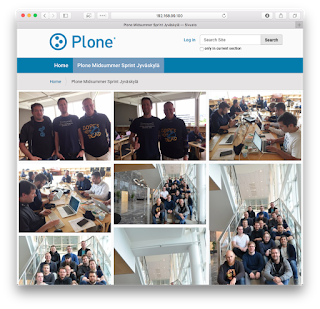
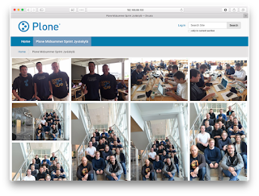
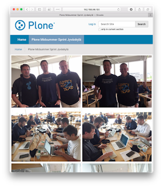
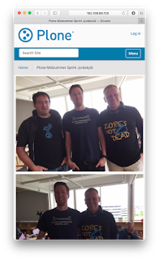

Plone, "[The Ultimate Enterprise CMS](https://plone.com/)", ships with
built-in batteries for building sophisticated content management
solutions without writing a single line of new Python code. For example,
a fresh installation of Plone allows to build custom structured content
types with custom HTML views, define custom state based workflows,
customize various user interface elements, and finish the user
experience by configuring custom event triggered content rules to react
on users\' actions. Not to mention the Diazo based theming tool, which
allows unlimited tweaking of the resulting HTML.

**All this by just clicking and typing things through-the-web (TTW) with
your browser.**

Yet, still some say that Plone is a difficult to customize and extend.

The flip side of customizing Plone TTW is that it\'s way too easy to
lost track of your customizations. That adds to technical debt and
therefore cost of maintaining those customizations over years and
upgrades to future Plone releases. The suggested solution to avoid those
problems has long been to avoid TTW customizations altogether, in favor
of customizing everything using "buildout-installed file-system Python
packages". But that makes customizing Plone feel unnecessary difficult
and technical.

At [Plone Conference 2017](https://2017.ploneconf.org/) [I gave a
talk](https://github.com/datakurre/ploneconf2017), where I showed an
alternative way for this: if it was possible to bundle all those
customizations together, for example in TTW managed theme, maintaining
those customizations would no longer be the blocker.

Customizing Plone could be made easy again.

Requirements
------------

Technically, Plone has supported exporting and importing most of the
possible TTW customizations for more than ten years, but the user
interface for that has been cumbersomely technical. Finally, Plone 4.1
introduced a new [Diazo](http://docs.diazo.org/) based theming feature
with easy to use theming control panel and theme editor. And now, with
only a couple of extra packages in your Plone setup, Plone theming
features get super powers to apply site customizations with any theme.

To complete the following example, you need a Plone site with these two
extra Python packages installed:
[collective.themesitesetup](https://pypi.python.org/pypi/collective.themesitesetup)
and
[collective.themefragments](https://pypi.python.org/pypi/collective.themefragments).

As usual, those can be installed by customizing and running buildout

```properties
[instance]
eggs =
    ...
    collective.themesitesetup
    collective.themefragments
```

or you can try out with the official Plone docker image:

```bash
$ docker run -p 8080:8080 -e PLONE_ADDONS="collective.themesitesetup collective.themefragments" plone fg
```

Case of the day: Wall of images
-------------------------------

As an example feature, we build a simple folder view that displays a
list of varying size images in an optimal grid layout using popular
[Masonry.js](https://masonry.desandro.com/) layout library, with help an
another library called
[imagesLoaded](https://imagesloaded.desandro.com/).

To summarize, building that view requires:

-   Providing JS bundles for both Masonry and imagesLoaded
-   Registering those bundles into Plone resource registry
-   A folder view template that renders images in that folder
-   Way to configure that view on a folder
-   JS code to initialize Masonry layout on that view



Getting started with theming
----------------------------

To get a fast start, we create a dummy theme base named `demotheme` that
simply re-uses styles and rules from Barceloneta, the default theme of
Plone 5. Your theme base should contain the following files:

-   `./index.html`
-   `./rules.xml`
-   `./scripts.js`
-   `./styles.css`
-   `./manifest.cfg`

At first, `./index.html` is just a copy of the same theme file from
Barceloneta:

```html
<!doctype html>
<html>
  <head>
    <title>Plone Theme</title>
    <link rel="shortcut icon" type="image/x-icon"
          href="++theme++barceloneta/barceloneta-favicon.ico" />
    <link rel="apple-touch-icon"
          href="++theme++barceloneta/barceloneta-apple-touch-icon.png" />
    <link rel="apple-touch-icon-precomposed" sizes="144x144"
          href="++theme++barceloneta/barceloneta-apple-touch-icon-144x144-precomposed.png" />
    <link rel="apple-touch-icon-precomposed" sizes="114x114"
          href="++theme++barceloneta/barceloneta-apple-touch-icon-114x114-precomposed.png" />
    <link rel="apple-touch-icon-precomposed" sizes="72x72"
          href="++theme++barceloneta/barceloneta-apple-touch-icon-72x72-precomposed.png" />
    <link rel="apple-touch-icon-precomposed" sizes="57x57"
          href="++theme++barceloneta/barceloneta-apple-touch-icon-57x57-precomposed.png" />
    <link rel="apple-touch-icon-precomposed"
          href="++theme++barceloneta/barceloneta-apple-touch-icon-precomposed.png" />
  </head>
  <body>
    <section id="portal-toolbar">
    </section>
    <div class="outer-wrapper">
      <header id="content-header">
        <div class="container">
          <header id="portal-top">
          </header>
          <div id="anonymous-actions">
          </div>
        </div>
      </header>
      <div id="mainnavigation-wrapper">
        <div id="mainnavigation">
        </div>
      </div>
      <div id="hero" class="principal">
        <div class="container">
          <div class="gigantic">
          </div>
        </div>
      </div>
      <div id="above-content-wrapper">
          <div id="above-content">
          </div>
      </div>
      <div class="container">
        <div class="row">
          <aside id="global_statusmessage"></aside>
        </div>
        <main id="main-container" class="row row-offcanvas row-offcanvas-right">
          <div id="column1-container">
          </div>
          <div id="content-container">
          </div>
          <div id="column2-container">
          </div>
        </main><!--/row-->
      </div><!--/container-->
    </div> <!--/outer-wrapper -->
    <footer id="portal-footer-wrapper">
      <div class="container" id="portal-footer"></div>
    </footer>
  </body>
</html>
```

Then, `./rules.xml` does nothing more than includes the existing rules
directly from the always available Barceloneta theme:

```xml
<?xml version="1.0" encoding="UTF-8"?>
<rules
    xmlns="http://namespaces.plone.org/diazo"
    xmlns:css="http://namespaces.plone.org/diazo/css"
    xmlns:xsl="http://www.w3.org/1999/XSL/Transform"
    xmlns:xi="http://www.w3.org/2001/XInclude">

  <!-- Import Barceloneta rules -->
  <xi:include href="++theme++barceloneta/rules.xml" />

</rules>
```

File `./scripts.js` starts empty and file `./styles.css` with the
following content to reuse styles from Barceloneta theme:

```css
@import "../++theme++barceloneta/less/barceloneta-compiled.css";

.plone-breadcrumb ol {
    padding: 18px 0;
    font-size: 14px;
}
```

They both should be registered as the implicit "theme bundle" (or
"Diazo-bundle") in `./manifest.cfg` by setting `production-css` and
`production-js` attributes as follows:

```properties
[theme]
title = Demo Theme
description =
production-css = /++theme++demotheme/styles.css
production-js = /++theme++demotheme/scripts.js
```

Saving these files and enabling the theme should already give the basic
Barceloneta experience. But let\'s continue to extend it with our
special feature\...

Registering Masonry.js bundles
------------------------------

Plone 5 resource registry supports many ways to configure new front end
resources. We go with the easy way by simply downloading the 3rd party
JS distributions and registering them mostly as such for Plone with the
following steps:

1.  Create folder `./bundles` into theme to keep the required front-end
    bundles separate from the other theme files

2.  Download [the official minified Masonry.js
    distribution](https://unpkg.com/masonry-layout@4/dist/masonry.pkgd.min.js)
    and save it as `./bundles/masonry.pkgd.min.js`

3.  Download [the official minified imagesLoaded
    distribution](https://unpkg.com/imagesloaded@4/imagesloaded.pkgd.min.js)
    and save it as `./bundles/imagesloaded.pkgd.min.js`

4.  Edit both of the previous files by adding line

    ```js
    (function() { var require, define;
    ```

    into the beginning of the file, and line

    ```js
    })();
    ```

    into the end of the file. These are required for any "AMD packaged"
    JS distribution to work in Plone\'s Require.js based JS environment.

5.  Add two empty files `./bundles/masonry.pkgd.min.css` and
    `./bundles/imagesloaded.pkgd.min.css` for pleasing the Plone
    resource registry in the next step.

6.  Create folder `./install` with file `./install/registry.xml` with
    the following contents to register the above bundles into Plone
    resource registry:

    ```xml
    <?xml version="1.0"?>
    <registry>
      <records prefix="plone.bundles/imagesloaded-js"
               interface="Products.CMFPlone.interfaces.IBundleRegistry">
        <value key="depends">plone</value>
        <value key="jscompilation">++theme++demotheme/bundles/imagesloaded.pkgd.min.js</value>
        <value key="csscompilation">++theme++demotheme/bundles/imagesloaded.pkgd.min.css</value>
        <value key="last_compilation">2017-10-06 00:00:00</value>
        <value key="compile">False</value>
        <value key="enabled">True</value>
      </records>
      <records prefix="plone.bundles/masonry-js"
               interface="Products.CMFPlone.interfaces.IBundleRegistry">
        <value key="depends">imagesloaded-js</value>
        <value key="jscompilation">++theme++demotheme/bundles/masonry.pkgd.min.js</value>
        <value key="csscompilation">++theme++demotheme/bundles/masonry.pkgd.min.css</value>
        <value key="last_compilation">2017-10-06 00:00:00</value>
        <value key="compile">False</value>
        <value key="enabled">True</value>
      </records>
    </registry>
    ```

Now, once edited theme files are saved and the theme re-activated or
updated, thanks to **collective.themesitesetup**, every response from
our site should include our these new resources.

Creating a folder view with list of images
------------------------------------------

Creating a view with **collective.themefragments** is similar for
writing any view template for Plone. Simply add a folder `./fragments`
into your theme with our example view `./fragments/wall_of_images.pt`
with the following contents:

```html
<html xmlns="http://www.w3.org/1999/xhtml" xml:lang="en"
      xmlns:tal="http://xml.zope.org/namespaces/tal"
      xmlns:metal="http://xml.zope.org/namespaces/metal"
      xmlns:i18n="http://xml.zope.org/namespaces/i18n"
      lang="en"
      metal:use-macro="context/main_template/macros/master"
      i18n:domain="plone">
<body>
<metal:main fill-slot="main">
  <metal:content-core define-macro="content-core">
    <div class="wall-of-images container-fluid"
         tal:define="items context/@@contentlisting">
      <tal:image tal:repeat="item items">
        
      </tal:image>
    </div>
  </metal:content-core>
</metal:main>
</body>
</html>
```

Please, note, how the view template uses
[plone.app.contentlisting](https://pypi.python.org/pypi/plone.app.contentlisting)
API for iterating through every item in the folder and then
[plone.app.imaging](https://pypi.python.org/pypi/plone.app.imaging) API
for rendering image tags for scaled images. Also, note the use of
`tal:on-error` to suppress all possible error messages (you may not
always want that, though).

Enabling the view on a site
---------------------------

Unfortunately, **collective.themefragments**\' views do not magically
appear into Plone toolbar display menu yet. Fortunately, those views can
be either be set as the default view of a content type or manually
assigned to a content item by setting its `layout`-property:

1.  At first, let\'s assume that we have a folder

    `http://localhost:8080/Plone/wall-of-images`

2.  Then, let\'s open the good old properties edit form for it

    `http://localhost:8080/Plone/wall-of-images/manage_propertiesForm`

3.  Finally, let\'s add a new property of type `string` with name
    `layout` and value `++themefragment++wall_of_images`

Now the content should be rendered using our brand new template,
displaying all the images one after one. It still does not look as
intended, though, because nothing enables Masonry.js for it.

Invoking Masonry.js on the view
-------------------------------

To enable Masonry.js on our brand new view, we could add the following
code into a theme file `./scripts.js`:

```js
jQuery(function($) {
  $('.wall-of-images').imagesLoaded(function() {
    $('.wall-of-images').masonry({
      itemSelector: 'img',
      percentPosition: true
    });
  });
});
```

That code simply uses jQuery to find our view templates main element and
configures Masonry.js for it after every image below it has been loaded.

An alternative for that jQuery script would be to rely on Plone\'s
Require.js setup and define the code as a pattern:

```js
require([
  'pat-base'
], function(Base) {
  'use strict';

  var Masonry = Base.extend({
    name: 'masonry',
    trigger: '.wall-of-images',

    init: function() {
      var self = this;
      self.$el.imagesLoaded(function() {
        self.$el.masonry({
          itemSelector: 'img',
          percentPosition: true
        });
      });
    }
  });

  return Masonry;
});
```

But something is still missing. Masonry.js is distributed without any
default styles. To make our wall of images look as it should, we need to
define responsive styles with our desired breakpoints in `./styles.css`:

```css
@media only screen {
   .wall-of-images {
        padding-left: 0;
        padding-right: 0;
        margin-top: -20px;
    }
    .wall-of-images img {
        float: left;
        width: 100%;
        height: auto;
        border: 5px solid transparent;
    }
}

@media only screen and (min-width: 768px) {
    .wall-of-images img {
        float: left;
        width: 50%;
        height: auto;
    }
}

@media screen and (min-width: 900px) {
    .wall-of-images img {
        float: left;
        width: 33.3333333%;
        height: auto;
    }
}

@media screen and (min-width: 1200px) {
  .wall-of-images img {
        float: left;
        width: 25%;
        height: auto;
    }
}
```

Finally, we\'d like to make our wall of images be displayed on full
browser window width. That\'s a bit tricky, because we need to escape
Barceloneta theme\'s default content container, but still fully possible
by adding the following Diazo rules into `./rules.xml`:

```xml
<!-- Wall of Images -->
<rules css:if-content=".wall-of-images">
  <!-- Make fullwidth -->
  <replace css:theme=".outer-wrapper > .container"
           css:content=".wall-of-images" />
  <!-- Include status message -->
  <before css:theme=".outer-wrapper > .container"
          css:content="#global_statusmessage"
          css:if-content=".wall-of-images" />
  <replace css:content="#global_statusmessage">
    <div id="global_statusmessage" class="container-fluid">
      <xsl:apply-templates />
    </div>
  </replace>
</rules>
```

Now our wall of images shines in every resolution:








PS. If want to learn more, my [talk
materials](https://github.com/datakurre/ploneconf2017) include a more
complex example with custom content types, workflows, permissions,
portlet assignments and content rules.
