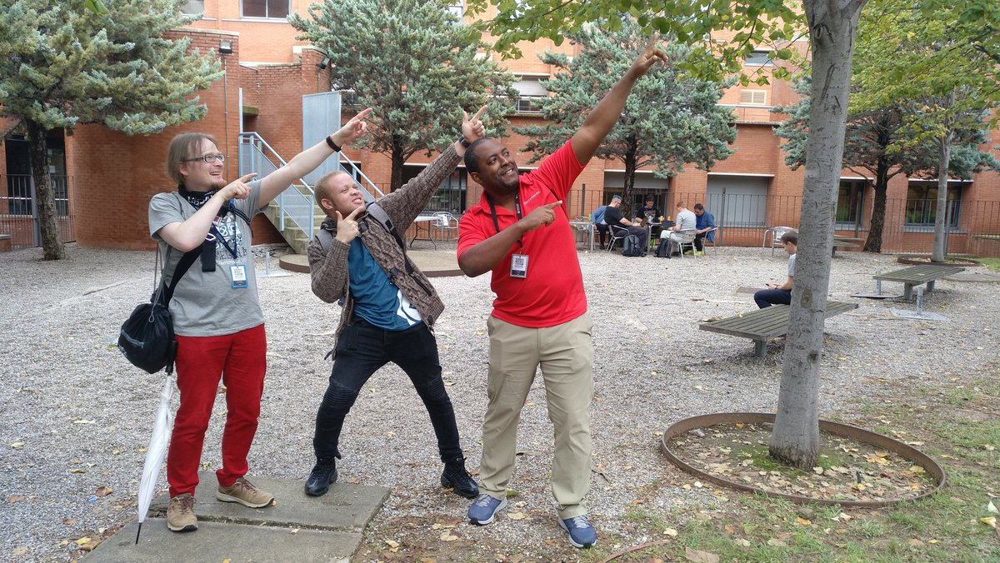

It was awesome to be back at Plone Conference this year. Finally! We
have had participation in Plone conferences in 2009, 2011–2012 and
2014–2017, but for me the previous one was years ago: Plone Conference
Bristol in 2014. Needless to say that I have missed the warm and
welcoming atmosphere of a Plone conferences, and It\'s my pleasure to
report that Barcelona did not let me down. Even the weather was still
warm there in this October.

This year there was no single big Plone news at the conference. The
latest major release of Plone CMS was released already two years ago,
and the next feature release is still waiting for its gold master. Yet,
there was still a lot of good news, and putting all the puzzle pieces
together resulted in a clear picture of the future of Plone.

*Disclaimer: These are obviously just my personal opinions on all these
things Plone\...*

*Published originally at
<https://tech.blog.jyu.fi/2017/10/plone-conference-barcelona-2017.html/>*

*Plone Conference Barcelona was so much of fun that I took a piece of it
with me back home.*

Plone 2020 and beyond
---------------------

At first, let\'s say it clear that Plone CMS remains to be a safe bet
for a long-term enterprise CMS solution. If there ever was any doubt,
whether Plone could make it to Python 3 in-time before the end of Python
2.7 maintenance in 2020, that should be no more. Plone will make it.

All the major blockers seem to have been solved, and the rest is just
hard work left for our community (check some related talks by
[Alexander](https://2017.ploneconf.org/talks/doing-the-impossible) and
[Hanno](https://2017.ploneconf.org/talks/zope-on-python-3) about the recent events on that). Python 3 version of Zope
application server powering Plone is already in beta, and it is
scheduled to be released within a year. Plone, for sure, has still
plenty of packages to be ported from Python 2.7 to Python 3, but there
are already many sprints scheduled to continue that work in near future
(including the already completed Barcelona Conference sprints). We might
even have an alpha version of Plone on Python 3 before end of 2018.

In addition that, it\'s always good to mention, that Plone Foundation
has continued to do its usual great job in all the possible paper work
around managing Plone\'s copyrights and trademarks.

All these should be good and relaxing news for any long-term Plone user.

Let\'s go frontend!
-------------------

The greatest challenge for Plone CMS seems to be keeping up with the
ever increasing UX expections of the day, while complying with the high
accessibility standards. After Plone 5 rewrote the default theme and
whole front-end resource management in Plone, there are no longer
blockers for using any current front-end tech with Plone. But just being
able to use some tech is not enough -- also the real work for better UX
needs to be done. And even a lot has been done for Plone 5 and 5.1, that
work seems to never end.

Plone Conference Barcelona included a great amount of front-end, user
experience and accessibility related talks to educate our community. So
many that I can only mention a few.

At first, there were talks regarding the current Plone user interface:
[Johannes](https://2017.ploneconf.org/talks/resource-registry-demystified) gave a bit technical, but very comprehensive talk how the new
frontend resource registries in Plone 5 really work. [My
talk](http://datakurre.pandala.org/2017/10/building-instant-features-with-advanced.html) instructed, how to combine the ancient powers of Zope
application server with the modern Plone 5 theming support to achieve
shorter iterations and faster deployments when developing new UX
features. Our
[Rikupekka](https://2017.ploneconf.org/talks/beyond-infinity-with-plone-5-are-we-there-yet) talked about our migration experiences from Plone 4 to Plone
5, and gave a demo about of the UI features we have developed using the
approach I discussed in my talk. Finally, I want to mention Wildcards\'
[Kim\'s](https://2017.ploneconf.org/talks/our-castles-strength) talk about Castle CMS, which really showcased, how much
difference well lead and focused UX development for Plone based
distribution could do in just about a year. Although, the fact that
Castle\'s development had to be forked a bit from the main Plone
distribution is also telling, how difficult it is to make the same UX
please everyone.

Then there were many talks about the future: there\'s a new branch of
Plone user interfaces built completely in JavaScript on top of the great
Plone REST API (which
[Timo](https://2017.ploneconf.org/talks/building-bridges-the-headless-future-of-plone) gave a nice presentation about). With Plone REST API it\'s
possible to combine the great and robust CMS features of our secure
Plone backend with leading edge JavaScript based frontend. It also makes
Plone based solutions feasible for the current generation of frontend
developers, because only very basic Plone knowledge is needed to get
started. And while there is no complete replacement of Plone user
interface in JavaScript yet, there are SDK like projects with many
familiar UI components already for
[ReactJS](https://www.npmjs.com/package/@plone%2Fplone-react),
[Angular](https://www.npmjs.com/package/@plone/restapi-angular) (check
[Eric\'s](https://2017.ploneconf.org/talks/this-is-2017-lets-go-frontend) talk) and even on
[VueJS](https://github.com/bierik/plone-vuejs).

If these don\'t feel ambitious enough, there was one more thing:
[Albert\'s](https://2017.ploneconf.org/talks/pastanaga-ui-resistance-is-futile) talk about Pastanaga UI -- a proposal for next generation UI
for generic CMSs.

Guillotina -- server for a more civilized age
---------------------------------------------

I\'m not sure how common mistake it is, but at least we have sometimes
ended up using Plone as a framework for projects, for which Plone was
not really the most optimal solution. That has happened, because Plone
has some very unique features we love and trust: object database with
URL traversal, extremely flexible Zope Component Architecture, and very
proven security model especially designed for hierarchical data.

At Barcelona conference,
[Nathan](https://2017.ploneconf.org/talks/guillotina-the-asyncio-rest-resource-api) from Onna presented their new "AsyncIO REST Resource
Application Server" called Guillotina (open sourced through Plone
Foundation)r What makes Guillotina very special and interesting is that
it has all those unique features we have learned to love in Plone
"framework", but with minimal server footprint and first class support
for asynchronous programming using Python 3 AsyncIO event loop. That
should allow Guillotina to go places where no Plone has gone before.

I really hope the next year brings us a suitable project to try
Guillotina in practice\...

There and back again
--------------------

To summarize all this, here\'s my picture of the future of Plone on the
base of Plone Conference Barcelona 2017 in three sentences:

-   Plone CMS as we know it remains here to stay -- the current users
    remain safe with Plone
-   Plone REST API and all the UI SDKs based on it "save Plone" by
    making it a feasible solution for content management related
    progressive web apps
-   Guillotina "saves Plone developers" by allowing them to transfer
    their current Plone "framework" knowledge into era of
    high-performance Python 3 AsyncIO microservices.

Obviously there was a lot more in the conference than this. There was a
lot of great talks by talented speakers. It was great to see all the old
friends and make some new ones. I had a chance to meet my GSOC 2017
student Oshane Bailey. And there are no parties like parties in Plone
Conferences.

Thanks once again for all the organizers. It was a pleasure to be there.

We\'ll see if I get to see
[Tokyo](https://plone.org/news/2017/plone-conference-2018-will-be-in-tokyo-japan) next year\...

*Photo of me, Oshane Bailey and David Bain by Maik Derstappen. They said
this pose is to honor Usain Bolt.*
