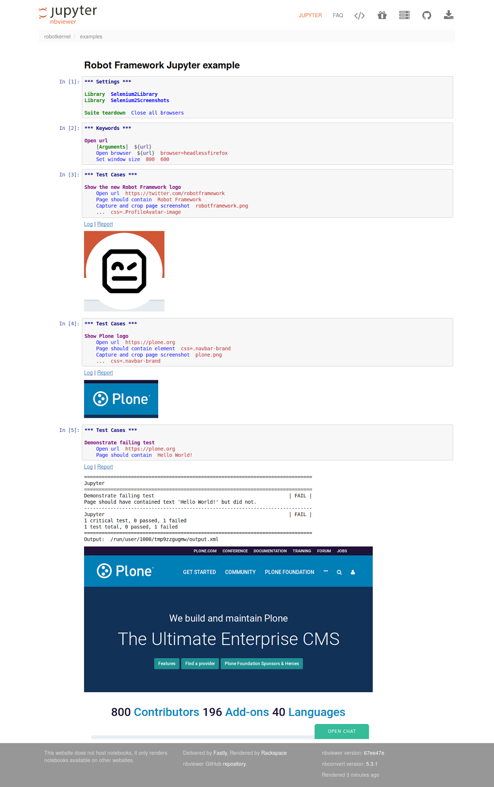

It\'s already over a week since I got back home from the first [Robot
Framework](https://robotframework.org/) conference ever -- [RoboCon
2018](https://robocon.io/). It was a pleasure to be there, and I really
feel privileged that I was accepted there as a speaker.

My RoboCon 2018
---------------

RoboCon 2018 was a single day conference about Robot Framework test
automation ecosystem, held in the heart of Helsinki, Finland, on 18th of
January 2018. The conference venue was quite if not completely full, so
there must have been around 250 participants. The event was in English
and had pretty good international participation. Yet, most of the
participants came from Finland, where Robot Framework has become
de-facto standard for test automation.

RoboCon 2018 had only a single track, so that had to be packed to
include something for everyone in its diverse audience. In addition,
there was plenty of time and a separate space for networking with the
other participants and conference sponsors. There was also organized
social program before and after the conference, but unfortunately, I was
unable to attend those at this time.

In my opinion the program was well balanced: The conference started with
introductory talks, continued with variety of differnet case studies
(Kone, Plone and Texas Instruments), and ended with more technical talks
about specific Robot Framework addons
([SeleniumLibrary](https://github.com/robotframework/SeleniumLibrary),
[the most awesome new REST
library](https://github.com/asyrjasalo/RESTinstance) and
[pabot](https://github.com/mkorpela/pabot)). And in the middle of
everything, there was my personal favorite: Ed Manlove\'s talk about
building successful open source communities. My presentation was called
[Robot Framework in Plone CMS
Project](https://datakurre.github.io/robocon2018/index.html): a case
study, story and some technical details, how Robot Framework got
successfully adopted in distributed open source community behind
[Plone](https://plone.com).

The most important part of this conference, of course, was getting a lot
of Robot Framework users and developers to meet in the same place at the
same time. After all, RoboCon 2018 was the first Robot Framework
conference ever. My personal absolute highlight during the conference
was meeting a former Plonista, Ed Manlove. He was the one who first
introduced me to Selenium testing in San Francisco Plone Conference in
2011, and whom I had not seen after that. Until now. I really hope takes
less than seven yeras to see him again\...

Jupyter kernel for Robot Framework
----------------------------------

After the conference on Thursday came the single day conference sprint
on Friday. And if the conference was a success, the sprint was even more
so: the sprint venue, three large office rooms, was packed full of
sprinters, many of them participating their first open source sprint
(and got a good introduction to open source development from Ed).

Because I had to leave early in Friday, I had planned a very specific
sprint goal for myself: a MVP [Robot Framework
kernel](https://github.com/datakurre/robotkernel) for Jupyter notebook.

[Jupyter](https://jupyter.org) notebook (previously known as IPython
notebook) is an open-source web application for creating and sharing
documents that contain live code, equations, visualizations and
narrative text. The architecture behind Jupyter notebook separates the
notebook application from its language specific "kernels" that are
responsible for executing the code in notebooks. Syntax highlighting in
notebooks, on the other hand, is provided by
[CodeMirror](https://codemirror.net/) project for the interactive
frontend, and [Pygments](http://pygments.org/) for server side generated
highlighting.

I\'m happy to say that I made it. And the more I use it, the more
confident I get on that Jupyter makes a great platform for learning also
Robot Framework. And not only for learning by yourself, but also for
sharing your notes with others.

[Check my example notebooks to judge the kernel by
yourself.](http://nbviewer.jupyter.org/github/datakurre/robotkernel/tree/master/examples/)

*Please, note that while*
[theseexamples](http://nbviewer.jupyter.org/github/datakurre/robotkernel/tree/master/examples/)
*are static renderings at http://nbviewer.jupyter.org/, they can be
opened and interacted live in any running Jupyter notebook with the new
kernel and required Python packages. See the*
[repository](https://github.com/datakurre/robotkernel) *for more
details.*

The main Jupyter Robot Framework support features shown in [those
examples](http://nbviewer.jupyter.org/github/datakurre/robotkernel/tree/master/examples/)
are:

-   Support for defining and executing Robot Framework test suite
    cumulatively step by step in successive notebook cells. The main
    limitation is that each cell should start with a test suite section
    header (settings, variables, keywords or test suites) even when the
    same header was already defined in some cell before.
-   HTML log and report files are linked below the executed cells
    containing the tests. Both files are actually bundled with the
    notebook in a way that sharing the notebook also shares the log and
    report files.
-   Images generated during test execution are shown below the executed
    cells generating the images. Similarly to HTML logs and reports also
    images are bundled with the notebook for sharing.
-   Support for `%%python module LibaryName` "cell magic" to allow
    defining custom Robot Framework keyword libraries in Python in fly.
    Once thell cell with a Python library class definition is executed,
    it can be imported in a successive Robot Framework code cell.
-   Syntax highlighting. But, unfortunately, until the CodeMirror plugin
    derived from *brackets-robotframework*-project is accepted into
    upstream, it must be manually patched into CodeMirror version
    shipped with Jupyter *notebook*-distribution. (I have not yet
    submitted a pull for it.)
-   If the last keyword of the last test case in the executed cell
    returns JSON string, it is rendered as cell execution output. I
    added this quite specific feature to make it more fun to learn
    RESTinstance library with Jupyter (*Output* keyword of RESTinstance
    library returns JSON).

Obviously, while the current versions is already fully functional on
Python 3, there\'s still a lot of work (QA, packaging and Python 2
support) left to polish the code for release. I\'m looking forward to
finish it during the spring.

Happy hacking! And hopefully see you in RoboCon next year -- or whenever
it is organized and I\'ll manage to participate it for the next time! :)
