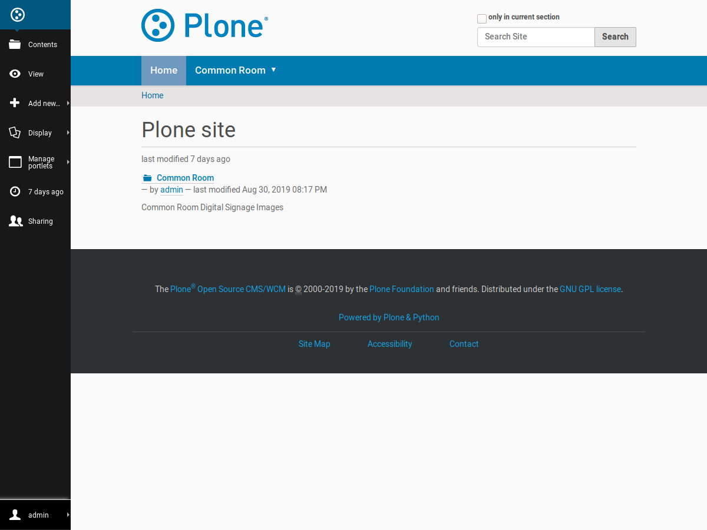
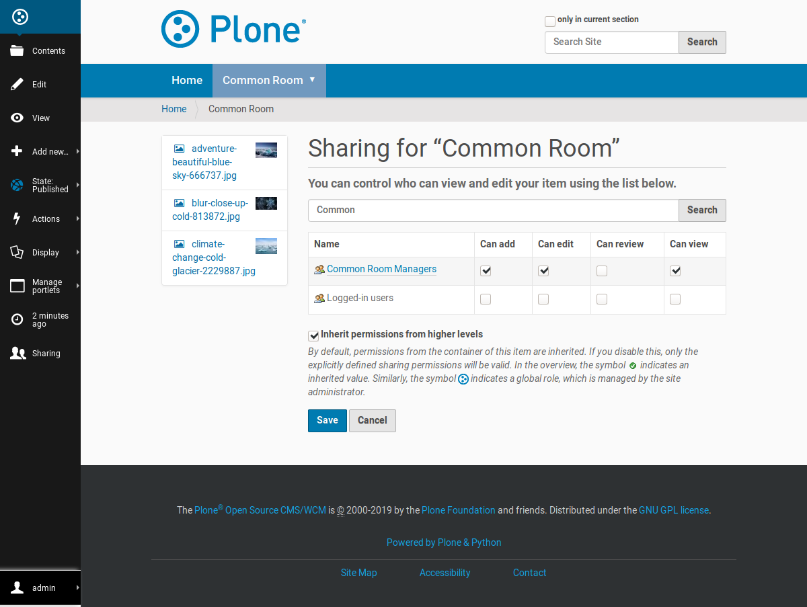
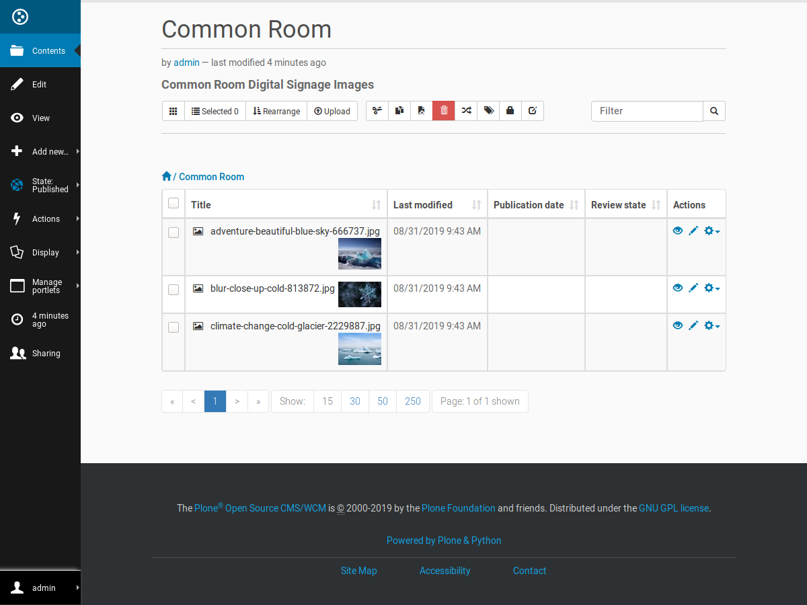
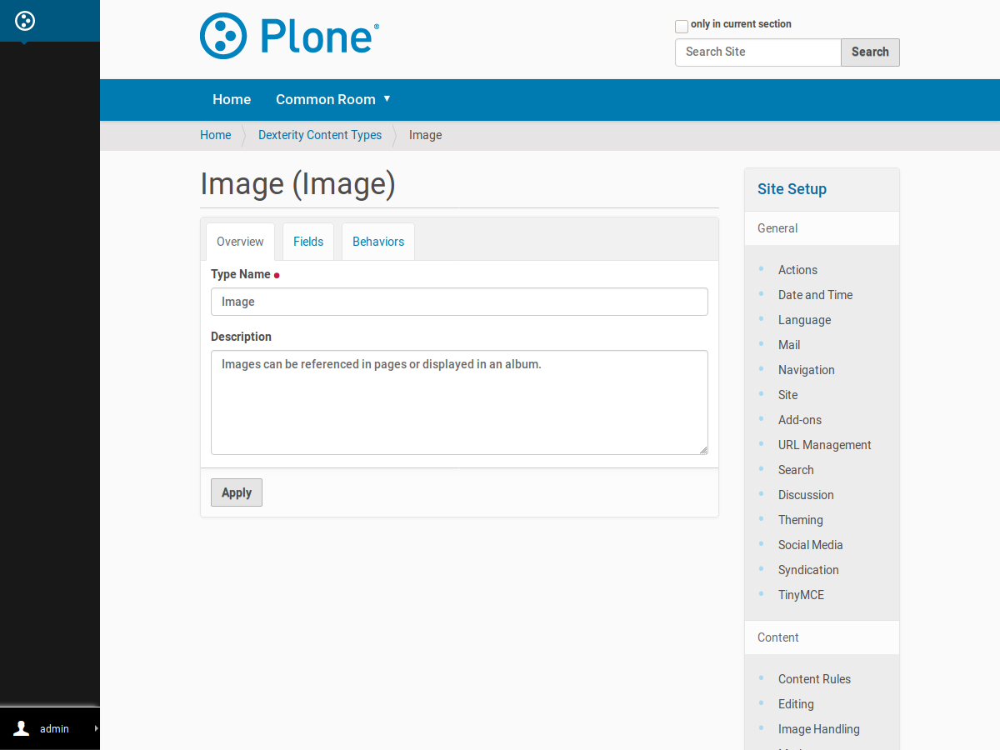
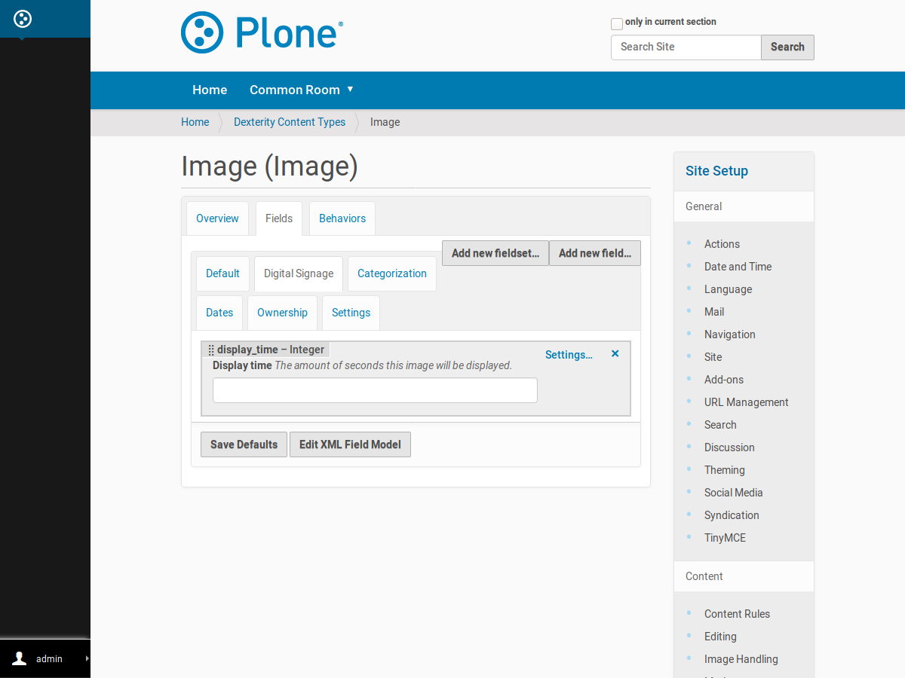

Sometimes complex problems have simple solutions, and this was one of those times. At work, we are piloting a new digital signage solution for our university. Unfortunately, the new system lacks in permission management, and for a while, it looked like we were unable to safely delegate digital signage content management to departments.

Lucky us that we knew a system that is very good in permission management: [Plone](https://www.plone.com/).



Plone is an open source content management system based on hierarchical object database. That's why Plone excels in managing many kind of content and related permissions in hierarchies. That's also why Plone has been a good fit for such hierarchical organizations where content management follows the hierarchy of the organization itself.



So, how we are going to solve the shortcomings of our digital signage system with Plone and GatsbyJS? In brief, we

* let our users to manage their digital signage content on Plone in the simples possible way: every display group has their own folder on Plone and the responsible users have required rights to manage content in their folders

* we use GatsbyJS project to fetch that content from Plone and build simple digital signage content players hosted as static web pages

* we use our on-premises GitLab CI and GitLab pages to build and host those web pages; a Plone feature called *content rules* is used to trigger a new updating build after each content update.

With this setup, instead of letting the content managers to directly manage the digital signage system (where we were unable to restrict their permissions to their own display groups), we configure the system to display those GatsbyJS built sites and let the users manage their digital signage content on Plone – on the content management system they are already familiar with.



And that's just the beginning. Thanks to Plone's customizable structured content types, we already added new content field for setting the display time of each content page. And in the future we can use this to add more configuration options to ensure that the content is displayed as intended by the content managers.






gatsby-theme-ds-player
----------------------

> Show the code or it didn't happen!

To be honest, our current solution is so simple that there is not that much to show.

Anyway, I put together a simple open source version where similar GatbyJS built web site is created from given Plone folder so that each subfolder has its own digital signage player to loop through the images dropped into that folder.

I packaged all this into a GatsbyJS "theme" plugin [gatsby-theme-ds-player](https://github.com/datakurre/gatsby-theme-ds-player) preconfigured to be best compatible with a Plone source using [gatsby-source-plone](https://github.com/collective/gatsby-source-plone/). There is also [a live demo of the result](https://datakurre.github.io/gatsby-theme-ds-player/ds/common-room/), automatically built from the theme package repository at Travis-CI:

<iframe src="https://datakurre.github.io/gatsby-theme-ds-player/ds/common-room/" width="900" height="600" frameborder="0" style="margin: 0 auto;"/>

<!--
```javascript
module.exports = {
  plugins: [
    {
      resolve: 'gatsby-source-plone',
      options: {
        baseUrl: 'http://localhost:8080/Plone/',
      },
    },
    {
      resolve: 'gatsby-theme-ds-player',
      options: {
        path: '/ds/',
      }
    },
  ],
};
```
-->


