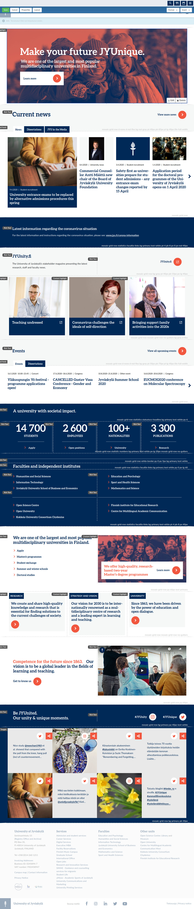
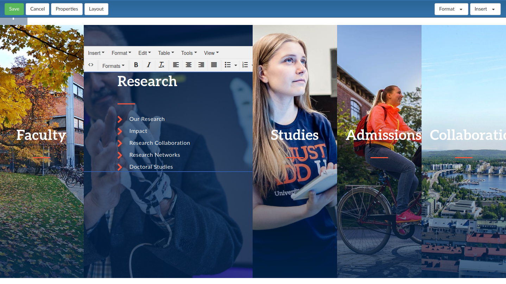
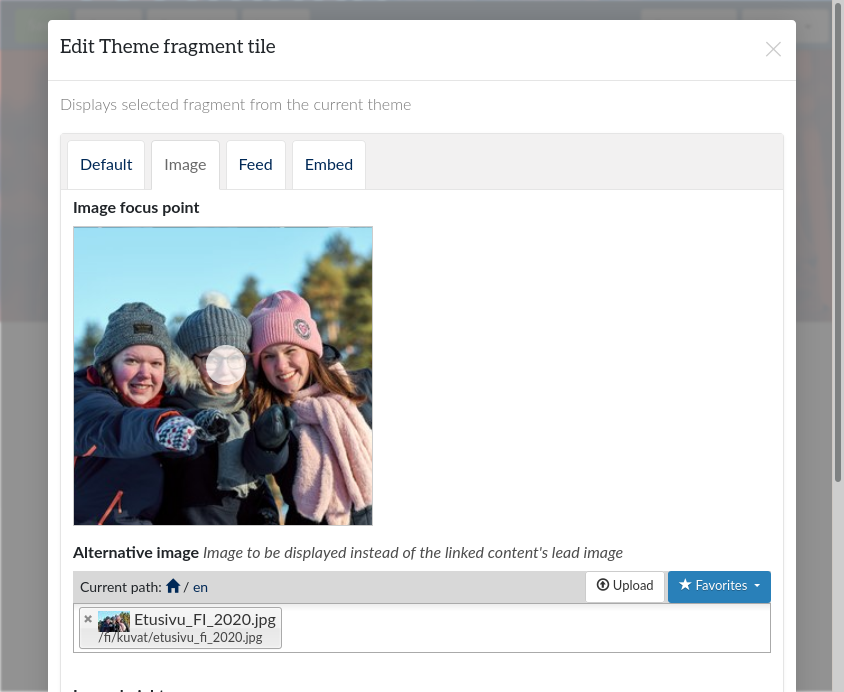
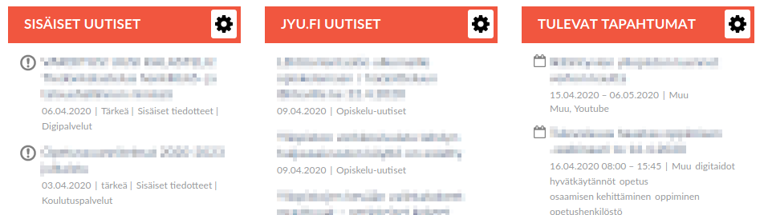

“How hard can it be? It is just a theme…”

Of course, it was. Unless it was a collection of configurable interactive components. With features like tabbed carousels, photo filters, hyphenation, and syndication of news or calendar feeds from various sources. All responsive. All accessible. All reusable around the site. All with multilingual user interface elements, when required.

Some might confuse that for requirement specification of a new CMS/WCM project. For us it was just a theme refresh for the current installation. And, to be honest, thanks to [Plone](https://www.plone.com/), the hardest part really was the CSS.

Real-time layouts with Plone Mosaic
-----------------------------------

Being able to see the content in its themed context while editing it, has always been the definitive part of Plone editor experience. WYSIWYG to the max, they say. There are still options to keep that Plone promise alive in the era of “modern web tech”. Our choice has been Plone Mosaic site layouts.

Plone Mosaic site layouts turn the principles of traditional CMS theming upside down (continuing the tradition of [Plone Diazo](https://docs.plone.org/external/diazo/docs/index.html)). Instead of theming content in CMS, the CMS content gets merged into theme, themed Plone Mosaic site layouts.

We build our themed layouts with Webpack. [Plone Webpack integration](https://github.com/collective/plonetheme.webpacktemplate) allows us to bring in all the bells and whistles we need from the huge open source JavaScript ecosystem without extra effort. And thanks to [Patternslib](https://patternslib.com/) and [Webpack code-splitting](https://webpack.js.org/guides/code-splitting/#dynamic-imports), huge libraries like MathJax are only loaded when required.

Eventually, the CMS content gets pulled into Plone Mosaic site layouts with “tiles” and “panels”: Tiles are placeholders for any CMS content from page title to body text. Panels are customizable areas, where more tiles can be placed in customizable grid layouts. And when that is not enough, some things can still be tweaked with Plone Diazo XSLT rules…

Configurable blocks with Theme Fragments
----------------------------------------

The days when it was enough to theme the existing features of a CMS are long gone. On the contrary, nowadays it seems that themes redefine the required features. Lucky us, not only was Plone there from the very beginning, Plone itself started as a themed user interface for Zope Content Management Framework. While the details have changed, in my opinion, Plone could still market itself as a low-code platform for web content management.

[Plone Theme Fragments](https://pypi.org/project/collective.themefragments/) provide flexible way to enrich theme with configurable functional blocks. Minimally, theme fragments are re-usable static HTML fragments usable around the theme. But they can also use all the power of Plone templating language to render the current content in custom manner. Even more, fragments can be bundled with Python functions to allow complex business logic calling most of the Plone backend API while keeping the templates itself simple.

With Plone Mosaic, theme fragments can be also used as tiles in any Mosaic layout. And when that itself is not flexible enough, theme fragment tiles can be made configurable with the full power of [Plone Supermodel XML schemata](https://docs.plone.org/external/plone.app.dexterity/docs/reference/dexterity-xml.html).

All this. Simply as part of any Plone theme. No wonder we have been using these beasts a lot.

Everything bundled with Theme Site Setup
----------------------------------------

When implementing a theme refresh for an existing web site cluster with dozen of independent CMS installations with tens of thousands of individual pages, it is important to be able to iterate fast. And for theming a Plone cluster that means, to be able to update the theme without need to restart the backend services after each update.

[Plone Theme Site Setup](https://pypi.org/project/collective.themesitesetup/) add-on for the rescue! Thanks to Theme Site Setup, our theme packages may include everything we need from the usual theming resources and Theme Fragments, to Plone Mosaic layouts, custom language localization catalogs and Plone site configuration changes (like customizing cached image scales).

In practice, we use Plone Webpack integration to produce complete theme packages with all the required resources supported by Plone Theme Site Setup. Then we use [Plone Theme Upload](https://www.npmjs.com/package/plonetheme-upload) to upload the resulting package to our sites on demand. No restarts needed.

Personally cached with Varnish ESI
----------------------------------

At the end, no features matter if the resulting web site is slow or its content is not up-to-date. Unfortunately, these two requirements are often contradicting each other. Especially on web portal front pages that mostly aggregate the current content from all the other pages.

Fortunately, Plone Mosaic was designed with ESI (Edge Side Includes) and tile specific caching configuration in mind. With simple customization of Plone Mosaic rendering pipeline and Plone caching rules, we have been able to achieve everything we wanted:

* Different parts of our pages are cached for different periods of time. For example, news listings tiles are invalidated from cache in every few minutes, while the rest of the page is only updated when modified.

* Cache is shared with anonymous and logged-in users when safe. For example, the same cached versions of header and footer tiles get shared between all users.

* Also most of the tiles for logged-in users can be securely cached: users with the same set of user roles share the same cached version.

* Thanks to Varnish' recursive ESI support, we are able to provided cached personalized news listing tiles: the first response is a non-cached tile rendering just the ESI-reference for the cached version, and all users with matching configuration get the same cached version. Fast.

Finally, Plone Webpack integration allows us to build a theme with all its front-end resources server from a separate server, possibly from a CDN, in an optimized manner. Allowing all our sites with the same theme share the same resources, and let Plone to focus on managing and serving the content.

---

All that said, and as already been said, thanks to [Plone](https://www.plone.com/), the hardest part really was (and remains to be) the CSS.
