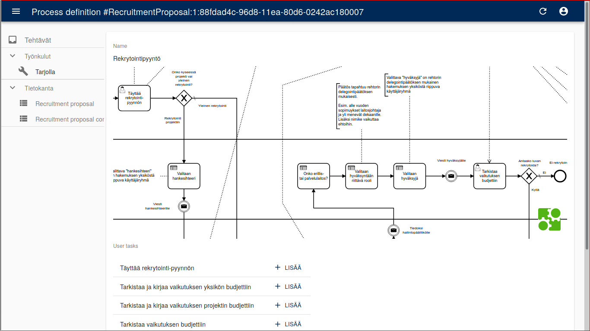
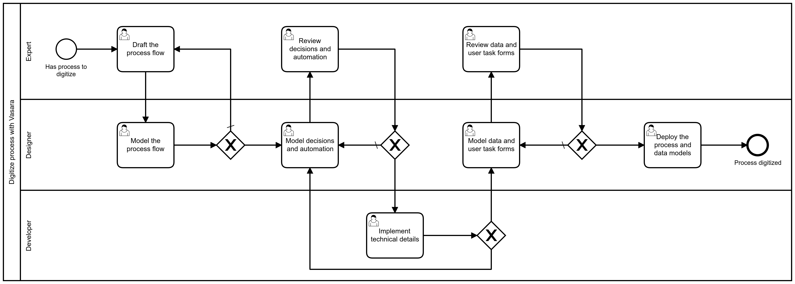
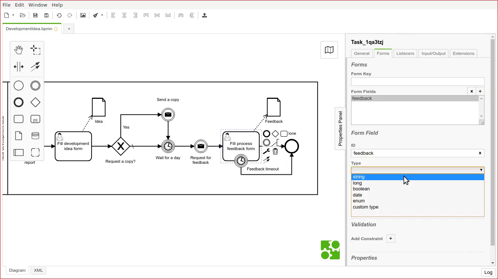
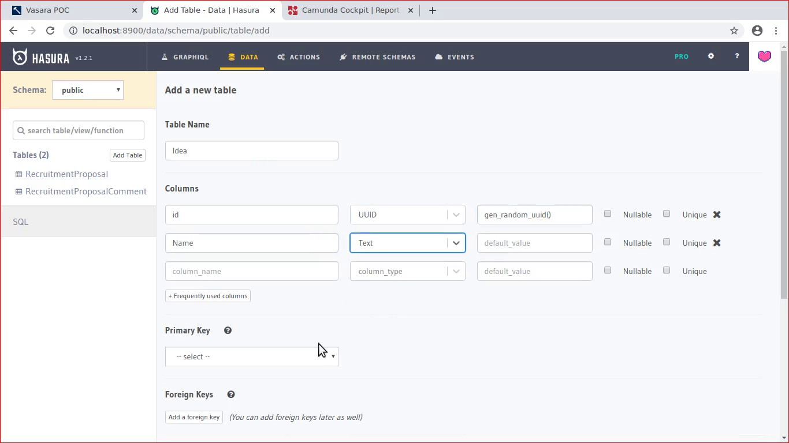
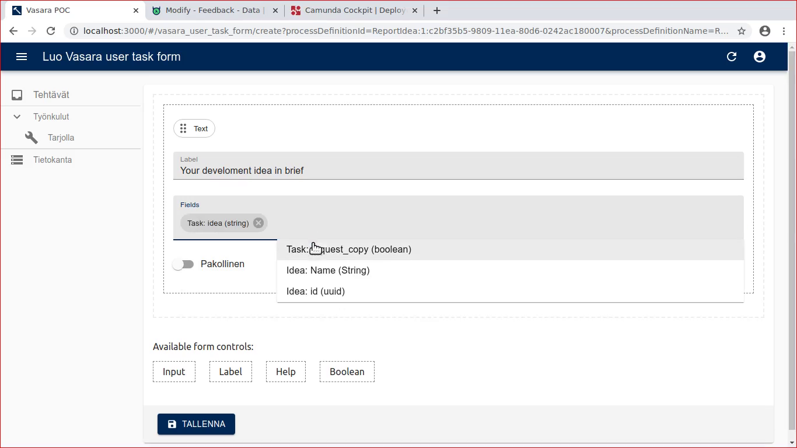
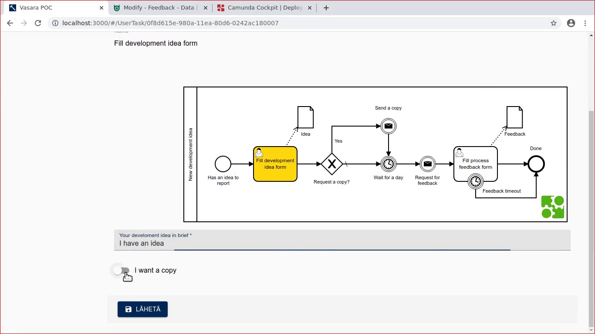

In the beginning of this year, we met to discuss the options for making more of our existing business processes more automatic, more efficient, more transparent, more digital. More everything. Commercial tools exist, but their pricing is prohibitive. Long-term costs erratic. Aren't there any more real alternatives? How about open source?

The jury is still out. Nevertheless we were allowed to use some time for figuring out, what could be achieved with mashing up together the best available open source options. Fast-forward to the present. Meet [Vasara BPM](https://gitlab.com/vasara-bpm/) – our open source mashup low-code concept proposal for digitizing business processes.

What are little processes made of?
----------------------------------

Forms, documents, tasks, people, decisions, notifications, work, results, customer satisfaction. That's what little business processes are made of. Vasara BPM concept aims to knit all these together.

The main Vasara user story starts outside system itself: the expert on the current process drafts the process flow with a BPM modeling tool. With the help of an experienced process modeler, the process model is developed into an executable process model. Now the process model is given for technical review. Technical details are completed and possible automation needs implemented. Only now Vasara is really needed.

Vasara provides tools for building the end-user experience for the process. Vasara extracts user controlled tasks from the process model and provides tools for building user interfaces for those tasks. Vasara allows to connect process and its tasks with their related database documents. Finally, Vasara could be used to start the processes manually, complete their user tasks when required and, of course, browse and and manage the related database documents.

Standing on the shoulders of giants
-----------------------------------

Vasara builds on top of the rock solid foundations of [Camunda BPM](https://camunda.com/) workflow and decision automation engine and [PostgreSQL](https://www.postgresql.org/) database. The workflow and process data are knitted together with awesome [Hasura GraphQL](https://hasura.io/) server, which provides nice database admin user interface and enables a single secure GraphQL API endpoint for all data and actions required.

While Camunda and Hasura have their own access control models, both are callable with the same [Open ID Connect](https://openid.net/connect/) authentication. Everything works as API first, consumed by Vasara front-end built with Marmelab [ReactAdmin](https://marmelab.com/react-admin/) user-interface framework – based on ubiquitous ReactJS. Web-based BPMN and DMN tooling by Camunda's [bmpn.io](https://bpmn.io/) will also be in heavy use.

GraphQL with Hasura has proven to be very powerful combination. Vasara relies on [GraphQL introspection](https://graphql.org/learn/introspection/) to generate some of the default forms automatically and provide hints for the custom form builder. Thanks to [Hasura access control](https://hasura.io/docs/1.0/graphql/manual/auth/authorization/basics.html) the introspection and therefore the whole API based user interface automatically adapts to the current user's permissions. Camunda BPM is missing an official GraphQL API, but a community extensions exists and [building on top of that](https://gitlab.com/vasara-bpm/camunda-bpm-graphql/) has been providing us all the flexibility we need in integrating Vasara with Camunda. Also, we just cannot wait for [Hasura Remote Joins](https://hasura.io/blog/remote-joins-a-graphql-api-to-join-database-and-other-data-sources/) to happen in the upcoming Hasura releases...

Sounds good, what next?
-----------------------

After only a couple of months of actual design and implementation work done, Vasara BPM is still in its very early stages. That said, we believe that [our proof-of-concept playground](https://gitlab.com/vasara-bpm/vasara) has proven the concept to be, not only possible, but also implementable with the limited resources on our hand. Incrementally, step by step, case by case, filling our exact requirements in-time only when really needed, of course. Everything released as open source. The first pilots should be running already in the next autumn. And by the end of the year we should know if we succeeded in forging this magical hammer or not. Fingers crossed.

