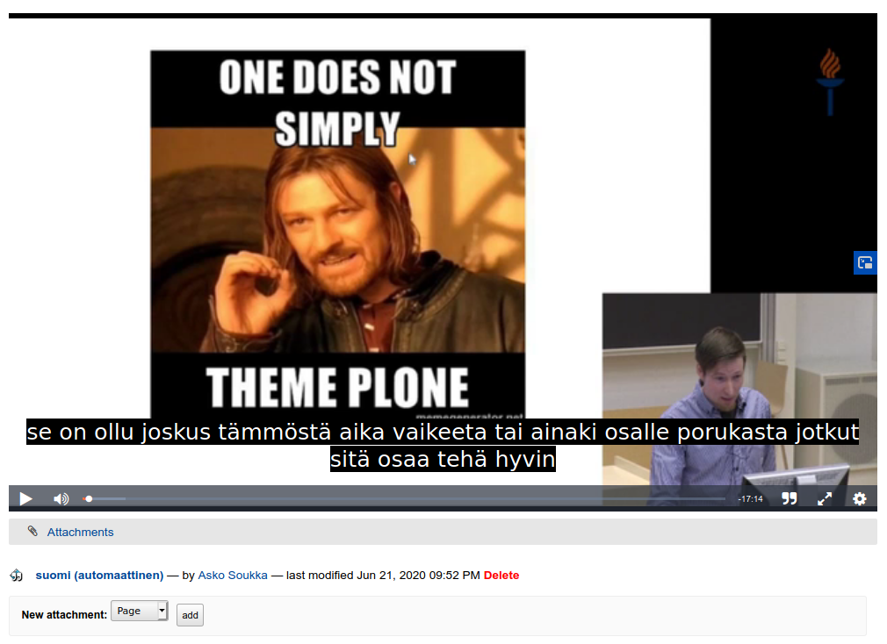

Never underestimate the importance of being able to make changes to your software – especially when they are critical to your business processes.

Our university has its own audio and video publishing platform, [Moniviestin](http://moniviestin.fi/). The first version was released in 2003 – well before Youtube. The latest major iteration was done in 2010, and is built on top of [Plone CMS platform](https://plone.com/), with microservice architecture based video encoding pipeline. After 10 years and counting, we had yet another critical feature request: most of the new published recordings must have subtitles, as automatically as possible.

Once the team had benchmarked the available automatic speech recognition (ASR) services for Finnish speech, they selected [Sanelius ASR](https://www.aanicompany.com/sanelius-ja-kirstu.html) HTTP API from [Ääni Company](https://www.aanicompany.com/services.html).

Now they had the specification, but how did relying on Plone help with the integration?

From “Publish” to “Publish with subtitles”
------------------------------------------

To make the end user experience as convenient as possible, the team decided to connect the automated subtitle generation into the current video publication workflow.

In Plone, every content object may be supported with one or more state managing workflows. For example, our video content pages, called “Media pages”, have one workflow for managing the publication process and another one for managing the video encoding process. Because Plone is designed to work as a web publishing platform out-of-the-box, only the publication workflow is exposed for end-users by default.

The obvious starting point for the integration was to branch the publication workflow with a new path: “Publish with subtitles”. That was enough to provide the required user interface for the feature, just next to the familiar “Publish” action. The new branch in the worklow made also possible the other required states and transitions to support the actual integration.

What can be seen, can be automated
----------------------------------

Our platform had support for manually configurable subtitles already. Plone is based on hierarchical object database, not unlike filesystem with folders and files. Therefore, our platform was built to represent its content with folder-like “Media page” containers, which could contain any amount of related attachment items, like slides, lecture notes, and... subtitles!

So, “Subtitles” was already a feature on our CMS based platform, and configurable within “Media page” manually through the user interface. But not only was "Subtitles" available to the end-users, it was also available through [Plone REST API](https://plonerestapi.readthedocs.io/en/latest/). And Plone REST API provided out-of-the-box most of the necessary actions to fetch “Media pages” waiting for subtitles, post new subtitles, update existing subtitles, and confirm the updates according to the workflow.

Having workflow changes, addable “Subtitles”-content and scriptable REST API in place, one more Plone automation feature still needs to be mentioned: configurable event based actions, also known as “content rules”:

For automated subtitles, Plone content rules made it simple to trigger automation service when “Publish with subtitles” was selected. Similarly it made simple to configure email notifications when automated subtitles were received.

Finally, let robots do the hard work
------------------------------------

RPA, or Robotic Process Automation, is usually associated with expensive automation platforms with visual programming features. Yet, deep inside, this fancy term could simply mean any kind of script automation, being triggered by external events or timer, to perform some business value providing action. Actually, a very useful approach for casual automation...

For automated subtitles, our team did not need to build tight integration between our video publishing platform and the selected ASR service. Neither did the team need to build any new continuosly running services to handle the integration. Our team simply needed to ensure that both ends had consumable HTTP APIs, and then write required scripts (“robots”) to handle the required communication between services.

The most obvious place for the required integration scripts was our existing Jenkins based RPA platform: [Jenkins](https://www.jenkins.io/) provides us job configuration, secrets management, webhooks endpoints, scheduled executions and archival of execution logs. Simply everything our team needed to manage the execution of these subtitle automation tasks.

In addition, our RPA Jenkins workers were already powered by [Nix package manager](https://nixos.org/) to provide all run-time dependencies for the automation scripts. I was told that just using Nix saved up to day in development time, because it provided complete and up-to-date ffmpeg installation for the integration scripts without any additional effort.

Let there be subtitles!
-----------------------------

Welcome our full subtitle automation story:

1. Video author selects “Publish with subtitles”.
2. Plone content rule calls Jenkins webhook to schedule a new robot.
3. Robot reads pending task from Plone, streams the video, extracts and converts the audio track, and submits the track to ASR service.
4. Jenkins schedules a new job to poll pending ASR jobs.
5. Robot reads completed task from ASR service, downloads the text, converts it into subtitles format and uploads the file to Plone.
6. Plone content rule notifies the video author with email that automatically generated subtitles are now available.
7. ???

Profit.
