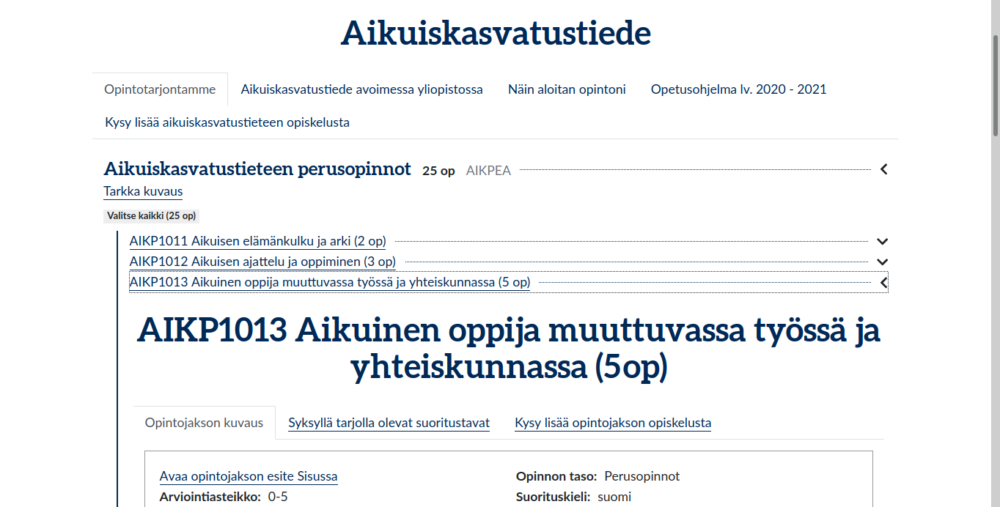
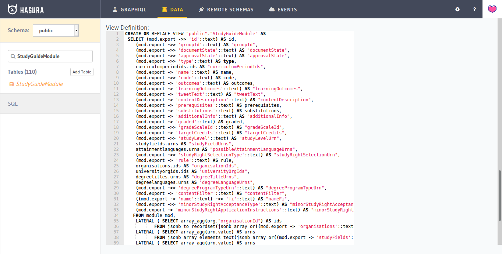
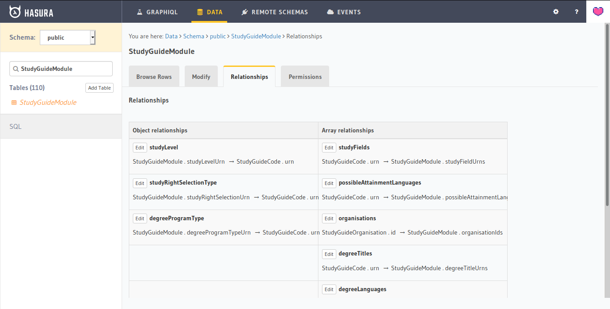
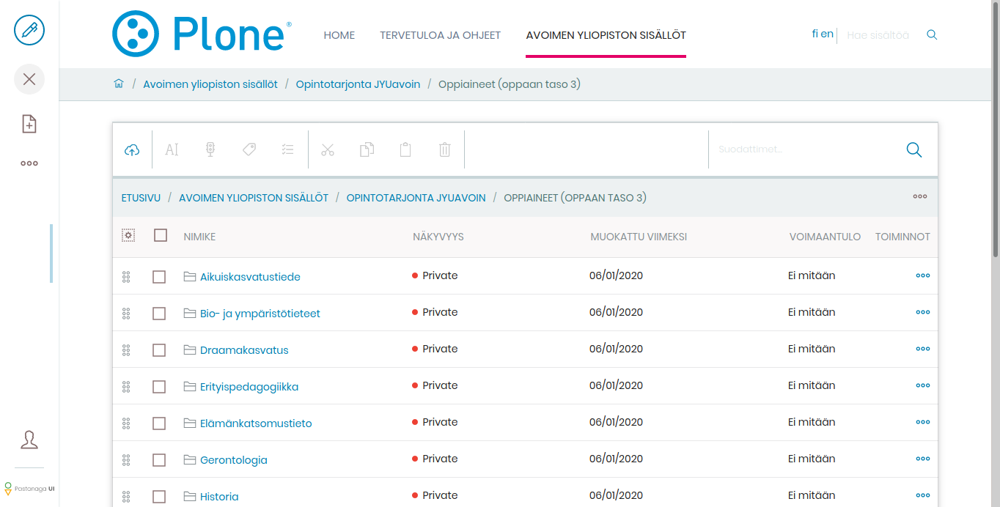
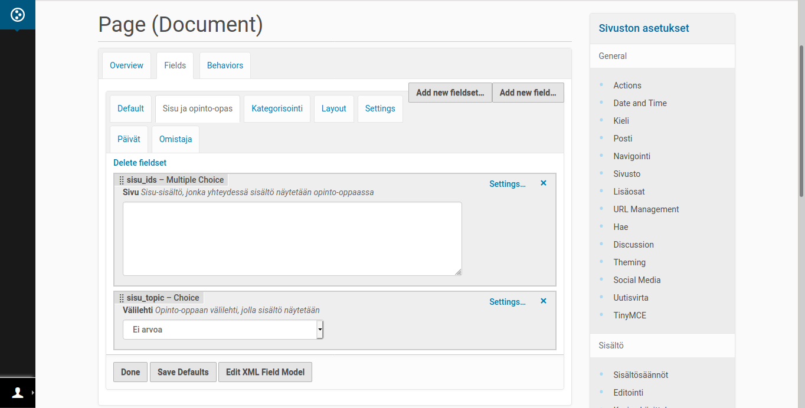
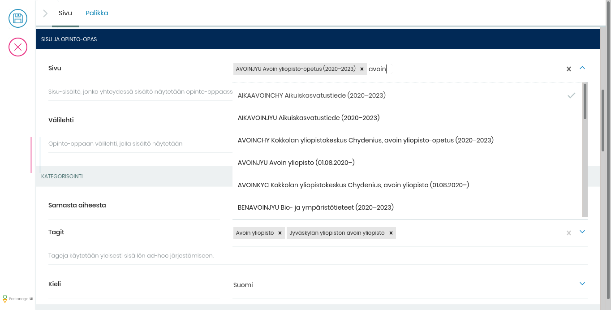
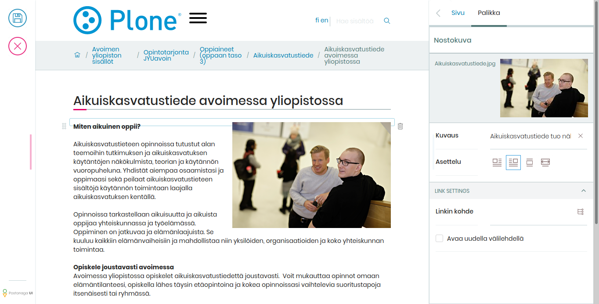
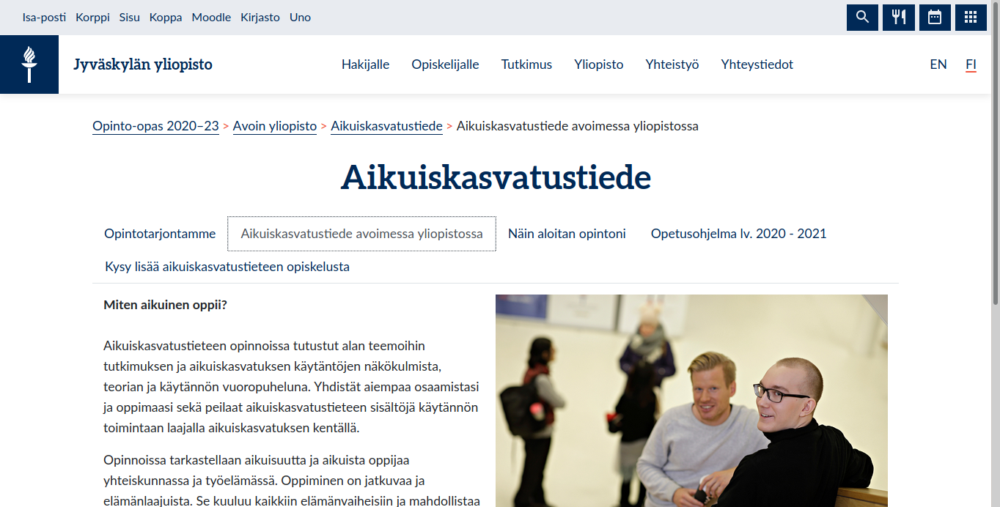

An another iteration of [our university's new study guide web site](https://studyguide.jyu.fi/2020/) has been completed. The project that started more than a year ago as a [JAMstack](https://jamstack.org/) experiment with [GatsbyJS](https://www.gatsbyjs.org/) and [Hasura](https://hasura.io/), has finally matured enough to get its long expected expansion: [a content management system](http://voltocms.com/)!

In the beginning there was data. A lot of it. A great amount of granular JSON chunks, to be turned into fast and well connected study guide web site. Regularly updated, of course. For years we had solved similar use cases by building and synchronizing CMS content out of more or less structured data. This time we had not enough resources for a such “sophisticated” CMS integration, but we had to look for more agile alternatives. As they say: think out of the box. We chose to go JAMstack, with GatsbyJS.

Hasura – the magical GraphQL gateway
------------------------------------

At first, of course, we had to make sense of our data. GatsbyJS requires to use [GraphQL](https://graphql.org/) queries to select the published content. By chance, we found [Hasura](https://hasura.io/), which is designed to turn any [PostgreSQL](https://www.postgresql.org/) database into well-connected GraphQL API. So, we built a pipeline to dump our JSON data into JSONB columns within simple PostgreSQL tables. Once the data was in the database, and we learned which parts we really needed, we could build dynamic database views to expose the data exactly as we wanted.

As designed, Hasura was able to publish those views as GraphQL types and connect them with the relations we needed. Suddenly we had complete GraphQL API for our data. Almost, but not quite entirely unlike, magic. Awesome. Really.

But publishing all that structured data with fast and accessible user experience was not enough. More information was required to be included on the site. This time with images, video embeds and attachments. And the master system was not designed to handle that.

After all, a real CMS was required.

Volto – a breeze of fresh air
-----------------------------

Lucky us, we had just right CMS product and experience available. [Plone CMS](https://www.plone.com/) with its latest user interface, [Volto](https://volto.kitconcept.com/), provided us both hierarchical object database and modern user interface required for managing the additional content. Plone shines in managing content in folder tree like hierarchies, and sharing access rights for them accordingly. Volto, on the other hand, makes Plone snappier and easier to use than ever.

And when it comes to [Plone as a data source for GatsbyJS](https://collective.github.io/gatsby-source-plone/): I personally mentored Google Summer of Code students both in [2018](https://summerofcode.withgoogle.com/archive/2018/projects/5034509258981376/) and [2019](https://summerofcode.withgoogle.com/archive/2019/projects/5770661249679360/), and then continued the work, to make sure that Plone integrates perfectly with any GatsbyJS project.

The last piece in our puzzle was to connect Volto authored Plone CMS content with our structured data from the Hasura powered GraphQL API. The flexibility of Plone CMS with fresh customization possibilities provided by Volto enabled the solution:

1) Plone ships with out-of-the-box customizable structured content types. Without any custom code, we were able to enhance our Volto-editable pages with metadata fields to store the connecting information – making it also available in Plone REST API for GatsbyJS data source integration.

2) Thanks to Volto user interface being customizable with our own ReactJS code. It was possible to customize the select widget of our primary connecting field to search the Hasura GraphQL API for all the possible value options to be saved with the content page.

All this required successful teamwork, not only with a few developers to do the technical implemenation, but also with the dozens of our content editors to create and connect the actual content.

That said, we successfully reached our goal, where what you see, edit and connect in Volto:

Is what you get in our GatsbyJS built study guide web site:

As they say: something old, something new and something blue. The perfect match.
