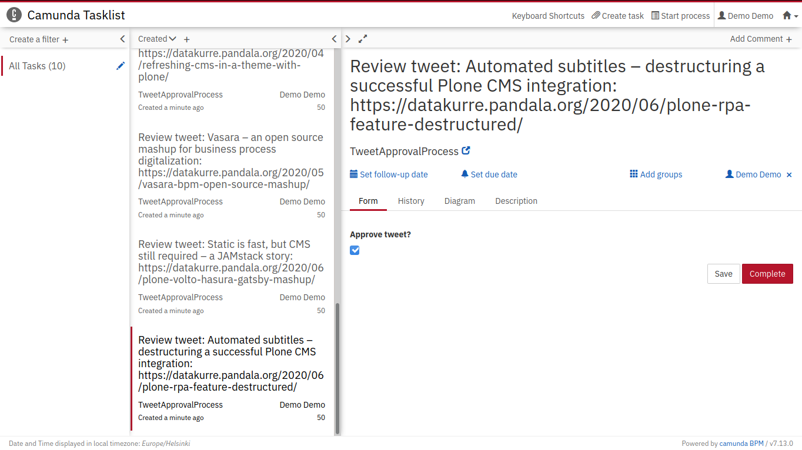

<!--  -->

[Robocorp's RPA suite is now open for everyone](https://robocorp.com/news/start-building-software-robots). Why does it matter? Because their “Robotic Process Automation” solution is based on [Robot Framework](https://robotframework.org). This does not only make Robocorp's solution great from the start, but it should also benefit the whole open source Robot Framework ecosystem with better [tools](https://github.com/robocorp/robotframework-lsp/), [resources](https://hub.robocorp.com/) and [automation libraries](https://rpaframework.org/).

To try out and learn these new tools, I played with a simple fictional business process...

Automating social media posts
=============================

The simplified story short: “As a community manager, I want to automate tweets for blog posts, so that I have more time to do something more important.”

More technically: A robot should regularly fetch new posts from selected blogs and prepare tweets for them. Then a human should be able to select and approve the tweets to be published. Finally, a robot should publish the approved tweets.

Because the process involves a human, Robocorp's tools as such are not enough. But that is not a bad thing. It allowed me to choose the best open source workflow platform I knew for managing processes with both humans and robots: [Camunda BPM](https://camunda.com/).

Here's the eventual process as designed with [Camunda Modeler](https://camunda.com/download/modeler/):

1. At first, a scheduled Robotcloud robot fetches blog posts, prepares tweets and messages Camunda to start a new tweet approval process for each of them

2. then Camunda waits for a human to approve the prepared tweets in their own approval process instances

3. next, Camunda either timeouts a process, ends process without tweet, or calls Robocloud API to trigger a robot to do the actual tweeting

4. finally, for each approved tweet with triggered publishing robot, Camunda waits for Robotcloud robot to acknowledge successful tweet before concluding the process.

Composing Robocloud processes
=============================

At Robocloud, work for robots must be organized into “Processes”. A single process is a sequence of configured “Activities”. Activities are reusable job configurations, which are managed as shareable “Packages”.

When implementing activities, it is good to know, that in Robocloud, activities placed in the same process, can share data with [Robocloud work items](https://hub.robocorp.com/resources/libraries/rpaframework-RPA-Robocloud-Items/).

For my example process, I created three activity packages, with one activity in each of them. The first activity is for preparing tweets from blog posts. The second one is for sending messages to Camunda. The last one remains for actually publishing the tweets.

I created and deployed my activity packages by using Robocorp's own downloadable IDE, [Robocode Lab](https://hub.robocorp.com/knowledge-base/articles/running-robots-in-robocode-lab/). A fun fact about Robocode Lab: Its main user interface is based on open source [JupyterLab](https://jupyter.org/), and its Robot Framework integration is [a maintained fork](https://github.com/robocorp/robocode-kernel) of my hobby [Robotkernel](https://github.com/robots-from-jupyter/robotkernel).

The few [RobotLab](https://robots-from-jupyter.github.io/) users should feel pretty familiar in Robocode Lab...

Executing with Camunda Tasklist
===============================

So, my final process implementation included two Robocloud processes. The first one of them is scheduled at Robocloud. The other one is orchestrated by Camunda, as configured in the process model (BPMN). The first one is composed of two activities:

1. The first activity turns blog posts into tweetable messages and passes them along as a Robocloud work item variable.

2. The second activity iterates through the messages in Robocloud work item variable, and with each of them, calls Camunda REST API to dispatch a Camunda message event, which results in creating a new process instance with the tweetable message.

Each process instance in Camunda stops at user task “``Review tweet: ${message}``” to wait for the user approval for the message to be tweeted. Camunda comes with application called Tasklisk, which can display pending user tasks in a TODO application like user interface. It can also render a simple task form defined in the BPMN model.

Once a user has completed the task, Camunda continues execution of the process up to service task “``Schedule Robot to tweet``”, which uses Camunda HTTP connector to call [Robocloud process API](https://hub.robocorp.com/knowledge-base/articles/robocloud-process-api/), triggering the second Robocloud process in asynchronous fashion.

The second Robocloud process is also a composition of two activities:

1. The first activity executes robot to publish the tweet passed as work item variable.

2. The second activity calls Camunda REST API to dispatch a Camunda message, which acknowledges the Robocloud process been completed successfully.

After executions of the second Robocloud process, approved tweets are published:

Meanwhile, Camunda Cockpit, which is also part of open source Camunda BPM, gives an overview of all the on-going process instances. A single glance can tell, how many tasks are still pending a human approval, or are already approved and waiting for the acknowledge of success from Robocloud.

That's Robocloud RPA orchestration platform orchestrated with Camunda BPM workflow automation platform. Looks pretty powerful combination.
