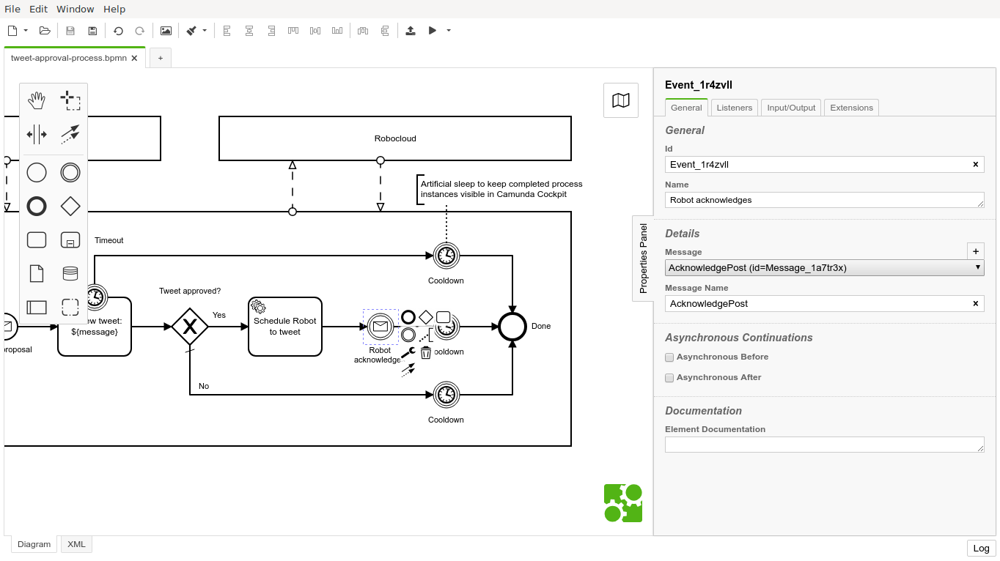

[In my previous post](/2020/07/camunda-robocloud/) I wrote an overview, how to implement a semi-automated business process involving both humans and robot with just [Camunda BPM](https://camunda.com/) and [Robocorp Robocloud RPA](https://hub.robocorp.com/). But how to really get started with Camunda BPM with Robocloud RPA?

Setting up Camunda Run
----------------------

Camunda workflow engine comes in almost too many flavors to choose from. I would recommend starting with [Camunda Run](https://docs.camunda.org/manual/latest/user-guide/camunda-bpm-run/). It is easier to configure than the default Tomcat-based distribution or Docker images. It is also based on [Camunda Spring Integration](https://docs.camunda.org/manual/latest/user-guide/spring-boot-integration/), which is the next step when customizing Camunda for real use cases. Also, be aware that their cloud offering [Camunda Cloud](https://camunda.com/products/cloud/) is based on the next generation [Zeebe](https://zeebe.io/) engine. Camunda Cloud's out of the box features don't match the regular Camunda BPM suite yet.

As long as you have Java runtime available, getting Camunda Run up and running should be almos trivial. Basically:

```bash
$ curl -LO https://downloads.camunda.cloud/release/camunda-bpm/run/7.13/camunda-bpm-run-7.13.0.tar.gz
$ tar xzvf camunda-bpm-run-7.13.0.tar.gz
$ bash start.sh
```

Yet, to be able to trigger processes at Robocloud, a few extra plugins (for `http-connector`) have to be downloaded into `./configuration/userlib`:

```bash
$ curl -L https://repo1.maven.org/maven2/org/camunda/bpm/camunda-engine-plugin-connect/7.13.0/camunda-engine-plugin-connect-7.13.0.jar -o ./configuration/userlib/camunda-engine-plugin-connect-7.13.0.jar
$ curl -L https://repo1.maven.org/maven2/org/camunda/connect/camunda-connect-core/1.4.0/camunda-connect-core-1.4.0.jar -o ./configuration/userlib/camunda-connect-core-1.4.0.jar
$ curl -L https://repo1.maven.org/maven2/org/camunda/connect/camunda-connect-connectors-all/1.4.0/camunda-connect-connectors-all-1.4.0.jar -o ./configuration/userlib/camunda-connect-connectors-all-1.4.0.jar
```

Camunda Run ships with two default example configurations `./configuration/default.yml` and `./configuration/production.yml`. The default one is the active one. It configures user `demo` with password `demo` and leaves Camunda REST API completely unsecured

But the default configuration is only good enough for local development and demonstrations. If you are about to make your Camunda instance public to make them accessible for Robocloud cloud workers, please, begin with

```bash
$ cp ./configuration/production.yml ./configuration/default.yml
```

before starting to customize the configuration more for your purposes.


Deploying the process model
---------------------------

To get anything done with Camunda BPM workflow engine, a BPMN workflow definition is required. The best available solution for this is to download and use the recommended [Camunda Modeler](https://camunda.com/download/modeler/). It's not only a very nice process modeling tool, but it also support deploying the models directly to Camunda. Oh, it even support starting processes from the modeler.

Here's my example model to download and experiment with:

[](tweet-approval-process.bpmn)

The deploy button is the second from the right on the toolbar:


Keeping secrets with Camunda
----------------------------

The most interesting part in my example BPMN process definition related to Robocloud is probably the service task activity “`Schedule Robot to tweet`”. It uses Camunda HTTP connector to call Robocloud HTTP API, which again triggers the configured process with accompanying payload. Obviously, the definition should contain neither hardcoded process trigger API URL nor its secret.

One possible solution for keeping secrets with Camunda is to pass those secrets as environment variables when starting the engine:

```bash
ROBOCLOUD_PROCESS_URL="https://api.eu1.robocloud.eu/.../runs" ROBOCLOUD_PROCESS_SECRET="secret" bash start.sh
```

Those secrets could then be loaded from environment variables into activity variables available only within the service task. This could be done in Camunda Modeler by defining “`Input Parameter`” with type  “`Script`” for the service task activity. The script would then rely on Camunda's JavaScript engine (Nashorn) ability to call Java API for reading the environment variables with something like `(java.lang.System).getenv('ENV_VAR_NAME')`:


Finally, those variables could then be used in parameter values using Camunda's “`${variable}`”-like string interpolation syntax:


Calling home from Robocloud
---------------------------

Usually it is not enough that Camunda can invoke processes at Robocloud, but also Robocloud must be able to send messages back to Camunda processes. Actually, in my example, the Camunda process even gets started by receiving a message from Robocloud run process.

Camunda, of course, has a [complete REST API](https://docs.camunda.org/manual/latest/reference/rest/) for automating its features. Unsurprisingy, there also is a dedicated end point for starting new process instances. Yet, the most flexible way to interact with processes are **messages**.

In my example process, it made sense to model the start of the approval process with a message receiving event “`Tweet proposal`”:


Camunda messages are not that complex:

* A minimal message only has the **message name**, and the message would be sent to all processes waiting for messages with matching name.

* In addition, message could have any amount of **correlated process variables** to only affect processes with matching variable values.

* Finally, message could have payload of additional **process variables** to inject into the process instance.

The other message receiving event in my process, “`Robot acknowledges`”, expects a correlated process variable, the tweeted message. It allows Camunda to pass message to the correct process instance. Unfortunately, this requirement is not visible in th e model, so it remains possible to acknowledge more than expected by accident:



Then the actual call from Robocloud to Camunda. It is simply a HTTP POST, for example, using Robocorp's open source [RPA Framework umbrella library for Robot Framewokr Python](https://rpaframework.org/libraries/http/). Yet, one should not simply do the call without a little bit more configuration and secret management...


Keeping secrets at Robocloud
----------------------------

I implemented a simple reusable Robot Framework activity to call Camunda from Robocoud. My activity required only the default libraries and features available for Robocloud worker. The core functionality of my activity is in this keyword “`Post message to Camunda`”:

```robotframework
*** Keywords ***
Post message to Camunda
    [Arguments]  ${message}
    Register Protected Keywords  Create dictionary
    Register Protected Keywords  Post request
    ${secrets}=  Get secret  ${SECRET_NAME}
    ${headers}=  Create dictionary
    ...  Accept=application/json
    ...  Content-Type=application/json
    ...  Authorization=${secrets}[CAMUNDA_AUTHORIZATION]
    ${messageVariable}=  Create dictionary
    ...  value=${message}
    ...  type=string
    ${processVariables}=  Create dictionary
    ...  message=${messageVariable}
    ${data}=  Create dictionary
    ...  messageName=${CAMUNDA_MESSAGE_NAME}
    ...  correlationKeys=${processVariables}
    ...  processVariables=${processVariables}
    Create session  default  ${CAMUNDA_REST_URL}
    Post request  default  /message
    ...  json=${data}
    ...  headers=${headers}
```

No hard-coded values in that keyword. Instead, it keyword requires both public and secret configuration parameters to be able to post a message with the passed “`${message}`” argument.

Public parameters could be configured as suite level variables with values from environment variables. For example, my activity requires to know the root URL of Camunda REST API “`${CAMUNDA_REST_URL}`” and name of the message to be posted “`${CAMUNDA_MESSAGE_NAME}`”:

```robotframework
*** Variables ***
${CAMUNDA_REST_URL}  %{CAMUNDA_REST_URL}
${CAMUNDA_MESSAGE_NAME}  %{CAMUNDA_MESSAGE_NAME}
${SECRET_NAME}  %{SECRET_NAME}
```

Robocloud Hub has a dedicated tutorial on [Using environment variables to configure your activities](https://hub.robocorp.com/knowledge-base/articles/configuring-activities-using-environment-variables/).

The last required variable “`${SECRET_NAME}`” is for reading a dictionary of secrets from Robocloud secrets vault. Particulary “`${secrets}[CAMUNDA_AUTHORIZATION]`” to be used as Authorization-header to authenticate Camunda. [Using a vault for secrets](https://hub.robocorp.com/knowledge-base/articles/vault/) is the recommended for managing secrets. But just using the vault for secrets is not enough...

Robot Framework comes with excellent step by step execution logs. Those comprehensive logs are a big reason, why Robot Framework works so well for RPA. Unfortunately, Robot Framework does not magically know what should be kept secret and what should could remain public for debugging purposes. Everything is public by default.

Preventing secrets leaking into logs must be done manually by registering keywords using secrets before their usage with “`Register Protected Keywords”`, as shown in myt example “`Post message to Camunda`”-keyword. An example for this is shown in my example keyword. This and and all the other keyword are part of [RPA Framework -library](https://rpaframework.org/) and can be used by importing their respective libraries:

```robotframework
*** Settings ***
Library  RPA.HTTP
Library  RPA.Robocloud.Secrets
Library  RPA.RobotLogListener
```

All the above might look quite complex for a such simple and silly task as my example process was. Yet, these principles should allow any integration of Robocloud robots with real business processes – even those not yet completely automated and still requiring human interaction or supervision.
