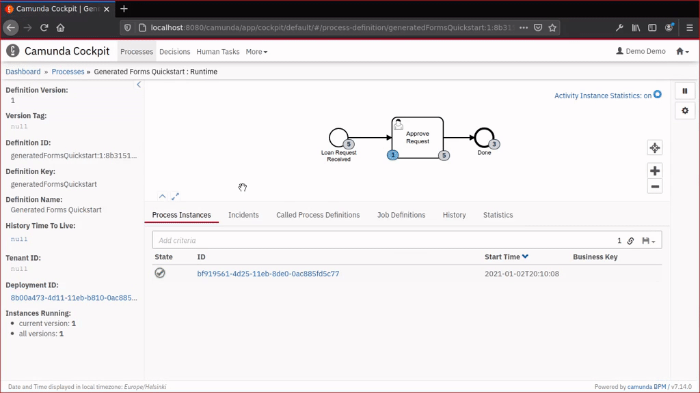
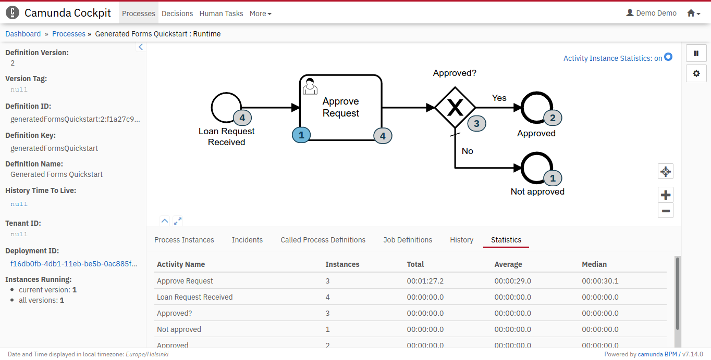
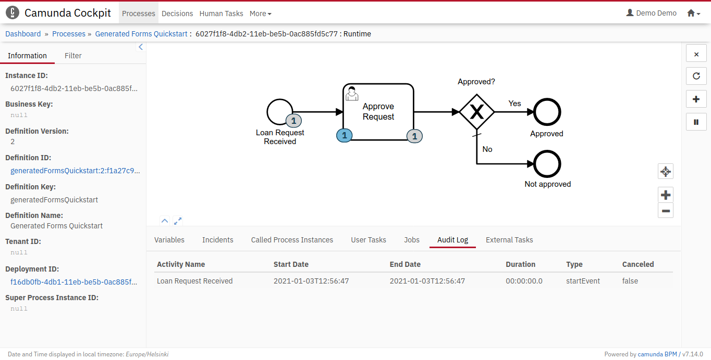
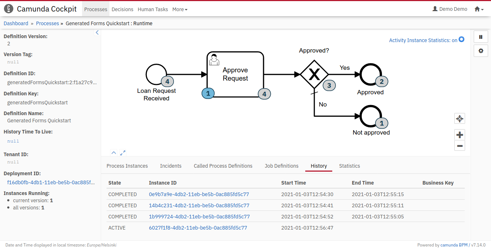
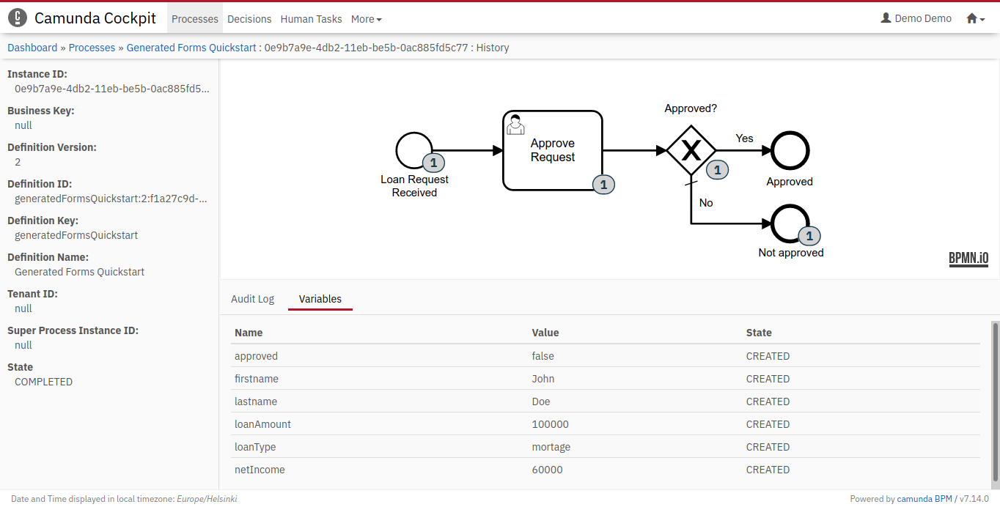

Year 2020 was a good year to learn business process automation possibilities with BPMN and [Camunda](https://camunda.com/) – an open-source workflow and decision automation platform. Not only were the related conferences online and free to attend, but good feature releases made the Camunda platform easier to adopt and extend.

A possible challenge in starting business process automation with Camunda BPM is, that its free and open source user interfaces are limited to show only running/uncompleted process instances. Once process instance has been completed, or it has been canceled, it disappears from Camunda user interfaces (unless you have subscribed to their commercial enterprise version).

Lucky us, thanks to the [new plugin plugin system introduced in Camunda BPM 7.14.0](https://camunda.com/blog/2020/08/all-new-frontend-plugin-system-for-cockpit-starting-with-camunda-bpm-7-14/), it is now easier than ever to [make at least some process history visible](https://github.com/datakurre/camunda-cockpit-plugins/) also in the open source version:



I am sure that [my plugins](https://github.com/datakurre/camunda-cockpit-plugins/) are far cry from the official commercial offerings (which I have never seen or used myself). Yet, I believe that, even in their initial state, they should smooth the experience of getting started with BPMN based ["hyperautomation"](https://en.wikipedia.org/wiki/Robotic_process_automation#Hyperautomation) and Camunda BPM.


Try out the plugins
-------------------

The easiest way to try my plugins yourself, is probably the new [Camunda BPM Run](https://docs.camunda.org/manual/latest/user-guide/camunda-bpm-run/) -distribution.

At first, download and unpack the distribution:

```bash
$ curl -LO https://downloads.camunda.cloud/release/camunda-bpm/run/7.14/camunda-bpm-run-7.14.0.tar.gz
$ tar xzvf camunda-bpm-run-7.14.0.tar.gz
```

Next, download a simple example process model:

```bash
$ curl -L https://raw.githubusercontent.com/camunda/camunda-bpm-examples/master/usertask/task-form-generated/src/main/resources/loanApproval.bpmn -o configuration/resources/loanApproval.bpmn
```

Now, prepare a temporary directory structure for the plugin:

```bash
$ mkdir -p META-INF/resources/webjars/camunda/app/cockpit/scripts/
```

Then, download the built versions of my plugins (at the time of this writing):

```bash
$ curl -L https://raw.githubusercontent.com/datakurre/camunda-cockpit-plugins/825566a3544f637225140bff14aa23ca84843194/definition-historic-activities.js -o META-INF/resources/webjars/camunda/app/cockpit/scripts/definition-historic-activities.js
$ curl -L https://raw.githubusercontent.com/datakurre/camunda-cockpit-plugins/825566a3544f637225140bff14aa23ca84843194/instance-historic-activities.js -o META-INF/resources/webjars/camunda/app/cockpit/scripts/instance-historic-activities.js
$ curl -L https://raw.githubusercontent.com/datakurre/camunda-cockpit-plugins/825566a3544f637225140bff14aa23ca84843194/instance-route-history.js -o META-INF/resources/webjars/camunda/app/cockpit/scripts/instance-route-history.js
$ curl -L https://raw.githubusercontent.com/datakurre/camunda-cockpit-plugins/825566a3544f637225140bff14aa23ca84843194/config.js -o META-INF/resources/webjars/camunda/app/cockpit/scripts/config.js
```

**UPDATE 2022-06-18:** For the latest plugin version, instead, use:

```bash
$ curl -L https://raw.githubusercontent.com/datakurre/camunda-cockpit-plugins/master/definition-historic-activities.js -o META-INF/resources/webjars/camunda/app/cockpit/scripts/definition-historic-activities.js
$ curl -L https://raw.githubusercontent.com/datakurre/camunda-cockpit-plugins/master/instance-historic-activities.js -o META-INF/resources/webjars/camunda/app/cockpit/scripts/instance-historic-activities.js
$ curl -L https://raw.githubusercontent.com/datakurre/camunda-cockpit-plugins/master/instance-route-history.js -o META-INF/resources/webjars/camunda/app/cockpit/scripts/instance-route-history.js
$ curl -L https://raw.githubusercontent.com/datakurre/camunda-cockpit-plugins/master/robot-module.js -o META-INF/resources/webjars/camunda/app/cockpit/scripts/robot-module.js
$ curl -L https://raw.githubusercontent.com/datakurre/camunda-cockpit-plugins/master/config.js -o META-INF/resources/webjars/camunda/app/cockpit/scripts/config.js
```

Finally, update the webapps with these plugins:

```bash
$ jar uf internal/webapps/camunda-webapp-webjar-7.14.0.jar META-INF
```

and start Camunda:

```
$ bash start.sh
```

That's it.

Since these are completely front-end plugins running on the browser, they should not have any side-effects for the process engine itself. Also, [the repository itself](https://github.com/datakurre/camunda-cockpit-plugins/), could work as an example for developing plugins with ReactJS in TypeScript (filenames are subject to change):

* `definition-historic-activities.js` plugin bundle adds diagram badges for the 100 latest activities from Camunda process history on the currently viewed process definition, and a new Statistics tab to show some statistics from those activities. The limit of 100 latest activities is just a safe guess, usually enough for learning purposes (and subject to be increased and removed once the plugin evolves)
  

* `instance-historic-activities.js` plugin bundle adds diagram badges for all historic activities on the currentlty viewed process instance, and a new Audit Log tab to show same data from the completed activitites

  

* `instance-route-history.js` plugin bundle adds a new History tab on process definition view to list the 100 latest historic process instances for the currently viewed process definition and a link to open those instances (even the completed ones) for a limited process instance view (with the diagram and some information tabs)

  
  

* finally `config.js` is an example Camunda Cockpit plugin configuration with configuration to enable the above plugin bundles.

For questions, please, just open [a new issue](https://github.com/datakurre/camunda-cockpit-plugins/issues) or [a new dicussion thread](https://forum.camunda.org/).
