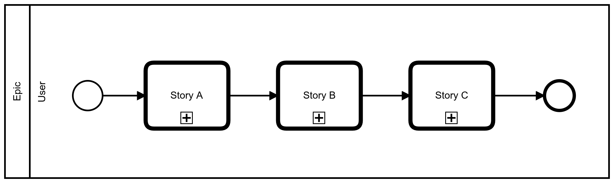
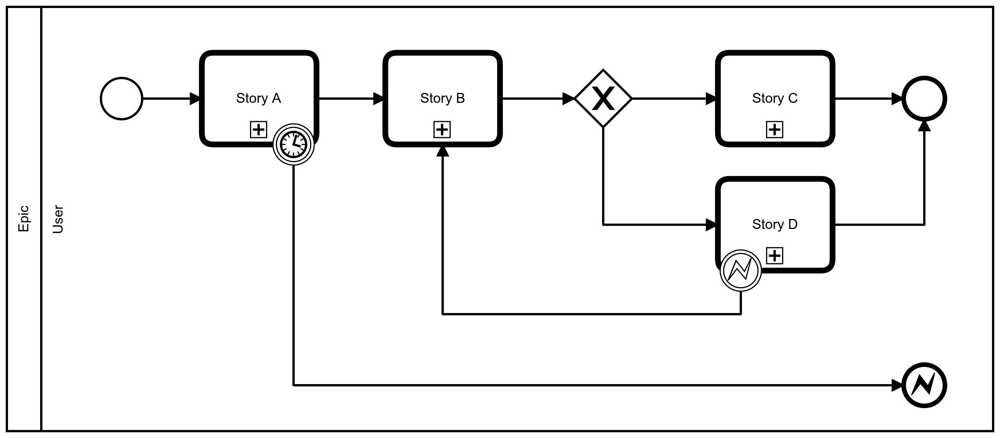
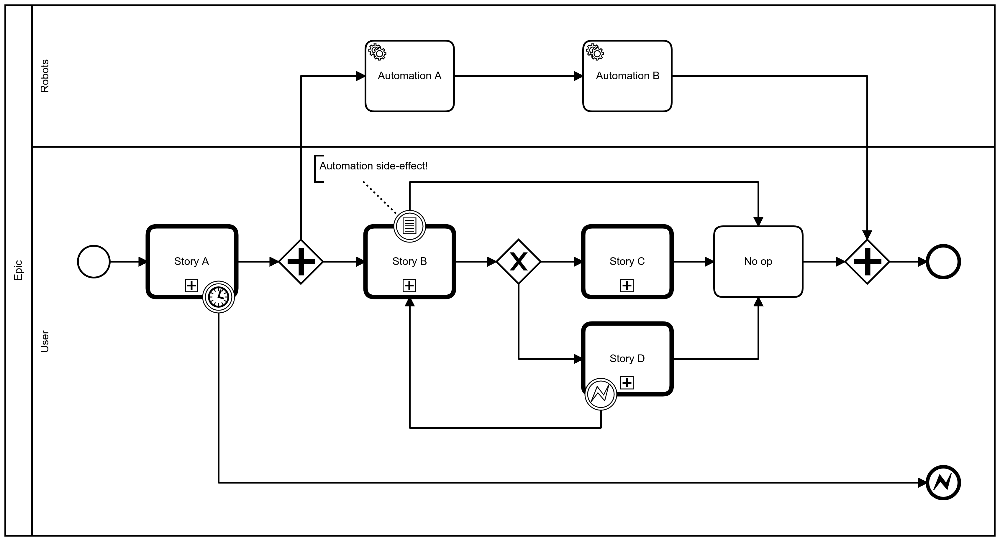
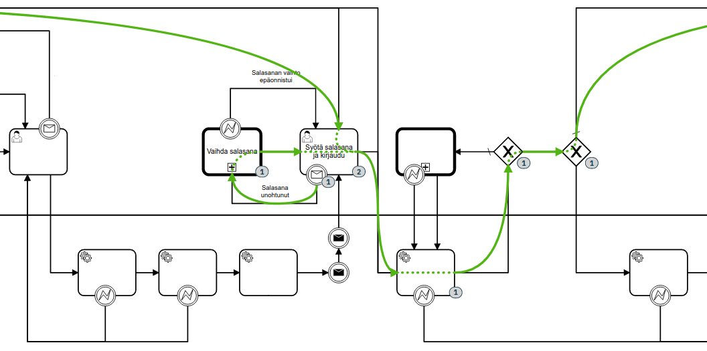

Many user stories start simple. For example: “A user self registers into a course”.
The final version, of course, tend to be more like: “A new user, after being verified to be an authentic real person, creates their new user account, immediately forgets and resets their new password, finally logs into the system, finds the course again, completes payment for the registration, and is then eventually enrolled into the course.” This is no longer a user story, but a series of stories supposed to be completed in a specific sequence. Let's call these user epics.

Individual user stories, by their definition, should be relatively straightforward to implement. For example, a stereotypical user story may require interaction with specific user interface element to start the story, following one or more views to gather the required user input to continue the story, finally ending with user's goal for the story. Where did the user come from, or where does the user continue afterwards, is simply not part of the story. On purpose.

But user epics are different.

An implementation of a user epic must know where the user came from, and must be able to decide, which stories the user should be guided to complete next. Epic should also cover the consequences of user failing to complete a story, or completely abandoning their fate. Therefore implementing an epic is not only about managing state, but also about programming the often complex business logic. Both being among the least fun parts of software development.

As an insult to injury, less and less are users doing their work alone, more and more they are being accompanied by various forms of automation. So, not only should an implemented epic be aware of the actions of its user, but it should also be able to react on known results or side effects of automation – anything from synchronous function calls to asynchronously executed software robots.

With just code, implementations for this kind of epics could get dirty and hard to understand, fast.

Offloading state and logic to BPMN engine
-----------------------------------------

It's not a coincidence that my example user epics above are drawn as BPMN diagrams. That's what I have been doing for the last couple of months in our latest project. We had to modernize a process, where users were found to require a lot of hand-holding to be able complete all the required steps and in the right order.

Also, with the previous implementation, when users got lost in the middle of their epics, or an unexpected system error blocked them, it was often surprisingly hard to figure out what really had happened.

This time all this should be different.

Whenever a user starts a new epic, a new BPMN modeled process is being started. The model may be as long and complex as needed. It may even be a composition of multiple nested models, resulting in an arbitrarily deep process tree when executed. But this is not a problem, because this is exactly what dedicated BPMN process execution engines have been built for.

**The fun part:** With a BPMN engine executing our user epics directly from their BPMN models, we don't really need to “implement” them at all. Instead, we:

1. Implement user interface routes and views for individual user tasks.
2. Make the views to read their preconditions from the process engine state.
3. Eventually complete the task at the engine (with user input when required).
4. Poll the engine for the next available task and redirect the user there.

Now our user task views are standalone, with no magical dependencies between them to code and maintain.

Plone, Volto and Camunda FTW
----------------------------

I would not be writing this, unless all the above could not be implemented by using open source software only:

* Because every application seems to need a CMS (sooner or later), we build on top of [Plone](https://plone.org/), the open source CMS we trust. Thanks to its powerful and complete [REST API](https://plonerestapi.readthedocs.io/), we can do all the integrations we need with just HTTP requests – no need to know about Plone internals.

* For modern user experience, we use [Volto](https://volto.plone.org/) – ReactJS based web experience on top of Plone REST API (with [Razzle](https://razzlejs.org/) based server side rendering support). Every part of Volto is easily [customizable](https://docs.voltocms.com/) and [extensible](https://docs.voltocms.com/addons/). For example, [custom server side routes](https://docs.voltocms.com/recipes/express/), like the ones we need to authorize and proxy calls to BPMN engine, are common and well documented use case.

* Finally, for the BPMN engine, we choose [Camunda BPM Community Edition](https://camunda.com/download/). While the open source version of Camunda is probably missing countless convenient features of their enterprise offering, its BPMN engine and [REST API](https://docs.camunda.org/manual/latest/reference/rest/) come uncompromised.

Thanks to all above, it's not a (technical) problem at all that users tend to forget their passwords just after sign up. Now the process engine remembers were they came from, and what they were supposed to do, just after resetting their password one more time...

