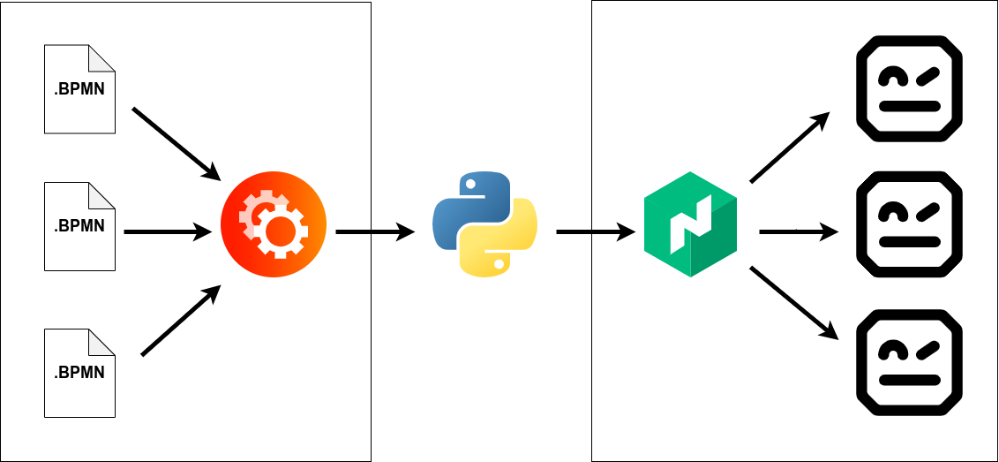
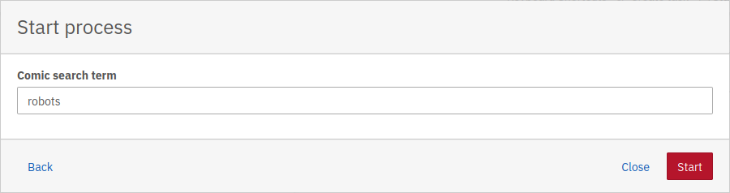
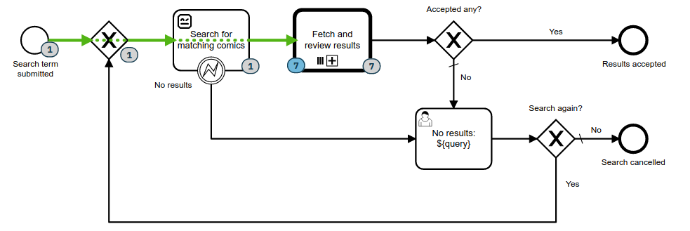
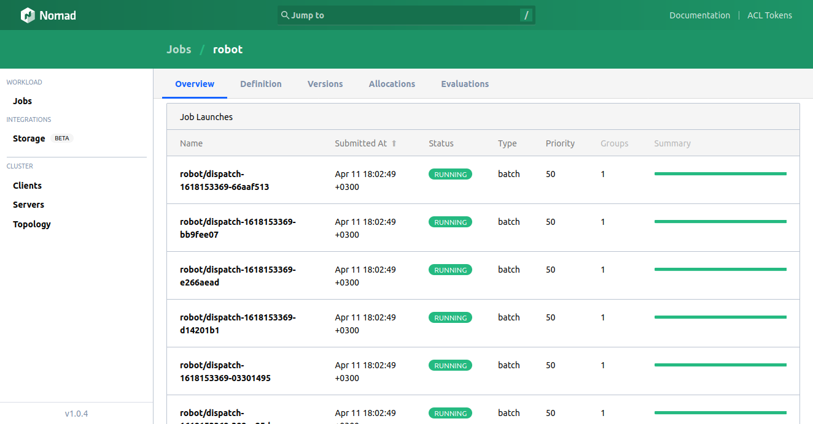
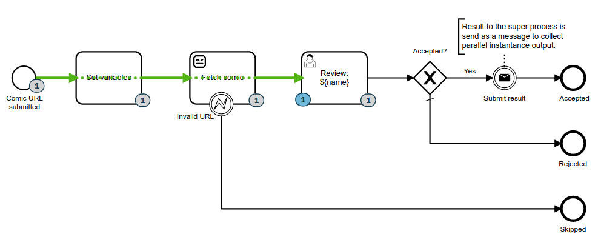
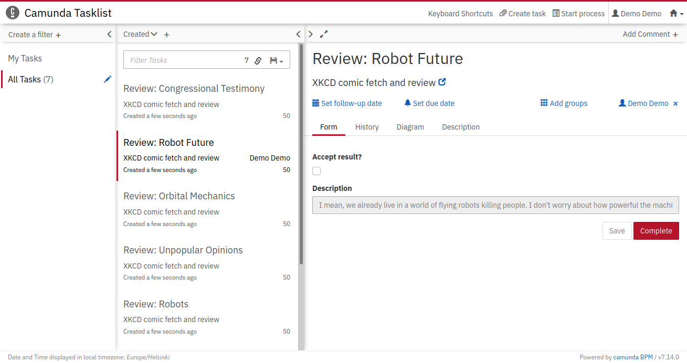
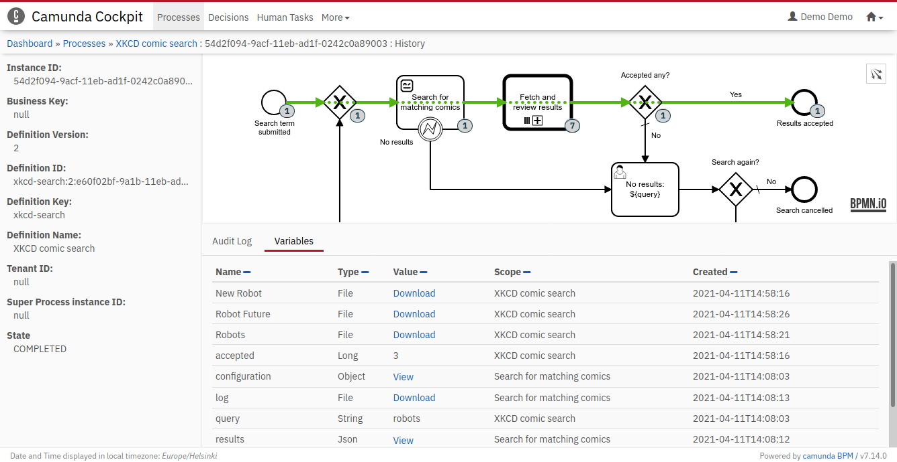
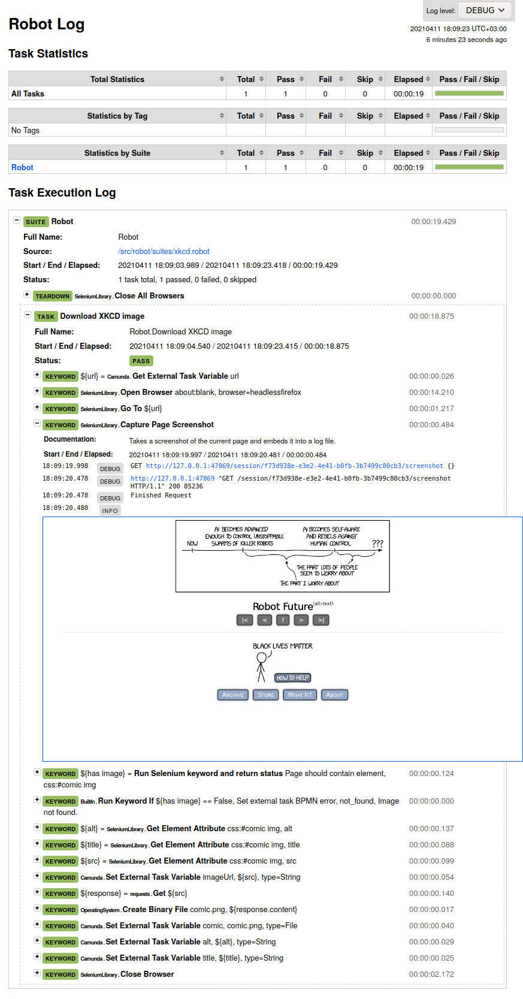

RPA, *Robotic Process Automation*, is a fancy marketing term for executing glue code between two systems, which may have not been designed to communicate with each other otherwise.

Last year, a well-kept secret in that field was revealed by new automation startup [Robocorp](https://robocorp.com): There exists a solid open source solution with hard working community for software automation. For the last then years [Robot Framework](https://robotframework.org) has been used and extended to automate everything imaginable. Thanks to Robocorp, there are now both [awesome documentation](https://robocorp.com/docs/) and [accessible tooling](https://robocorp.com/products/) for anyone to become a "software robot developer".

But when automation is part of a business process, it should not happen in isolation. Another open source software, [the community edition of Camunda BPM](https://camunda.com/download/) – workflow and decision automation platform, has been built especially with unlimited process automation possibilities in mind. When a manual information process has been digitalized with BPMN, and made executable with Camunda, it is possible to gradually automate it with various technologies, including RPA.

Orchestrating swarms of bots
----------------------------

At the last [Robocon.io](https://robocon.io/), annual Robot Framework community event, there was [a talk](https://robocon.io/#robotframework-camunda-library:-orchestrating-robotic-tasks-with-camunda) and [a demo](https://github.com/TheProjectAurora/camunda-robotframework-demo/) about orchestrating fleets of Robot Framework RPA bots with Camunda. Since we have been adopting Camunda for some use cases lately, the examples from Robocon got me inspired to think about: What would be my dream Robot Framework RPA orchestration setup with Camunda...

Currently, we are still using [Jenkins](https://www.jenkins.io/) for executing Robot Framework and Python automation tasks, most of them being part of [Plone CMS](https://plone.com/) based document workflows. But in the future, I'd fancy to have something more close to our other infrastructure. And that'd mean using [Nomad](https://www.nomadproject.io/):

Nomad is a generic workload scheduler, which can deploy and manage both containers and non-containerized code across various environments. Thanks to its first party integration with [Consul](https://www.consul.io/), which we use for service discovery, and [Vault](https://www.vaultproject.io/), which we use for secrets management, Nomad could give our Robot Framework bots access to everything they need for fluent automation.

Proof-of-concept
----------------

To try out the concept, let's dream of a fictive process for searching illustrative comics about some topic:

The main process starts with a search term to look for comics. The process executes a Robot Framework bot with a real web browser for Google search to find out the matching results.

Then, some real BPMN magic happens: A parallel multi-instance task *Fetch and review results* triggers a dedicated sub process for each result to actually fetch the image with another Robot Framework RPA bot. That'd results a swarm of bots, depending the amount of results for the given term.

The sub process ends with a human review task whether to submit the result back to the main process or not.

Finally, after all results have been reviewed and those sub processes completed, the main process receives all the accepted results. History of every step and the final result remain available for configurable period of time for later review and further usage.

Robot Framework provides detailed step-by-step execution logs of each completed automation. All this saved nicely together with the process execution history at Camunda.

Imagine what could be done with this feature set…

…or try it yourself
-------------------

The above proof of concept implementation of my idea for Camunda Nomad Robot Framework RPA orchestration is publicly available and can be tried out with Docker Compose by following the instructions at: https://gitlab.com/vasara-bpm/camunda-nomad-client/
