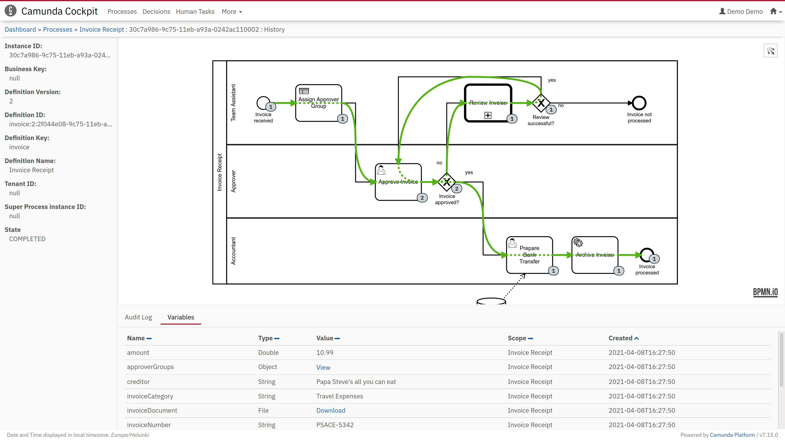
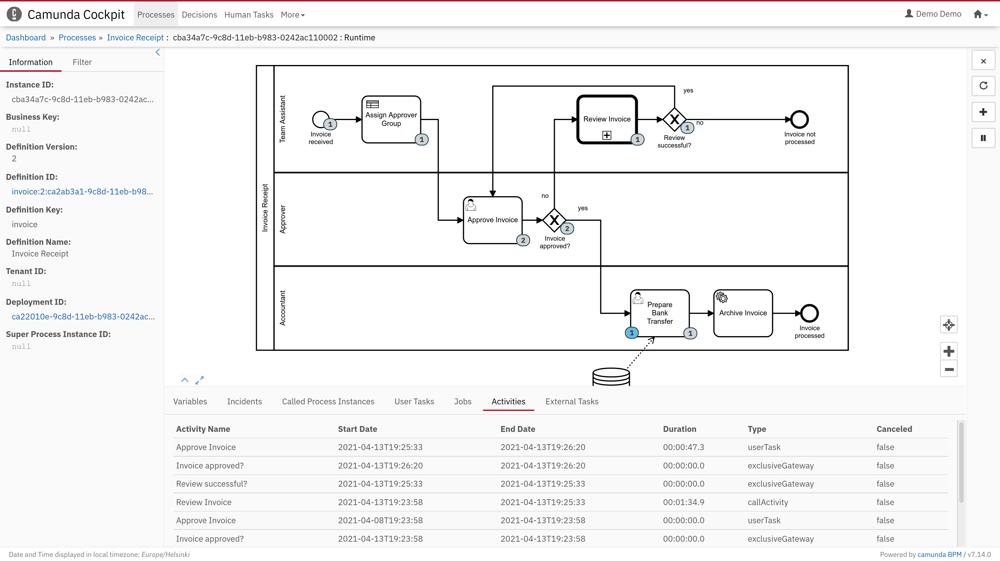
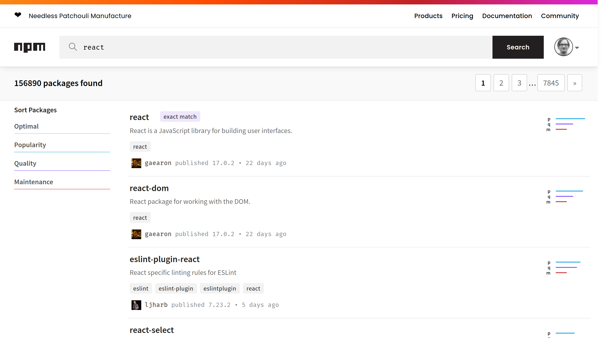
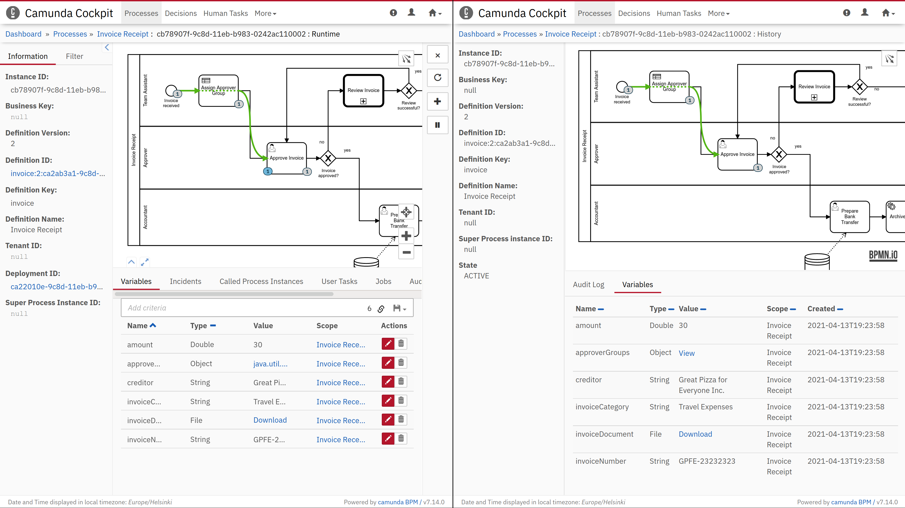
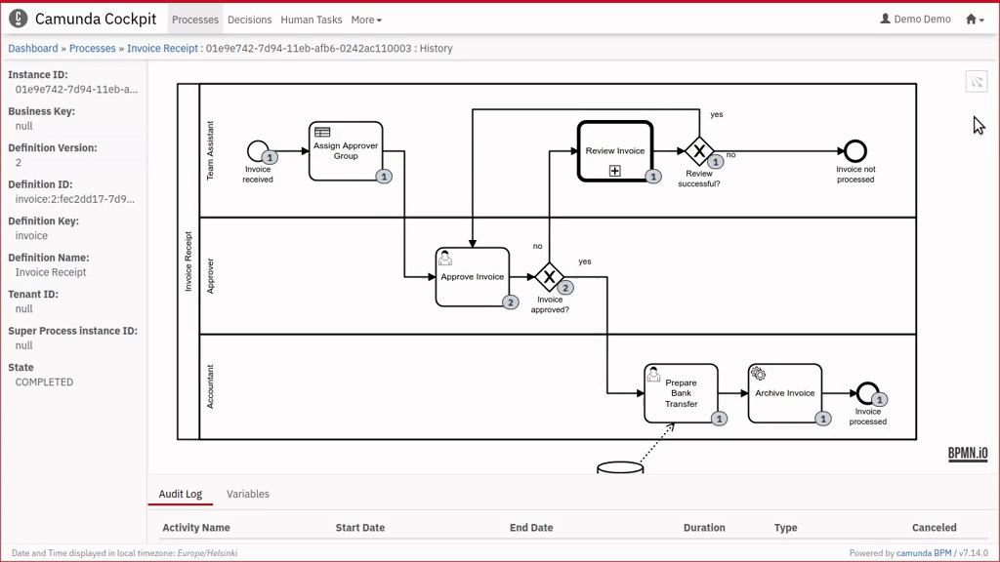

For the last few months, I've been steadily developing [an open source “history plugin” for Camunda Community Edition Cockpit](https://github.com/datakurre/camunda-cockpit-plugins/). Obviously a very basic one, but one that's growing and learning Camunda with me. This is a small writeup on how it came to be.

*The plugin includes a custom "history route" for browsing completed processes.*

Camunda BPM 7.14 was the first Camunda Platform release with [the new frontend plugin system](https://docs.camunda.org/manual/latest/webapps/cockpit/extend/plugins/). Around the time of its release, in October 2020, I was still polishing up our first real Camunda-based project production ready. Because the project included its own simple user interface, I was not too worried about the limitations of the Community Edition of Camunda Cockpit. Besides, we had already implemented some process history visualization on our application with [bpmn-js](https://bpmn.io/toolkit/bpmn-js/) and [Camunda REST API](https://docs.camunda.org/manual/latest/reference/rest/). Still, I knew that new use cases with new requirements would come soon...

In late November, a Camunda tutorial on [How to Build a Camunda Cockpit Plugin](https://www.youtube.com/watch?v=BwsoozZRAqo) release at Youtube coincided with our team's "hack day" at work. If that was not a sign, I don't know what is. I had some prior experience on Camunda history REST API and bpmn-js already, and I was able to complete a functional first version already on that same day. That was a pleasant experience!

[The first commit](https://github.com/datakurre/camunda-cockpit-plugins/commit/1acea4c95340b0f42e433c1e13d1497400e45ac4) to the public GitHub repository came soon after. The first version had no frameworks, no architecture – just plain JavaScript, and me copying and pasting code around like there was no tomorrow. After all, technically it was already four separate plugins: two tab plugins and two diagram overlay plugins. All having at least some overlapping code.

*The first version, written in plain JavaScript, included historical tokens on diagrams and minimal activity audit log for running processes.*

But those first versions were only able to augment views for running processes. They were completely missing the main thing: Historical route and view for completed processes. And there my learning curve and progress went Z-shaped.

So far, it had been enough to render gray tokens and a table: little HTML and some CSS. Simply copying the HTML structure and CSS class names from the default views got me far enough. But for the history view I had to provide everything from draggable panels to BPMN rendering myself. Of course, that was also the opportunity. I had my MVP, now I could do it right.

*Converting plain JavaScript prototype into ReactJS application involves choosing the right packages from more than 156890 options.*

I started my rewrite by looking into re-using the bundled user interface components in Camunda. I soon found out that there really is a component library called [camunda-commons-ui](https://github.com/camunda/camunda-bpm-platform/tree/master/webapps/camunda-commons-ui), but with big warning letters about it being subject to change at any time. I was more into [ReactJS](https://reactjs.org/) and [TypeScript](https://www.typescriptlang.org/) anyway, so I hide my experiments on calling those AngularJS widgets from my plugins, and went to crawl npm registry for [components for the replacement widgets](https://github.com/datakurre/camunda-cockpit-plugins/blob/7e2d5ae4004da25865365f91e64af46ff4db01a8/package.json#L18).

*Spot the differences and missing features between official view using AngularJS components (on the left), and the custom "history view" re-implementing everything with ReactJS components (on the right).*

Next up was the building and bundling challenge. One does not simply declare dozens of ReactJS components and SVG icons as dependencies for a Cockpit plugin and expect them to work by magic. I decided to bundle my plugins, and their dependencies into easily distributable standalone plugin scripts – not only including the compiled JavaScript code, but also the required CSS styles. For bundling, tried both [Webpack](https://webpack.js.org/), which I was familiar before, and [Rollup](https://rollupjs.org/), which was [the featured bundler option on Camunda blog](https://camunda.com/blog/2020/08/all-new-frontend-plugin-system-for-cockpit-starting-with-camunda-bpm-7-14/). Rollup was the winner in this contest, and hopefully [the Rollup configuration for my plugin](https://github.com/datakurre/camunda-cockpit-plugins/blob/7e2d5ae4004da25865365f91e64af46ff4db01a8/rollup.config.js) will help others with similar requirements.

Once the rewrite was done, it has been easy to return to the project every now and then, to implement features I've considered helpful for my use of Camunda. Maybe the most interesting feature so far has, been adding the curved green highlight for the executed path, as inspired by Nico Rehwaldt's [camunda-playground](https://github.com/nikku/camunda-playground). The current implementation is not flawless, but for me it has been good enough for giving a visual overview of the execution, with just a glance.

*The plugin can highlight the executed path in the process. At least in quite many of the cases…*

That's the story of the open source “history plugin” for Camunda Cockpit so far. The plugin is [publicly available at GitHub](https://github.com/datakurre/camunda-cockpit-plugins/), and it supports currently Camunda Platform 7.14.0 and 7.15.0. The plugin is easy to try out with the official Camunda Platform Docker images, and hacking it further should not be much harder.

