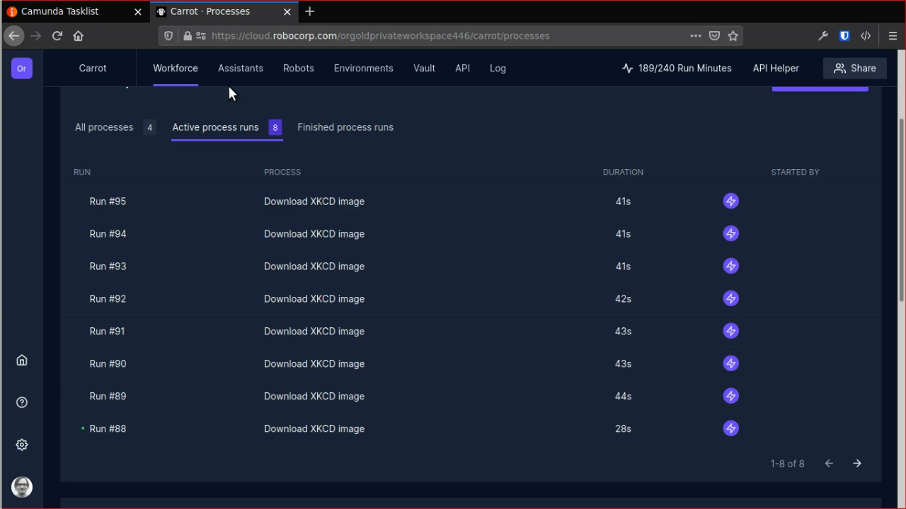
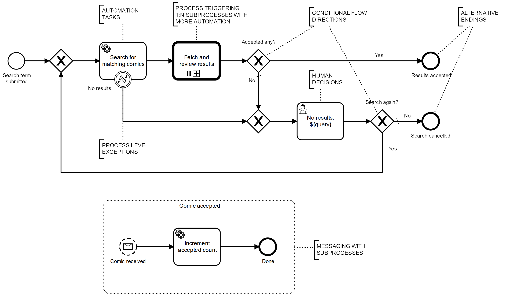
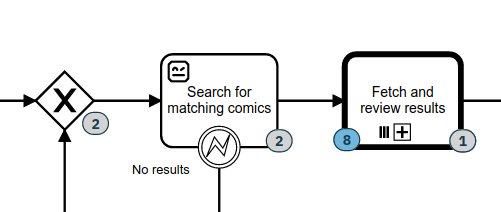
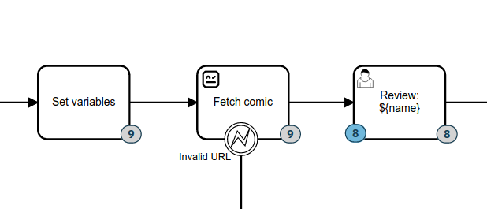
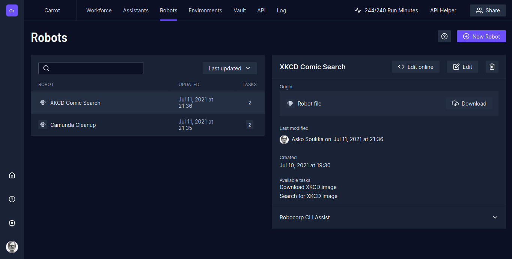
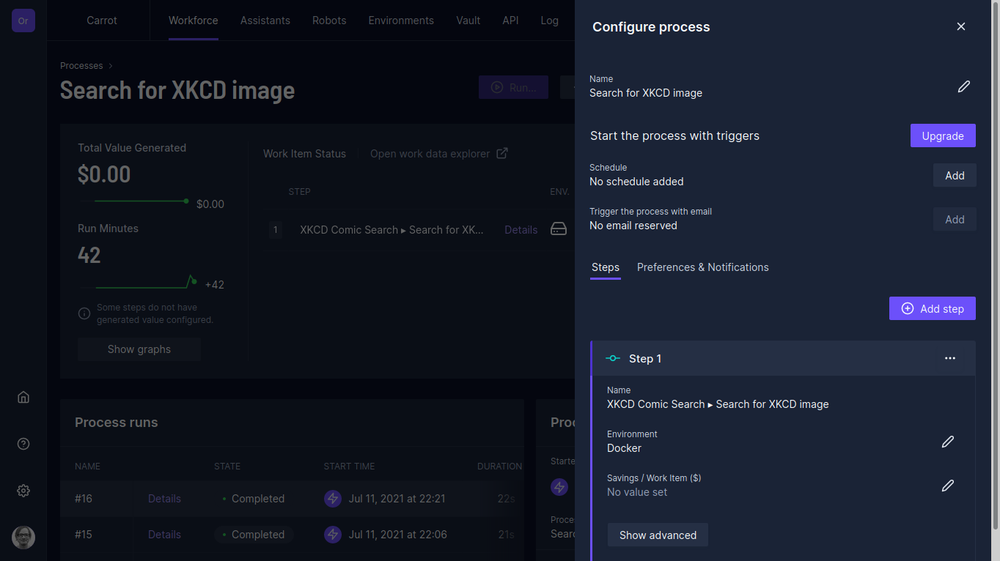
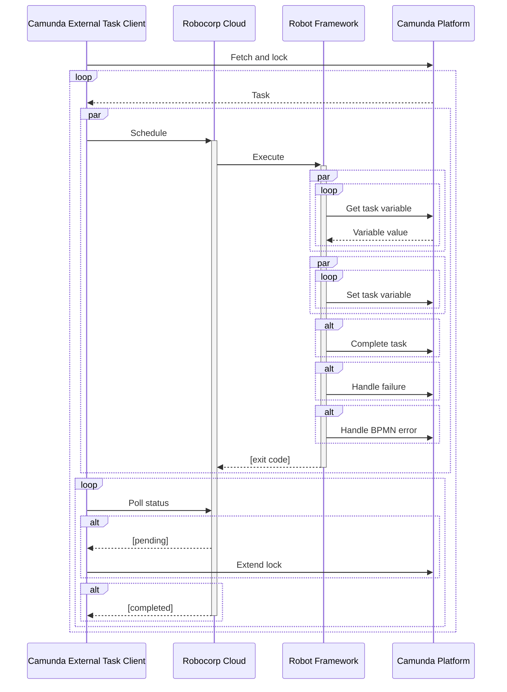
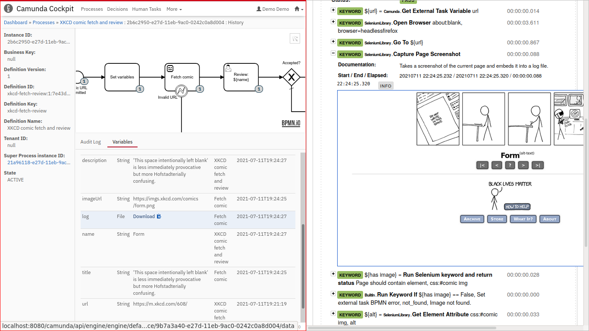

[Robocorp Cloud](https://robocorp.com/docs/robocorp-cloud/overview) is a commercial automation bot orchestration service by [Robocorp](https://robocorp.com/). It differentiates itself from the others by promoting license free open source automation solutions based on [Robot Framework](https://robotframework.org/). I am mostly excited by their contributions to open source Robot Framework ecosystem (e.g. [RPA Framework](https://rpaframework.org/), [Xeus-Robot](https://github.com/jupyter-xeus/xeus-robot) and their [training material](https://robocorp.com/docs/courses). Yet, [every now](https://datakurre.pandala.org/2020/07/camunda-robocloud/) and [then](https://datakurre.pandala.org/2020/07/camunda-run-robocloud-setup/), I try to update my knowledge on how their main product works.

Right now, most of the [Robocorp products](https://robocorp.com/docs/robocorp-cloud/overview) and documentation seem to focus on building and running software robots. But I doubt those robots run in isolation. Instead, they probably have their own activites to complete in (more or less) digitized business processes. And that's why I've been working hard to learn [BPMN 2.0](https://en.wikipedia.org/wiki/Business_Process_Model_and_Notation) and [Camunda Platform](https://camunda.com/products/camunda-platform/): I desire to be able to smoothly and transparently integrate automation bots with digitized business processes.

Also Robocorp Cloud does compose of robots into higher level “processes”. But those processes are *just* linear series of steps with access to shared process variables (“work item” in RPA terms). While they are definitely useful, they are far cry from processes which can be modeled with BPMN.

From a BPMN process…
--------------------

To showcase Camunda Platform with Robocorp Cloud (especially [Robocorp Control Room](https://robocorp.com/products/control-room/)), we need to have an example process showcasing many of the features available when digitizing process using BPMN. Even better, if the example was easy enough to understand and fun to try out…

Say hello to my automated **XKCD Comic Search** process:

The process is about searching popular [XKCD comic](https://xkcd.com/) strips with a given search term, fetch the results, and then let a real person do final review for each comic.

The process involves fair amount of [BPMN features](https://camunda.com/bpmn/), including:

* exclusive gateways for conditional process flow
* service tasks for delegating automated tasks for bots
* multi-instance activity for triggering 1:N concurrent subprocesses
* BPMN messaging between the root process and its subprocesses
* business process level exception handling
* alternative process specific end states
* user tasks for manual process activities

BPMN 2.0 can model all this and more. Camunda Platform, on the other hand, is well capable of executing the process. In addition, Camunda provides good enough APIs to fetch and delegate external tasks in the process to available software robots.

…to Robocorp Cloud processes
----------------------------

The example process includes two external tasks to be automated:

* **Search for matching comics** task in the beginning of the main process expects [a robot to do a search for matching XKCD comics](https://github.com/datakurre/carrot-executor/blob/6577d32c9c8eec66a949573c09fc83bc0cd582ec/robot/xkcd.robot#L26) and pass along a list for URLs to the candidates.

  
   

* **Fetch comic** task deep inside **Featch and review results** activity expects [a robot to fetch a single comic](https://github.com/datakurre/carrot-executor/blob/6577d32c9c8eec66a949573c09fc83bc0cd582ec/robot/xkcd.robot#L53) and pass it along for a review.

  
   

Configuring Robocorp Cloud bots for these Camunda tasks require the following steps, or something alike:

1. [Building and packaging a robot](https://robocorp.com/docs/setup/robot-structure). Or multiple robots. Defining a convenient way to package and distribute Robot Framework robots is one of many achievements by Robocorp. In this case, it makes sense to implement all required steps in [a single robot bundle](https://github.com/datakurre/carrot-executor/tree/main/robocloud/xkcd-bot/).

2. Building and registering [a Robot Workforce Agent](https://robocorp.com/docs/robocorp-cloud/robot-workforce). On-premises Camunda deployment, in practice, requires on-premises Robot Framework agents for convenient and secure communication between robots and Camunda. With [Camunda Cloud](https://camunda.com/products/cloud/) it might be possible to solely use Robocorp Cloud agents instead, but that would be a completely different story…

   

   Note that Robocorp does provide [a Dockerfile and instructions](https://robocorp.com/docs/robocorp-cloud/robot-workforce/setting-local-container) for building [and customizing](https://github.com/datakurre/carrot-executor/blob/6577d32c9c8eec66a949573c09fc83bc0cd582ec/robocloud/Dockerfile#L16) these on-premise agents.

3. Defining a Robocorp Cloud workforce processes to bind the executable robot tasks from robot packages with the registered workforce runtime environment agents.

   

   One for each external task in our BPMN process.

   

Try to not confuse Camunda processes with Robocorp Cloud workforce processes. Camunda executes the business process defined in BPMN. Robocorp Cloud workforce process can be thought more like configuration concept for binding specific robot tasks to be executed with specific agent runtime environments.

Workforce processes should work well allocating and monitoring computing resources for robot usage and configuring allowed concurrency for particular tasks. They could also be used to bridge on-premises workforce agents with cloud ones.

And the glue code to connect their APIs
---------------------------------------

So, how does all this really work out? Camunda Platform and Robocorp Cloud do not just magically interconnect, yet, but they do have APIs for that. [Camunda external Task API](https://docs.camunda.org/manual/latest/reference/rest/external-task/) can be used to fetch pending tasks, which then can be passed forward to [Robocorp Process API](https://robocorp.com/docs/robocorp-cloud/api/process-api). (Note: At the time of writing, Robocorp Cloud's APIs arenot included in their free tiers.)

Obviously, there are many possible technical ways to actually implement the integration. This is [my current approach](https://pypi.org/project/carrot-executor/):

 

Briefly explained:

1. A custom Camunda external task client fetches and locks pending external tasks from Camunda, schedules their execution at Robocorp Cloud, and keeps polling the Robocorp Process API and the task locked until its execution at Robocorp Cloud has been completed.

2. At Robocorp Cloud, a new workforce process run is triggered for each external task. Robocorp Cloud is responsible for choosing an available worker and controlling the execution.

3. Finally, a Robot Framework bot gets just enough external task details from its workforce process' “work item” to be able to fetch the task variables (including files) it needs directly from Camunda. The robot also sends the result variables back to Camunda by itself.

For convenience, the whole [robot run is wrapped](https://github.com/datakurre/carrot-executor/blob/6577d32c9c8eec66a949573c09fc83bc0cd582ec/robocloud/xkcd-bot/robot.yaml#L12) with a [special Robot Framework *listener library*](https://github.com/datakurre/carrot-executor/blob/main/lib/CamundaListener.py). That manages the completion or failing of the task, and submits its log files directly back to Camunda external task context.

With this approach, log files from automation bot executions are saved into related task contexts and preserved in Camunda process execution history. For both passing and failing executions. This makes the log files also available from Camunda Cockpit, and possibly saves the process owner from need to visit also Robocorp Control Room when in need for any bot execution details.

---

This work for integrating Camunda Platform with Robocorp Cloud (Control Room) is part of my [carrot-executor](https://github.com/datakurre/carrot-executor)-project (also [available at PyPI](https://pypi.org/project/carrot-executor/)). Just now, the documentation is still missing the parts for trying out this particular example, or trying it with Robocorp Cloud, but hopefully that comes soonish…

