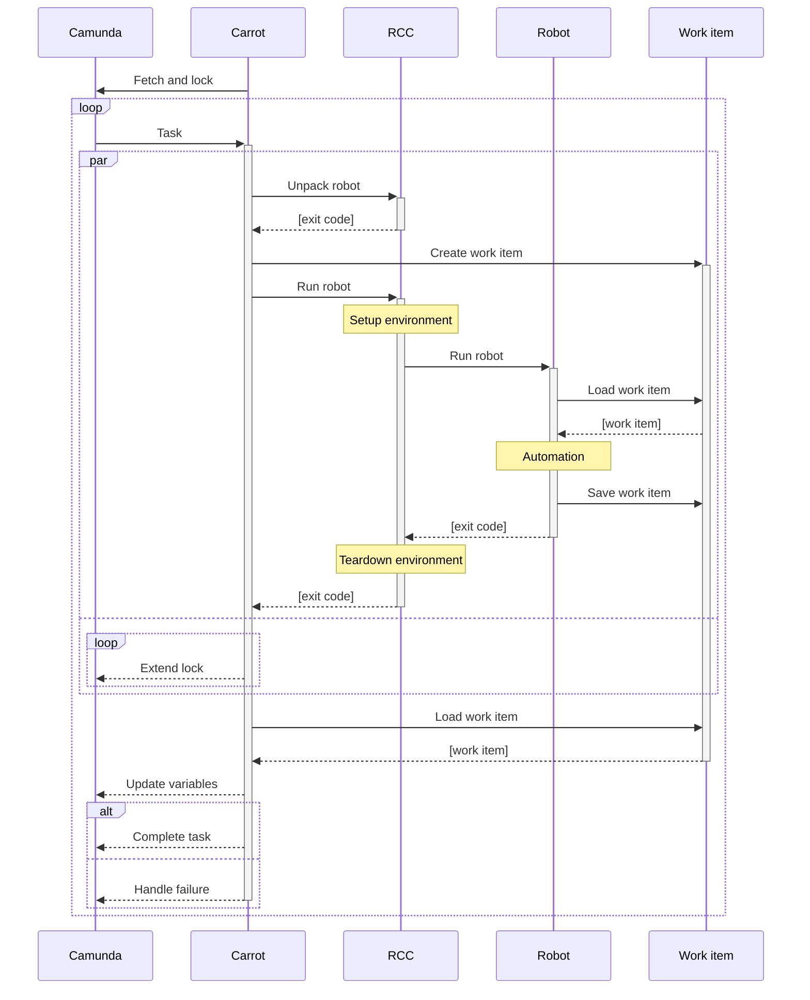

[On my previous post](../../07/camunda-robocorp-cloud-executor/), I shortly revisited [Robocorp](https://robocorp.com/) contributions to [Robot Framework RPA](https://robotframework.org/rpa/) ecosystem, and then tried out their [cloud](https://robocorp.com/docs/robocorp-cloud/overview) for orchestrating [Camunda Platform external task](https://docs.camunda.org/manual/latest/user-guide/ext-client/) bots. While re-learning their tools, I realised, I had overlooked their latest open-source contribution: [Robot Code Configuration toolchain](https://robocorp.com/blog/simplifying-python-based-automation-introducing-rcc/) (or simply RCC).

[RCC](https://robocorp.com/docs/rcc/overview) is a single-file binary command-line interface (CLI) tool to create, manage, and distribute Python-based self-contained automation bots. In addition, it can execute those bots and implicitly manage their runtime environments. By managing those runtime environments with [Micromamba](https://mamba.readthedocs.io/en/latest/), RCC gives bots access to [Conda](https://docs.conda.io/en/latest/) ecosystem. And that matters, because it makes the whole scientific Python and machine learning ecosystem available to the bots.

I've been trying to figure out the easiest possible way to demonstrate the power of Robot Framework in writing automation bots for Camunda Platform external tasks.

I decided to try, if I could finally achieve that with RCC.


carrot-rcc
----------

Meet [carrot-rcc](https://pypi.org/project/carrot-rcc/). It is my proof-of-concept RCC (and [camunda-external-task-js](https://github.com/camunda/camunda-external-task-client-js)) based external task client for Camunda Platform. It can even be installed by using just RCC. So, in practice, [RCC download](https://downloads.robocorp.com/rcc/releases/index.html) is its only real dependency.

Previously, I've been writing my example Robot Framework bots to interact directly with Camunda Platform. Now, with RCC, it suddenly makes more sense to write bots unaware of Camunda Platform. What if we could simply follow the [Robocorp documentation](https://robocorp.com/docs/) best practices for writing new bots, and they would then just work also for Camunda external tasks? That's what [carrot-rcc](https://pypi.org/project/carrot-rcc/) is about.


carrot-rcc is a small program (currently written for NodeJS with Python wrapper for PyPI distribution) that binds RCC-authored Robot Framework automation bots with Camunda external tasks. Briefly, it

* accepts any amount of zip-packaged bots on its startup

* reads `robot.yaml` files from those archives to collect names for all automation task they implement

* subscribes Camunda Platform for external task topics matching the tasks collected from `robot.yaml` files

* for each fetched external task, it then creates a [work item](https://robocorp.com/docs/development-guide/robocorp-cloud/data-pipeline) from its variables, executes the related bot with RCC and pushes saved work item back to Camunda Platform external task context variables – with the execution logs

* it also supports for [RPA framework secrets](https://rpaframework.org/libraries/robocloud_secrets/) by providing environment variables as `env` secret (to keep them out of logs)

* bot execution is done locally, multiple tasks in parallel, RCC using its Conda-power and implicitly managing their runtime dependencies

* finally, based on RCC exit status code, carrot-rcc either completes the task at Camunda or fails it, causing an incident to be raised at Camunda.



To be honest, I may never put this into production myself (I'm still looking forward for [Nomad based task scheduling](../../04/camunda-nomad-robotframework-rpa/)). I don't even know the limits of running RCC in parallel on the same machine. But I did have a lot of fun playing with carrot-rcc and Camunda myself for a demo...


Fleamarket submission demo
--------------------------

A new tool needs a new demo process. [On my previous post](../../07/camunda-robocorp-cloud-executor/) I described an example BPMN process doing a search for matching XKCD comics. While the updated example for that is available at the [carrot-rcc repository](https://github.com/datakurre/carrot-rcc), I also wanted to have something new.

[Fleamarket submission demo process](https://github.com/datakurre/carrot-rcc/tree/main/camunda/deployment) showcases all BPMN features from the comic search demo, but adds more [Robot Framework automated tasks](https://github.com/datakurre/carrot-rcc/tree/main/fleamarket-bot) and also a DMN based business decision task.

In the fleamarket submission demo process:


1. User submits a photo of items.

2. Items are detected from the photo using [YOLO v3](https://pjreddie.com/darknet/yolo/) deep neural network object detection. [^1]

3. For each detected item, a review subprocess is created.


4. The review starts by cropping the item from the original photo and assigning initial price for it by its recognized category (with a DMN-powered business task).

5. After the user has corrected the recognized data and accepted the item, it is submitted back to the main process.

6. Finally, at the main process, all accepted items are collected into a spreadsheet that is made available for the user to download.

There is [a silent recording](https://www.youtube.com/watch?v=Aqt6Z76r_YQ) available the show the process in action while carrot-rcc executes the related automation bots.


RCC bot dissected
-----------------

To make it convenient to build and distribute software automation bots with Robot Framework, Robocorp had to invent its own [software robot packaging format](https://robocorp.com/docs/setup/robot-structure). Or put simply, define convention for a zip file with configuration metadata, Robot Framework automation code and optional supportive resources. I think, they came up with a quite nice solution.

For an example, let's look into the [bot implementing all Fleamarket demo external tasks](https://github.com/datakurre/carrot-rcc/tree/main/fleamarket-bot).

**`./conda.yaml`** defines the [runtime requirements](https://robocorp.com/docs/setup/environment-control) for the bot:
```yaml
channels:
  - conda-forge

dependencies:
  - python>=3.8,<3.10
  - rpaframework=9.6.0
  - appdirs=1.4.4
  - py-opencv=4.2.0
```
In this case, the bot requires Python with [RPA Framework](https://rpaframework.org/), supportive [appdirs](https://pypi.org/project/appdirs/)-package and [OpenCV](https://opencv.org/) for running YOLO v3 object detection. And they all come from [conda-forge](https://anaconda.org/conda-forge) to ensure they work seamlessy together on all supported platforms.

**`./robot.yaml`** defines the [task configuration](https://robocorp.com/docs/setup/robot-yaml-format) for the bot:
```yaml
tasks:

  Extract items from photo:
    robotTaskName:
      Extract items from photo

  Crop image:
    robotTaskName:
      Crop image

  Create JSON array:
    robotTaskName:
      Create JSON array

  Update JSON object:
    robotTaskName:
      Update JSON object

  Save items to spreadsheet:
    robotTaskName:
      Save items to spreadsheet
```
A single bot may implement multiple tasks. Each task can be executed independently from each other. When used with carrot-rcc, `robot.yaml` is the place to bind Camunda Platform external task topics to Robot Framework automation tasks (defined in `tasks.robot`). In our example, Robot Framework task names match the external task topic names, but this is not a strict requirement. For example. `robot.yaml` mapping makes it possible to map the same Robot Framework task to multiple different external task topics.

In addition, `robot.yaml` has plenty of room for additional external task topic specific configuration. For example, in the future, we could add support for annotating tasks with their mandatory variables, and then `robots.yaml` could both configure Camunda Platform external task client to fetch only the required variables, and it could be used to generate [Camunda Modeler element templates](https://github.com/camunda/camunda-modeler/tree/master/docs/element-templates)...

**`./tasks.robot`** is the default Robot Framework task suite for the bot:

```robotframework
*** Settings ***

Library  RPA.Robocloud.Items
Library  RPA.Excel.Files
Library  Collections
Library  Image
Library  YOLO

*** Tasks ***

Extract items from photo
    Set task variables from work item
    ${items}=  Identify objects  ${input}
    Set work item variable  items  ${items}
    Save work item

Crop image
    Set task variables from work item
    ${filename}=  Crop image
    ...  ${input}  ${name}  ${x}  ${y}  ${width}  ${height}
    ...  output=${OUTPUT_DIR}
    Set work item variable  output  ${filename}
    Add work item file  ${OUTPUT_DIR}${/}${filename}
    Save work item

Create JSON array
    ${output}=  Create list
    Set work item variable  output  ${output}
    Save work item

Update JSON object
    Set task variables from work item
    ${keys}=  Get dictionary keys  ${b}
    FOR  ${key}  IN  @{keys}
      Set to dictionary  ${a}  ${key}  ${b}[${key}]
    END
    Set work item variable  a  ${a}
    Save work item

Save items to spreadsheet
    Set task variables from work item
    Create workbook  fmt=xlsx
    Set worksheet value  1  A  Item
    Set worksheet value  1  B  Price
    Set worksheet value  1  C  Image
    ${row}=  Set variable  2
    FOR  ${item}  IN  @{input}
      Set worksheet value  ${row}  A  ${item}[name]
      Set worksheet value  ${row}  B  ${item}[price]
      Insert image to worksheet  ${row}  C  ${${item}[filename]}  0.5
      ${row}=  Evaluate  ${row} + 1
    END
    Save workbook  ${OUTPUT_DIR}${/}items.xslx
    Set work item variable  output  items.xslx
    Add work item file  ${OUTPUT_DIR}${/}items.xslx
    Save work item
```
Please, note, how each task starts with `Set task variables from work item` and ends with `Save work item`. Use of these keywords is how carrot-rcc loads variables from Camunda Platform external tasks and saves added and modified variables back to the same external task context. While being fully consistent with Robocorp [work item documentation](https://robocorp.com/docs/development-guide/robocorp-cloud/data-pipeline).

It may surprise, how compact that single `tasks.robot` is, even it implements all the external task topics in our example process. That's because most the code has been abstracted into reusable Python keyword libraries. Two of them, `Image` and `YOLO`, being custom for this bot and distributed as [part of the same zip package](https://github.com/datakurre/carrot-rcc/tree/main/fleamarket-bot).

All this is thanks to the power and flexibility of Robot Framework.

[^1]: [My bot](https://github.com/datakurre/carrot-rcc/tree/main/fleamarket-bot) for the object detection uses the example models trained by the original author of YOLO v3 and therefore its recognition capabilities are limited by the objects known by those models. That said, the Internet is full of examples on how to train your own YOLO v3 models (it is just a lot of work).

