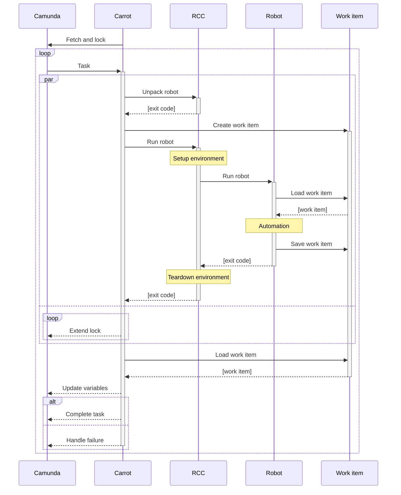
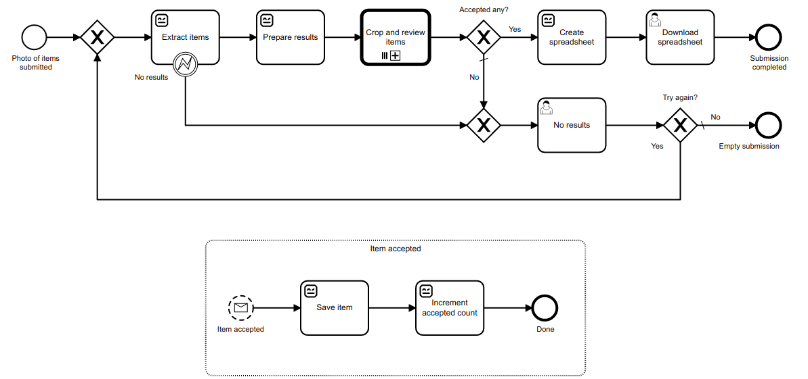
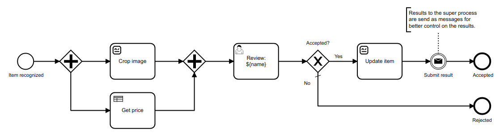

[On my previous post](../../07/camunda-robocorp-cloud-executor/), I shortly revisited [Robocorp](https://robocorp.com/) contributions to [Robot Framework RPA](https://robotframework.org/rpa/) ecosystem, and then tried out their [cloud](https://robocorp.com/docs/robocorp-cloud/overview) for orchestrating [Camunda Platform external task](https://docs.camunda.org/manual/latest/user-guide/ext-client/) bots. While re-learning their tools, I realised, I had overlooked their latest open-source contribution: [Robot Code Configuration toolchain](https://robocorp.com/blog/simplifying-python-based-automation-introducing-rcc/) (or simply RCC).

[RCC](https://robocorp.com/docs/rcc/overview) is a single-file binary command-line interface (CLI) tool to create, manage, and distribute Python-based self-contained automation bots. In addition, it can execute those bots and manage their runtime environments. By managing those runtime environments with [Micromamba](https://mamba.readthedocs.io/en/latest/), RCC gives bots access to [Conda](https://docs.conda.io/en/latest/) ecosystem. And that matters, because it makes the whole scientific Python and machine learning ecosystem available to the bots.

I've been trying to figure out the easiest possible way to demonstrate the power of Robot Framework in writing automation bots for Camunda Platform external tasks.

I decided to try, if I could finally achieve that with RCC.

carrot-rcc
----------

Meet [carrot-rcc](https://pypi.org/project/carrot-rcc/). It is my proof-of-concept RCC (and [camunda-external-task-js](https://github.com/camunda/camunda-external-task-client-js)) based external task client for Camunda Platform. It can even be installed by using just RCC. That should make [RCC download](https://downloads.robocorp.com/rcc/releases/index.html) its only real dependency.

Previously, I've been writing my example Robot Framework bots to interact directly with Camunda Platform. Now, with RCC, it suddenly makes more sense to write bots unaware of Camunda Platform. What if we could simply follow the [Robocorp documentation](https://robocorp.com/docs/) best practices for writing new bots, and they would then just work also for Camunda external tasks? That's what [carrot-rcc](https://pypi.org/project/carrot-rcc/) is about.

carrot-rcc is a small program (currently written for NodeJS with Python wrapper for PyPI distribution) that binds RCC-authored Robot Framework automation bots with Camunda external tasks. Briefly, it

* accepts any amount of zip-packaged bots on its startup

* reads `robot.yaml` files from those archives to collect names for all automation task they implement

* subscribes Camunda Platform for external task topics matching the tasks collected from `robot.yaml` files

* for each fetched external task, it then creates a [work item](https://robocorp.com/docs/development-guide/robocorp-cloud/data-pipeline) from its variables, executes the related bot with RCC and pushes saved work item back to Camunda Platform external task context variables – with the execution logs

* bot execution is done locally, multiple tasks in parallel, RCC managing their runtime dependencies

* finally, based on RCC exit status code, carrot-rcc either completes the task at Camunda or fails it, causing an incident to be raised at Camunda.

I may never put this into production myself. I don't even know the limits of running RCC in parallel on the same machine. But I did have a lot of fun playing with carrot-rcc and Camunda myself...

Fleamarket submission demo
--------------------------

A new tool needs a new demo process. [On my previous post](../../07/camunda-robocorp-cloud-executor/) I described an example BPMN process doing a search for matching XKCD comics. While the updated example for that is available at the [carrot-rcc repository](https://github.com/datakurre/carrot-rcc), I also wanted to have something new.

[Fleamarket submission demo process](https://github.com/datakurre/carrot-rcc/tree/main/camunda/deployment) showcases all BPMN features from the comic search demo, but adds more [Robot Framework automated tasks](https://github.com/datakurre/carrot-rcc/tree/main/fleamarket-bot) and also a DMN based business decision task.

In the fleamarket submission demo process:

1. User submits a photo of items.

2. Items are detected from the photo using [YOLO v3](https://pjreddie.com/darknet/yolo/) deep neural network object detection. [^1]

3. For each detected item, a review subprocess is created.

4. The review starts by cropping the item from the original photo and assigning initial price for it by its recognized category.

5. After the user has corrected the recognized data and accepted the item, it is submitted back to the main process.

6. Finally, at the main process, all accepted items are collected into a spreadsheet that is made available for the user to download.

There is [a silent recording](https://www.youtube.com/watch?v=Aqt6Z76r_YQ) available the show the process in action while carrot-rcc executes the related automation bots.

[^1]: [My bot](https://github.com/datakurre/carrot-rcc/tree/main/fleamarket-bot) for the object detection uses the example models trained by the original author of YOLO v3 and therefore its recognition capabilities are limited by the objects known by those models. That said, the Internet is full of examples on how to train your own YOLO v3 models (it is just a lot of work).

