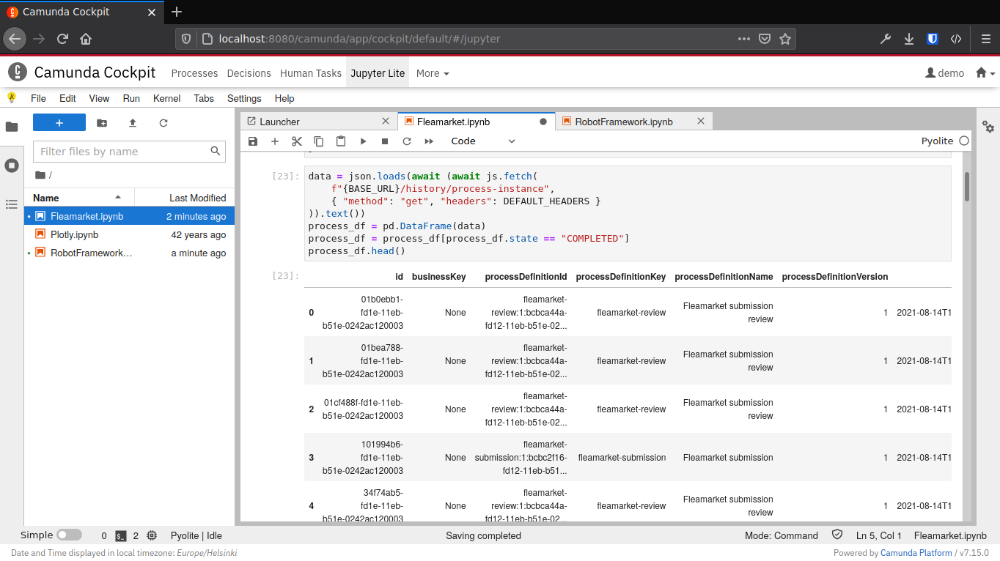
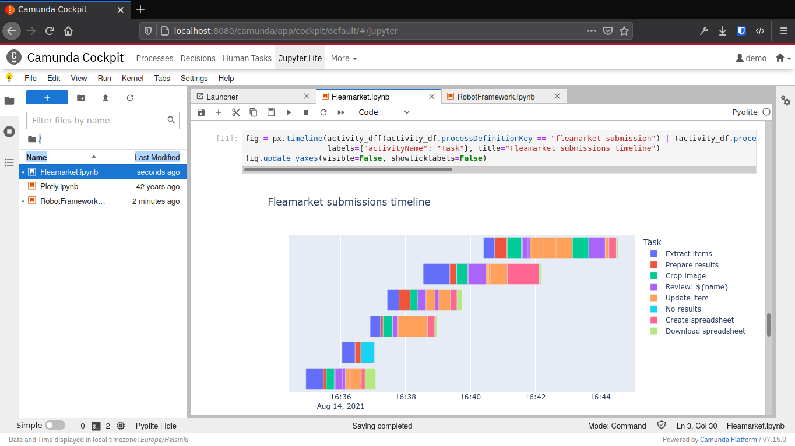
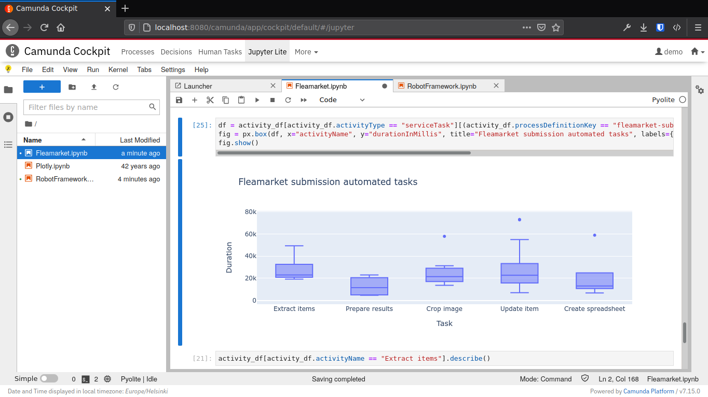
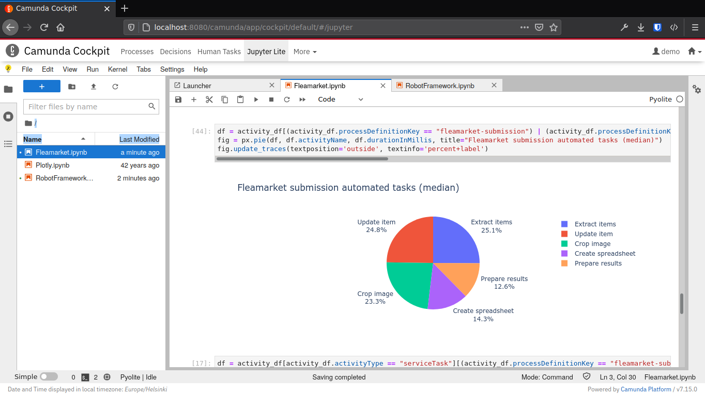
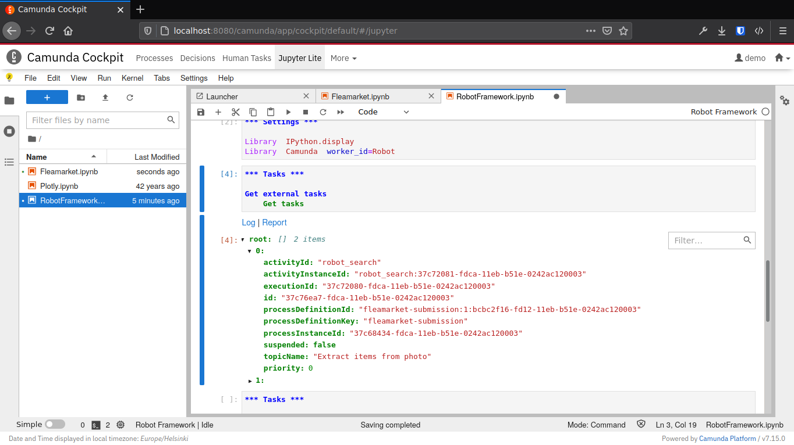

[Jupyter Notebooks](https://jupyter.org/) are extremely popular tool for manipulating, analyzing and visualizing data. [JupyterLab](https://jupyterlab.readthedocs.io/en/latest/), the currently maintained Notebook environment by Project Jupyter, can be scaled to large number of users when deployed with [JupyterHub](https://jupyter.org/hub) [on Kubernetes](https://z2jh.jupyter.org/). All open source.

But soon providing the core Jupyter Notebook features will be much easier.

[JupyterLite](https://blog.jupyter.org/jupyterlite-jupyter-%EF%B8%8F-webassembly-%EF%B8%8F-python-f6e2e41ab3fa) is a JupyterLab distribution that runs entirely in the web browser, backed by in-browser language kernels. It is an unofficial Jupyter project, but being developed by the core Jupyter developers. It reboots and combines knowledge from several attempts at making a **full static Jupyter distribution that runs in the browser**.

This time for real.

Embedded, frictionless and still powerful
-----------------------------------------

Example should help to understand the possibilities of in-browser JupyterLab environment. For that, I spent some time composing [Camunda Cockpit Plugin Jupyter](https://github.com/datakurre/camunda-cockpit-plugin-jupyter), which integrates JupyterLite as an embedded application right inside Camunda Platform's process management interface:

[Camunda Platform](https://camunda.com/products/camunda-platform/) is an open source framework and engine for workflow and decision automation with BPMN and DMN. By its nature, it gathers a lot of historic data from the digitized business processes.

Understanding and analyzing that data is the key to optimize and develop those processes further.

JupyterLite makes it possible to remove all friction from Jupter-capable users to start understanding and analyzing their data:

1. Because JupyterLite runs completely in-browser, there is no backend server resource allocation needed upfront.

2. For the same reason, there is no need for the users to install anything. Launching embedded JupyterLite from the host application could as simple as a single mouse click.

3. Embedded JupyterLite re-uses authentication and authorization from its host application. For example, on Camunda Cockpit, JupyterLite uses the existing Camunda Cockpit browser session for calling Camunda REST API. Therefore users can analyze just the data they are allowed to see with single sign-on.

As simple as it could be.

JupyterLite ships with an in-browser Python 3 environment ("kernel"), which is based on [WASM](https://webassembly.org/) compiled CPython, [Pyodide](https://pyodide.org/en/stable/). Pyodide brings along the best of the Python scientific stack including [NumPy](https://numpy.org/), [Pandas](https://pandas.pydata.org/), [Matplotlib](https://matplotlib.org/), [SciPy](https://www.scipy.org/) and [scikit-learn](https://scikit-learn.org/stable/). That's quite a collection of state-of-art open source data-analysis libraries, with also basic machine-learning capabilities.

In addition to Matplotlib, JupyterLite supports also [Altair](https://altair-viz.github.io/), [bqplot](https://bqplot.readthedocs.io/en/latest/) and [Plotly](https://plotly.com/python/) interactive visualization libraries. And, of course, [ipywidgets](https://youtu.be/8IYbdshUd9c), the generic Jupyter widget library for building ad-hoc user interfaces.

One more thing...
-----------------

Well, I would not be blogging about this, if JupyterLite was not also capable of running [Robot Framework](https://robotframework.org). Robot Framework support makes embedded JupyterLite capable of many kind of scripting and maintenance tasks, which would benefit from Robot Framework's awesome step-by-step logging. (But, for now, don't expect many Robot Framework ecosystem packages to be compatible with in-browser execution.)

