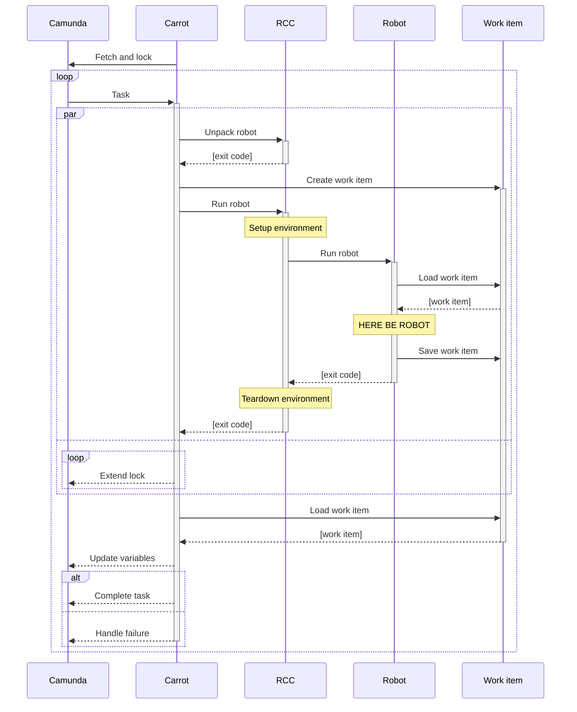

Successful business process automation requires real ability to iterate the automation part.
During the last year, I went through many ideas and iterations on how to make [Camunda Platform](https://camunda.com/download/) BPMN [external service task handlers](https://docs.camunda.org/manual/latest/user-guide/process-engine/external-tasks/) more convenient to develop and execute – especially in Python or [Robot Framework](https://robotframework.org/rpa/).
By the end of the year, I surprised myself by settling down on a quickish solution based on [Robocorp RCC](https://robocorp.com/docs/rcc/overview): a lightweight wrapper I named [carrot-rcc](https://pypi.org/project/carrot-rcc/).




Standing on the shoulders…
--------------------------

After struggling in mapping many Camunda or BPMN concepts to Robot Framework, I seem to have learned the best practise to be simply: **do not**.

**What if** one could just go to [Camunda provided documentation](https://camunda.com/best-practices/_/) to learn about process modelling and [Robocorp provided documentation](https://robocorp.com/docs/) to learn about RPA and automation (or just "glue coding" in general. Then use their optimized tools to iterate on both, and eventually **everything would just work**.

That's [what carrot-rcc is about](../../../2021/08/carrot-rcc/). **Carrot-rcc works as a bridge between Camunda Platform external service tasks and Robocorp style Python or Robot Framework robot packages.** It converts Camunda Platform process task state into Robocorp style work item, and then uses Robocorp RCC to execute the robot package for it (by matching external task topic to robot task name). Finally, the external task state is updated from the saved work item, and then the task is either completed or mark failed at the Camunda Platform process.

[Carrot-rcc is not a lot of code.](https://github.com/datakurre/carrot-rcc/) So it could also be taken as a concept, which should be re-implementable within reasonable time.


The playground
--------------

Open-source mashup on top of Camunda Platform and Robocorp toolchain provides extremely flexible automation foundation.
The downside is that, because there is no single product, putting it all together requires some effort.

Fortunately, carrot-rcc approach can be tried out using prepared playground implemented as a [Vagrant](https://www.vagrantup.com/) provisioned [virtual machine](https://app.vagrantup.com/datakurre/boxes/carrot-rcc):


[Vagrant](https://www.vagrantup.com/) is a popular developer tool for managing development environments, which is able to start the playground with just:

```shell
vagrant init datakurre/carrot-rcc
vagrant up
```

That will setup a virtualized desktop environment with everything required, ready to use, especially:

* [Camunda Platform Community Edition](https://camunda.com/download/) with a [minimal history plugin](https://github.com/datakurre/camunda-cockpit-plugins) and configuration to load and migrate process definitions from a desktop folder

* [carrot-rcc](https://github.com/datakurre/carrot-rcc/) with a configuration to load robot packages from a desktop folder

* [Camunda Modeler](https://camunda.com/download/modeler/) with recommended plugins for BPMN process modelling

* VSCode with [Robocorp extensions](https://robocorp.com/docs/developer-tools/visual-studio-code/overview) for the recommended 

Of course, both [Vagrant](https://www.vagrantup.com/) and a supported virtualization environment like [VirtualBox](https://www.virtualbox.org/), must be installed beforehand. (Alternatively also [libvirt](https://libvirt.org/) should be supported and [hyperv](https://www.vagrantup.com/docs/providers/hyperv) could be later.)

To be even more honest, a configuration file with better defaults is recommended for better experience. That means a file named `Vagrantfile` with the following content:

```ruby
# -*- mode: ruby -*-
# vi: set ft=ruby :

Vagrant.configure("2") do |config|
  config.vm.box = "datakurre/carrot-rcc"

  config.vm.provision "rebuild", type: "shell",
    inline: "sudo nixos-rebuild switch --max-jobs 1"

  config.vm.provider "virtualbox" do |vb, override|
    vb.gui = true
    vb.memory = 4096
    vb.cpus = 4
    override.vm.provision "remount", type: "shell",
      inline: "sudo mount -t vboxsf vagrant /vagrant -o umask=0022,gid=1000,uid=1000"
  end
end
```

With that file in place, a new playground can be started with simply:

```shell
vagrant up --no-provision
```

And upgrade at any time to the latest available version with:

```shell
vagrant provision
```

In-place upgrades with `vagrant provision` is made possible by building the playground virtual machine on top of [NixOS](https://nixos.org/) (check the repository for [virtual machine details](https://github.com/datakurre/carrot-rcc/tree/main/vagrant)).


Walkthrough
-----------

(to be continued)


<!-- So, it seems that with their [work item concept](https://robocorp.com/docs/development-guide/control-room/work-items) Robocorp has already figured out necessary abstractions -->


