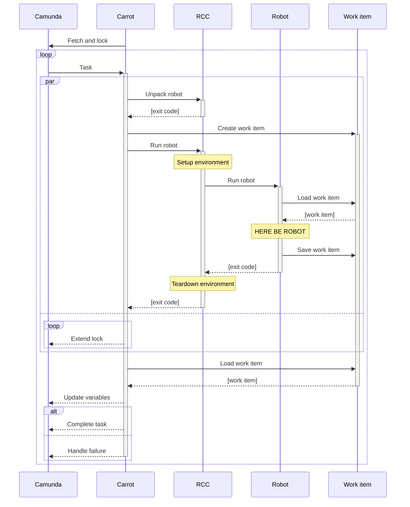

Successful business process automation requires real ability to iterate the automation part.
During the last year, I went through many ideas and iterations on how to make [Camunda Platform](https://camunda.com/download/) BPMN [external service task handlers](https://docs.camunda.org/manual/latest/user-guide/process-engine/external-tasks/) more convenient to develop and execute – especially in Python or [Robot Framework](https://robotframework.org/rpa/).
By the end of the year, I surprised myself by settling down on a quickish solution based on [Robocorp RCC](https://robocorp.com/docs/rcc/overview): a lightweight wrapper I named [carrot-rcc](https://pypi.org/project/carrot-rcc/).




Standing on the shoulders…
--------------------------

After struggling in mapping many Camunda or BPMN concepts to Robot Framework, I seem to have learned the best practise to be simply: **do not**.

**What if** one could just go to [Camunda provided documentation](https://camunda.com/best-practices/_/) to learn about process modelling and [Robocorp provided documentation](https://robocorp.com/docs/) to learn about RPA and automation (or just "glue coding" in general. Then use their optimized tools to iterate on both, and eventually **everything would just work**.

That's [what carrot-rcc is about](../../../2021/08/carrot-rcc/). **Carrot-rcc works as a bridge between Camunda Platform external service tasks and Robocorp style Python or Robot Framework robot packages.** It converts Camunda Platform process task state into Robocorp style work item, and then uses Robocorp RCC to execute the robot package for it (by matching external task topic to robot task name). Finally, the external task state is updated from the saved work item, and then the task is either completed or mark failed at the Camunda Platform driven process.

[Carrot-rcc is not a lot of code.](https://github.com/datakurre/carrot-rcc/) So it could also be taken as a concept, which should be re-implementable within days.


The playground
--------------

Open-source mashup on top of Camunda Platform and Robocorp toolchain provides extremely flexible automation foundation.
The downside is that, because there is no single product, putting it all together requires some effort.

Fortunately, carrot-rcc approach may now be tried out at a playground implemented as [Vagrant](https://www.vagrantup.com/) powered [virtual machine](https://app.vagrantup.com/datakurre/boxes/carrot-rcc):


[Vagrant](https://www.vagrantup.com/) is a popular developer tool for managing development environments.

```ruby
# -*- mode: ruby -*-
# vi: set ft=ruby :

Vagrant.configure("2") do |config|
  config.vm.box = "datakurre/carrot-rcc"

  config.vm.provision "rebuild", type: "shell",
    inline: "sudo nixos-rebuild switch --max-jobs 1"

  config.vm.provider "virtualbox" do |vb, override|
    vb.gui = true
    vb.memory = 4096
    vb.cpus = 2
    override.vm.provision "remount", type: "shell",
      inline: "sudo mount -t vboxsf vagrant /vagrant -o umask=0022,gid=1000,uid=1000"
  end
end
```

```shell
vagrant up --no-provision
```

```shell
vagrant provision
```

<!-- So, it seems that with their [work item concept](https://robocorp.com/docs/development-guide/control-room/work-items) Robocorp has already figured out necessary abstractions -->


