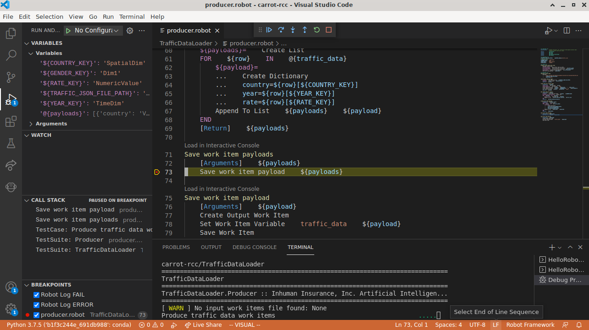
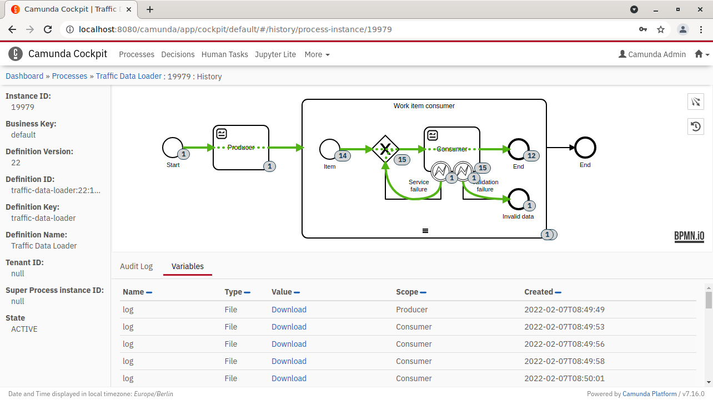

Successful business process automation requires real ability to iterate the automation part.
During the last year, I went through many ideas and iterations on how to make [Camunda Platform](https://camunda.com/download/) BPMN [external service task handlers](https://docs.camunda.org/manual/latest/user-guide/process-engine/external-tasks/) more convenient to develop and execute – especially in Python or [Robot Framework](https://robotframework.org/rpa/).
By the end of the year, I surprised myself by settling down on a quickish solution based on [Robocorp RCC](https://robocorp.com/docs/rcc/overview): a lightweight wrapper I named [carrot-rcc](https://pypi.org/project/carrot-rcc/).


Standing on the shoulders…
--------------------------

After struggling in mapping many Camunda or BPMN concepts to Robot Framework, I seem to have learned the best practise to be simply: **do not**.

**What if** one could just go to [Camunda provided documentation](https://camunda.com/best-practices/_/) to learn about process modelling and [Robocorp provided documentation](https://robocorp.com/docs/) to learn about RPA and automation (or just "glue coding" in general). Then use their optimized tools to iterate on both, and eventually **everything would just work**.

That's [what carrot-rcc is about](../../../2021/08/carrot-rcc/). **Carrot-rcc works as a bridge between Camunda Platform external service tasks and Robocorp style Python or Robot Framework robot packages.** It converts Camunda Platform process task state into Robocorp style work item, and then uses [Robocorp RCC](https://robocorp.com/docs/rcc/overview) to execute the robot package for it (by matching external task topic to robot task name). Finally, the external task state is updated from the saved work item, and then the task is either completed or marked failed at the Camunda Platform process.

[Carrot-rcc is not a lot of code.](https://github.com/datakurre/carrot-rcc/) So it could also be taken as a concept, which should be re-implementable within reasonable time.


The playground
--------------

Open-source mashup on top of Camunda Platform and Robocorp toolchain provides extremely flexible automation foundation.
The downside is that, because there is no single polished product, putting it all together requires some effort.

Fortunately, carrot-rcc approach can be tried out using prepared playground implemented as a [Vagrant](https://www.vagrantup.com/) provisioned [virtual machine](https://app.vagrantup.com/datakurre/boxes/carrot-rcc):


*Screencast of developing Hello World process with a Robot Framework bot with the carrot-rcc playground*

[Vagrant](https://www.vagrantup.com/) is a popular developer tool for managing development environments. And it is able to start a new local playground with just:

```shell
vagrant init datakurre/carrot-rcc
vagrant up
```

That will setup a virtualized desktop environment with everything required, ready to use, especially:

* [Camunda Platform Community Edition](https://camunda.com/download/) with [minimal history plugin](https://github.com/datakurre/camunda-cockpit-plugins) and configuration to load and migrate process definitions from the desktop folder named *BPMN*

* [carrot-rcc](https://github.com/datakurre/carrot-rcc/) with configuration to load zipped [Robocorp robot packages](https://robocorp.com/docs/setup/robot-structure) from the desktop folder named *Robots*

* [Camunda Modeler](https://camunda.com/download/modeler/) with recommended plugins for BPMN process modelling

* VSCode with [Robocorp extensions](https://robocorp.com/docs/developer-tools/visual-studio-code/overview) for RPA and generic automation code development

* the current working directory mounted on to the desktop with name *Shared*.

Of course, both [Vagrant](https://www.vagrantup.com/) and supported virtualization environment like [VirtualBox](https://www.virtualbox.org/), must be installed beforehand. (Alternatively also [libvirt](https://libvirt.org/) should be supported and [hyperv](https://www.vagrantup.com/docs/providers/hyperv) could be later.)

To be even more honest, a configuration file with better defaults is recommended for better experience. That means a file named `Vagrantfile` with the following content:

```ruby
# -*- mode: ruby -*-
# vi: set ft=ruby :

Vagrant.configure("2") do |config|
  config.vm.box = "datakurre/carrot-rcc"

  config.vm.provision "rebuild", type: "shell",
    inline: "sudo nixos-rebuild switch --max-jobs 1"

  config.vm.provider "virtualbox" do |vb, override|
    vb.gui = true
    vb.memory = 4096
    vb.cpus = 4
    override.vm.provision "remount", type: "shell",
      inline: "sudo mount -t vboxsf vagrant /vagrant -o umask=0022,gid=1000,uid=1000"
  end
end
```

With that file in place, a new playground can be started with simply:

```shell
$ vagrant up --no-provision
```

And upgrade in-place at any time to the latest available version with:

```shell
$ vagrant provision
```

In-place upgrades with `vagrant provision` is made possible by building the playground virtual machine on top of [NixOS](https://nixos.org/) (check the repository for the [full virtual machine configuration in Nix](https://github.com/datakurre/carrot-rcc/tree/main/vagrant)).

Finally, the playground may be destroyed with:

```shell
$ vagrant destroy
```


A walkthrough
-------------

The playground starts with a minimal Xfce desktop environment with all required applications, web services and special folders (*BPMN*, *Robots* and *Shared*) directly on the desktop. Yet, terminal and other usual Xfce features are available on the right click context menu.


Playground packages Camunda Modeler with many useful plugins, like [BPMN linter](https://github.com/camunda/camunda-modeler-linter-plugin) and [token simulation](https://github.com/bpmn-io/bpmn-js-token-simulation), preinstalled.


VSCode comes packaged with [Robocorp Code](https://marketplace.visualstudio.com/items?itemName=robocorp.robocorp-code) and [Robot Framework LSP](https://marketplace.visualstudio.com/items?itemName=robocorp.robotframework-lsp) extensions, which together provide top of the line Robot Framework bot development experience. This includes support for mock data and interactive debugging.



Another cool feature in Robocorp Code is Jypyter Notebook -inspired interactive console to support more exploratory development style.


Because everything in the playground is set up to work well together, processes may be deployed and started directly from the modeler, out of the box.


That said, the recommended way to deploy models on the playground is saving them to *BPMN*-named folder on the desktop. Because the playground runs [Micronaut-powered Camunda](https://github.com/camunda-community-hub/micronaut-camunda-bpm) with minimal startup time, it has been possible to configure it to deploy models directly from the filesystem with restart and re-deploy. Also, during re-deploy, all running processes are automatically migrated to the latest BPMN versions on when possible.


Packaged Camunda Platform build also comes with my [minimal history plugin](https://github.com/datakurre/camunda-cockpit-plugins) to make inspecting completed tasks and processes more convenient with the open-source version of the platform.



And if something does not right, both Camunda and carrot-rcc services stream their log into system(d) journal, which can be viewed either from terminal or clicking Journal icon on the desktop.


The only thing that is missing its own UI is, how to package developed version of a bot into a package recognized by carrot-rcc service. For now, it must be done manually on a terminal with running `rcc robot wrap -z /var/lib/carrot-rcc/RobotName.zip` while inside the folder of a developed robot.


Examples, examples…
-------------------

Personally, I feel the playground to be a low barrier environment to experiment with.

Fun and easy enough that, the my is to stream [how to use the playground](https://www.twitch.tv/datakurre) every now and with Markus Stahl during this spring. For example, on the last Friday, we converted the latest [Robocorp course: Work data management](https://robocorp.com/docs/courses/work-data-management) to run on the playground, replacing Robocorp Cloud orchestrato with playground's Camunda Platform. The result, and hopefully more on later, is available at [our "GitHub show notes"](https://github.com/datakurre/robotlive).

Fun fact: [moving to Camunda reduced the lines of robot code](https://github.com/datakurre/robotlive/commit/72cdfe1b8de3342fc567a4d8bf825946be8138fe) (by moving some logic into BPMN).
