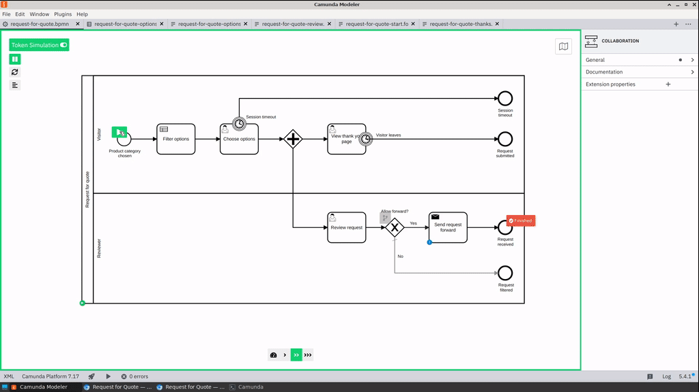

Doing whatever necessary to implement various business process use cases with [Plone CMS](https://plone.org) used to be my groundhog day at work.

We've been using [form](https://docs.plone.org/develop/plone/forms/ploneformgen.html) [builders](https://github.com/collective/collective.easyform) and [more](https://github.com/plomino/Plomino), custom [content types](https://training.plone.org/5/ttw/dexterity.html) with [custom workflows](https://training.plone.org/5/workflow/index.html), bags of [content rules](https://docs.plone.org/working-with-content/managing-content/contentrules.html), and also a lot and even more of custom code make everything feel seamless. In the "last iteration", a few years ago, we put everything we knew about "low code Plone" into something called [collective.flow](https://www.slideshare.net/rioksane/workflows-and-plone-case-supervisiondoc), but despite the name, we never really published it.

Then we got into [BPMN 2.0](https://camunda.com/bpmn/reference/) and [Camunda Platform 7](https://camunda.com/download/). We ended up building our own [custom solution](../../../2020/05/vasara-bpm-open-source-mashup) on top of Camunda and other open-source software, to meet all our requirements (especially on forms) as they kept piling up. And that work is still continuing...

Meanwhile, I've been out of the office for a while, and been able to rethink, out of the box, without any real-life requirements, how would I bring my BPMN love back to Plone.

collective.bpmproxy
-------------------

So, I've been playing with a new experimental Plone add-on [collective.bpmproxy](https://github.com/datakurre/collective.bpmproxy) to figure out, the simplest possible way to bring the possibilities of BPMN to Plone. And without any real-life requirements, there has been no need to implement any specific features by force, but accept the limitations of easily available components, and only do what is easily done, in limited time.

Right now, the add-on comes with:

* A custom content-type, "BPM Proxy" to publish an existing process with forms from a configured Camunda Platform 7 (later just "C7") instance as a CMS page with "sub pages" for currently open tasks in running instances of that process.

* A portlet to list all tasks available in every running process on the configured C7 instance. (Or just the tasks related to the current Plone page.)

* A content-rule action to broadcast BPMN signals events at the configured C7 instance from configured events at Plone.

* Support to show related available user task forms also for pages of other types than BPM Proxy.

The two most obvious use cases with these features are:

* Publishing standalone form-driven processes for their users by publishing them with Plone.

  

* Supplementing Plone's own content workflows by using Plone content-rules to start supplementing BPMN processes.

  

But none of this would matter, if running and configuring C7 for the add-on would be complicated. Therefore, most gratifying discovery for myself was, how little customization for C7 made its use with Plone trivial.

Camunda Platform 7 customizations
---------------------------------

The [add-on repository includes pre-configured C7 engine](https://github.com/datakurre/collective.bpmproxy/tree/master/camunda) based on the [community maintained Micronaut distribution](https://github.com/camunda-community-hub/micronaut-camunda-platform-7). It has a lot of faster startup time and also somewhat smaller memory footprint than the official distribution. In addition to a usable default configuration, the most important inclusion is a custom authentication plugin:

The customized C7 engine, requires no extra configuration whatsoever for Plone users, groups or authentication. Also, the engine will preserve no persistent information about its Plone users. Instead, when the add-on calls C7, it includes calling user's authentication details as a signed JWT payload. C7 verifies the payload, and executes actions as there really was a such user. And the rest of C7 authorizations just works. It is even possible to invent transient user ids for unauthenticated anonymous users in fly. Once processes have completed, and their history timed out, the engine no longers remembers anything, becoming stateless in strategical sense.

Once I have updated the add-on to use C7 multi-tenancy support, this design also allows single C7 instance to support multiple Plone sites with completely different sets of local users. And therefore saving resources in low-volume scenarios. Also, with this approach. C7 never calls back Plone or nor even needs to know that there is a Plone: The only thing it cares about is that it has the key to verify JWTs from incoming REST API requests.

In addition to all this, C7's own user interfaces can still be accessed with its own locally configured users, which allows having administrative accounts separate from Plone instances.

End-to-end low-coding support
-----------------------------

After customizing Plone CMS in many unimaginable ways for a decade, and then being a few years almost completely out of the loop, I'd fancy a fresh start. With BPMN support in Plone, the related ecosystems provide exciting ways to implement or extend Plone features even in "low coding" fashion.

The main tool for building BPMN processes for Camunda Platform is their free and open source [Camunda Modeler](https://github.com/camunda/camunda-modeler).

Its main feature is modeling and configuration of executable BPMN 2.0 process diagrams.

In addition, it supports building DMN decision tables, which could be used in BPMN processes to model decisions directly in the process.

Finally, the modeler supports so called Camunda Forms, which is the official form definition supported by Camunda Platform. Camunda Forms are also supported in the add-on, because similarly to [other modeler feautures](https://bpmn.io/https://bpmn.io/), the [libraries for editing or rendering those forms are open source](https://github.com/bpmn-io/form-js) by Camunda.

Unfortunately, Camunda Forms are still young and may have surprising limitations or missing features. Still, being able to edit all BPMN, DMN and forms with a single modeling tool, is so big thing, that I am taking the ristk and counting on Camunda Forms to get better soon enough.

Then, eventually, there is need for code. Camunda Platform supports so called ["external task pattern"](https://docs.camunda.io/docs/components/best-practices/development/invoking-services-from-the-process-c7/), where execution of a BPMN service task could be delegated to code running outside the platform. In practice, with Camunda Platform 7, a custom microservice could long-poll C7 REST APIs for new external service tasks for a specific topics, execute the custom code with variables from the process, and complete those tasks by calling REST API again.

A year ago, I wrote one special such service. [carrot-rcc](../../../2021/08/carrot-rcc) further delegates external service task executions to [Robocorp RCC toolchain](https://robocorp.com/docs/rcc/overview). Because of RCC, [Robocorp Robot packaging](https://robocorp.com/docs/rcc/overview), and power of Conda repositories, carrot-rcc is able to take a bunch of different "robot packages", poll and complete a lot of different external service tasks with a single worker service.

And, before the end of this year, I am expecting [Robocorp Automation Studio](https://robocorp.com/products/automation-studio) to get the missing features for producing "carrot-rcc compatible robot packages". This would close the loop and provide "low code" programming tool also for implementing BPMN service tasks.

I almost cannot wait for the next year, being back at work, and hopefully being able to implement a yet another business process use-case with Plone :)
