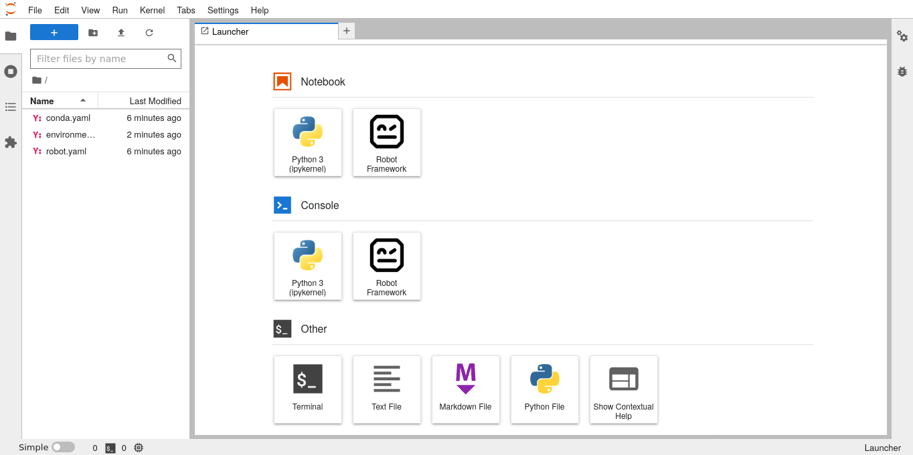

**Nix way, RCC way, or the high way?**

Q: **Explain how declarative configuration differs from imperative configuration in a tweet.**

A: *Declarative configuration focuses on what the desired end state should be, while imperative configuration focuses on the specific steps needed to achieve that end state. In declarative configuration, the system automatically sets up the necessary resources and configurations, whereas in imperative configuration, the user must explicitly define and execute each step. #declarativeconfig #imperativeconfig* -ChatGPT

I'm a fan of [Project Jupyter](https://jupyter.org/), which develops and maintains interactive computing environments all programming languages. Mostly known for [JupyterLab](https://jupyter.org/try) and [Jupyter Notebook](https://jupyter.org/try). Yet, I use them much less than I'd like to. Most probably, because I am missing a convenient way to define and maintain local Jupyter environments within those projects where they could be useful.

As of today, I might have found the way I have been looking for. Unfortunately, it might not be [Nix](https://nixos.org/), but something else, that everyone can use in minutes. That said, let's try the Nix way at first.


Status quo: jupyterWith
-----------------------

[jupyterWith](https://github.com/tweag/jupyterWith) is a project, which helps to define and maintain Jupyter environments with [Nix](https://nixos.org), the purely functional package manager. Let's assume that Nix has already been installed and flakes enabled as told in  [withJupyter's documentation](https://jupyterwith.tweag.io/getting-started/), and continue to follow it to create JupyterLab with [Robot Framework kernel](https://pypi.org/project/robotkernel/).

At first, we need to scaffold the base environment with:

```
$ nix flake init --template github:tweag/jupyterWith
wrote: .../flake.nix
wrote: .../default.nix
wrote: .../kernels/python
wrote: .../kernels

    You have created a jupyterWith template.

    Run nix run to immediately try it out.

    See the jupyterWith documentation for more information.

    https://github.com/tweag/jupyterWith/blob/main/docs/how-to.md
    https://github.com/tweag/jupyterWith/blob/main/docs/tutorials.md
```

And then we are able to start the default setup with:

```
$ nix run
```


Although, this gives us JupyterLab with only plain Python kernel. It's good to know, that jupyterWith properly separates JupyterLab from its kernels, and is then able to support any number of different kernels or configurations in a single environment. Thankfully, to get started with custom kernel configuration, it creates a template for Python kernel with custom packages.

And it took a couple of hours for me to figure out, how to customize jupyterWith's Python kernel setup to run Python based RobotFramework kernel instead. That required defining a Python environment with [RobotKernel](https://pypi.org/project/robotkernel/) into the Python custom kernel template at `./kernels/python` with [Poetry](https://python-poetry.org/):

```
$ poetry init

This command will guide you through creating your pyproject.toml config.

Package name [python]:  robotkernel-env

Would you like to define your main dependencies interactively? (yes/no) [yes]

Search for package to add (or leave blank to continue): robotkernel

Enter package # to add, or the complete package name if it is not listed:
 [0] robotkernel
 [1] jupyterlite-robotkernel
 > 0

Do you confirm generation? (yes/no) [yes]
```

And, of course, also lock its dependencies:

```
$ poetry lock
Creating virtualenv robotkernel-env-aFhfNoGt-py3.9 in .../.cache/pypoetry/virtualenvs
Updating dependencies
Resolving dependencies... (31.3s)

Writing lock file
```

And then the hard part... With the following `./kernels/python/default.nix`:

```
{
  name,
  availableKernels,
  extraArgs,
}:
let base = availableKernels.python {
  projectDir = ./.;
  displayName = "Robot Framework";
  name = "robotframework";
  preferWheels = true;
}; in {
  path = ./kernel.nix;
  args = base.args // { inherit (base) path; };
}
```

And `./kernels/python/kernel.nix`:

```
args@{ path, ...}:

let
  base = import path (builtins.removeAttrs args [ "path" ]);
in base // {
  argv = [
    (builtins.head base.argv)
    "-m"
    "robotkernel.kernel"
    "-f"
    "{connection_file}"
  ];
  language = "robotframework";
  codemirrorMode = "robotframework";
}
```

I was able to have my declarative JupyterLab with Robot Framework kernel started simply with re-running `nix run`.


Unfortunately, even after all that, my JupyterLab was still missing syntax highlighting for Robot Framework code, because that would have required Nix-packaging and installing [jupyterlab-robotmode](https://pypi.org/project/jupyterlab-robotmode/) extension into the Python environment of JupyterLab itself.

According to jupyterWith's documentation. They are still working on to support declarative configuration for extensions...


Contender: RCC
--------------

How about the challenger? [RCC](https://robocorp.com/docs/rcc/overview) is an open source environment management and task execution tool from [Robocorp](https://robocorp.com). Initially designed to manage environments and execution of Robot Framework and Python RPA bots, but technically generic enough to manage any environment based on packages available at [Conda](https://conda.io/) [repositories](https://anaconda.org/search) or installable with [Pip](https://pypi.org/project/pip/). (Under the hood it is using [Miniconda](https://docs.conda.io/en/latest/miniconda.html) as its package manager.)

At first, RCC is installed usually just by [downloading a precompiled binary](https://downloads.robocorp.com/rcc/releases/index.html). Then it requires two files to built the environment and start a program from it. `conda.yaml`:

```yaml
channels:
  - conda-forge
dependencies:
  - jupyterlab
  - pip:
      - robotkernel
      - jupyterlab-robotmode
```

And `robot.yaml`:

```yaml
tasks:
  lab:
    shell: jupyter lab
condaConfigFile:
  conda.yaml
artifactsDir:
  .
```

Once these are in place, the sole task from `robot.yaml` run from the environment defined in `conda.yaml` can be run with:

```
$ rcc task run
```

This was all that was required to have a declaratively configured JupyterLab launched from a project directory.



And this time also syntax highlighting was enabled:


Looks like we have a winner!


How about reproducibility?
--------------------------

Was this a fair comparison? Not completely. Nix package manager is built to maximize reproducibility, while Conda used by RCC does more like "best effort" for it. Also, jupyterWith is clearly desiged to support also more complex JupyterLab environments with multiple kernels, when my use case required only one, based on Python. Therefore installing kernel packages into the same environment with JupyterLab itself was possible.

That said, RCC tries its best to make the environment as reproducible as possible with Conda. When `rcc task run` is run with ambiquous `conda.yaml` it outputs `environment_[system]_[arch]_freeze.yaml` (e.g. `environment_linux_amd64_freeze.yaml`) with all installed packages:


```yaml
channels:
- conda-forge
dependencies:
- _libgcc_mutex=0.1
- _openmp_mutex=4.5
- anyio=3.6.2
- argon2-cffi=21.3.0
- argon2-cffi-bindings=21.2.0
- asttokens=2.2.1
- attrs=22.1.0
- babel=2.11.0
- backcall=0.2.0
- backports=1.0
- backports.functools_lru_cache=1.6.4
- beautifulsoup4=4.11.1
- bleach=5.0.1
- brotlipy=0.7.0
- bzip2=1.0.8
- ca-certificates=2022.12.7
- certifi=2022.12.7
- cffi=1.15.1
- charset-normalizer=2.1.1
- cryptography=38.0.4
- debugpy=1.6.4
- decorator=5.1.1
- defusedxml=0.7.1
- entrypoints=0.4
- executing=1.2.0
- flit-core=3.8.0
- idna=3.4
- importlib-metadata=5.1.0
- importlib_resources=5.10.1
- ipykernel=6.14.0
- ipython=8.4.0
- ipython_genutils=0.2.0
- jedi=0.18.2
- jinja2=3.1.2
- json5=0.9.5
- jsonschema=4.17.3
- jupyter_client=7.4.8
- jupyter_core=5.1.0
- jupyter_events=0.5.0
- jupyter_server=2.0.1
- jupyter_server_terminals=0.4.2
- jupyterlab=3.5.1
- jupyterlab_pygments=0.2.2
- jupyterlab_server=2.16.5
- ld_impl_linux-64=2.39
- libffi=3.4.2
- libgcc-ng=12.2.0
- libgomp=12.2.0
- libnsl=2.0.0
- libsodium=1.0.18
- libsqlite=3.40.0
- libstdcxx-ng=12.2.0
- libuuid=2.32.1
- libzlib=1.2.13
- markupsafe=2.1.1
- matplotlib-inline=0.1.6
- mistune=2.0.4
- nbclassic=0.4.8
- nbclient=0.7.2
- nbconvert=7.2.6
- nbconvert-core=7.2.6
- nbconvert-pandoc=7.2.6
- nbformat=5.7.0
- ncurses=6.3
- nest-asyncio=1.5.6
- notebook=6.5.2
- notebook-shim=0.2.2
- openssl=3.0.7
- packaging=22.0
- pandoc=2.19.2
- pandocfilters=1.5.0
- parso=0.8.3
- pexpect=4.8.0
- pickleshare=0.7.5
- pip=22.3.1
- pkgutil-resolve-name=1.3.10
- platformdirs=2.6.0
- prometheus_client=0.15.0
- prompt-toolkit=3.0.36
- psutil=5.9.4
- ptyprocess=0.7.0
- pure_eval=0.2.2
- pycparser=2.21
- pygments=2.13.0
- pyopenssl=22.1.0
- pyrsistent=0.19.2
- pysocks=1.7.1
- python=3.10.8
- python-dateutil=2.8.2
- python-fastjsonschema=2.16.2
- python-json-logger=2.0.1
- python_abi=3.10
- pytz=2022.6
- pyyaml=6.0
- pyzmq=24.0.1
- readline=8.1.2
- requests=2.28.1
- send2trash=1.8.0
- setuptools=65.5.1
- six=1.16.0
- sniffio=1.3.0
- soupsieve=2.3.2.post1
- stack_data=0.6.2
- terminado=0.15.0
- tinycss2=1.2.1
- tk=8.6.12
- tomli=2.0.1
- tornado=6.2
- traitlets=5.7.1
- typing_extensions=4.4.0
- tzdata=2022g
- urllib3=1.26.13
- wcwidth=0.2.5
- webencodings=0.5.1
- websocket-client=1.4.2
- wheel=0.38.4
- xz=5.2.6
- yaml=0.2.5
- zeromq=4.3.4
- zipp=3.11.0
- pip:
  - arrow==1.2.3
  - backports.functools-lru-cache==1.6.4
  - docutils==0.19
  - fastjsonschema==2.16.2
  - flit_core==3.8.0
  - fqdn==1.5.1
  - importlib-resources==5.10.1
  - ipython-genutils==0.2.0
  - ipywidgets==8.0.3
  - isoduration==20.11.0
  - jsonpointer==2.3
  - jupyter-events==0.5.0
  - jupyterlab-pygments==0.2.2
  - jupyterlab-robotmode==0.3.1
  - jupyterlab-widgets==3.0.4
  - lunr==0.6.2
  - notebook_shim==0.2.2
  - Pillow==9.3.0
  - pkgutil_resolve_name==1.3.10
  - prometheus-client==0.15.0
  - pure-eval==0.2.2
  - rfc3339-validator==0.1.4
  - rfc3986-validator==0.1.1
  - robotframework==6.0.1
  - robotkernel==1.6
  - stack-data==0.6.2
  - uri-template==1.2.0
  - webcolors==1.12
  - widgetsnbextension==4.0.4
```

Adding this to `robot.yaml`:


```yaml
tasks:
  notebook:
    shell: jupyter lab
condaConfigFile:
  conda.yaml
artifactsDir:
  .
environmentConfigs:
- environment_linux_amd64_freeze.yaml
```

should help the environment to build and run with the same version also on other machines.

P.S. You may disable RCC telemetry with `rcc configuration identity -t`.

P.P.S. Check RCC authors [Tips, tricks, and recipies](https://github.com/robocorp/rcc/blob/master/docs/recipes.md) for more interesting features and use cases.
