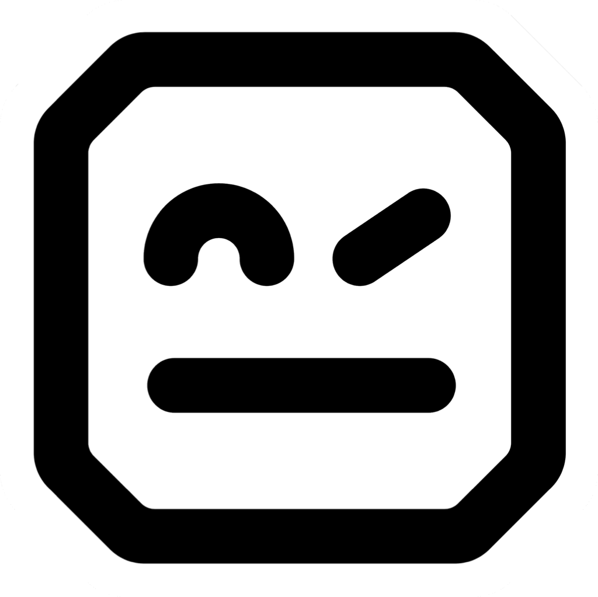
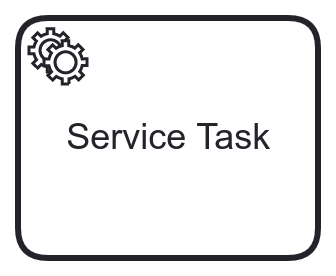
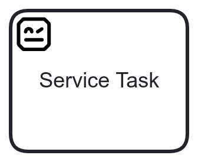
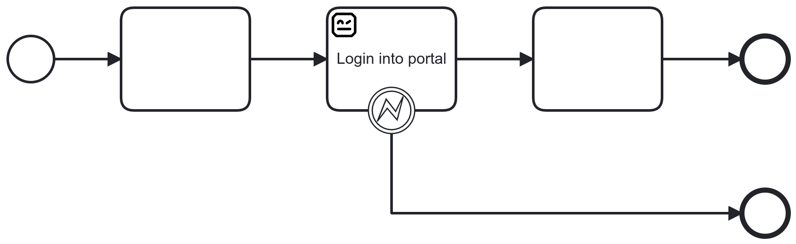
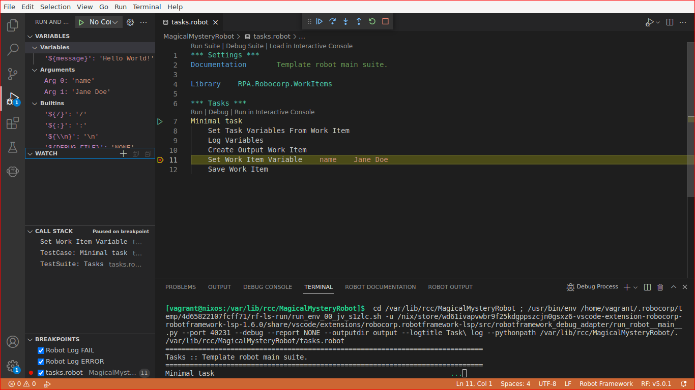
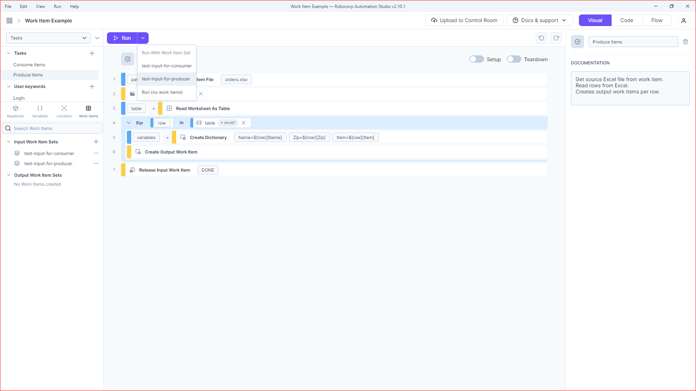

This year I've been tinkering mainly around [Camunda Platform](https://camunda.com/download/), the BPMN based open-source process orchestration platform of my choice [[1]](#footnote-1).
Especially, how [Robot Framework](https://robotframework.org/), an open source automation framework with extensive ecosystem, seems to be an unexpected match for implementing automated tasks in BPMN processes.

Let's start by asking OpenAI's ChatGPT about the topic:

**How would you conceptually align Camunda platform and Robot Framework so that Camunda automates the execution of BPMN defined processes, but Robot Framework is used to execute external service tasks within those processes?**

*To align Camunda and Robot Framework in this way, you would use Camunda to define and manage your business processes, and then use Robot Framework to automate the execution of specific tasks within those processes. This would involve integrating Robot Framework into your Camunda processes, so that the appropriate Robot Framework scripts are triggered whenever a specific task needs to be performed.*

*For example, let's say you have a Camunda process that involves several steps, including interfacing with an external web service to retrieve some data and then making a decision based on that data. In this case, you could use Camunda to define the overall process and manage its execution, and then use Robot Framework to automate the execution of the task that involves interfacing with the web service. This would allow Camunda to control the overall flow of the process, while Robot Framework handles the details of interfacing with the external service.*

*Overall, this approach would allow you to use Camunda to manage and automate your business processes, while leveraging the power of Robot Framework to automate specific tasks within those processes. This could help to improve the efficiency and reliability of your processes, and ultimately help your organization to achieve its goals.*

I couldn't agree more... but **what does it really mean to integrate Robot Framework into your Camunda processes?**




Tasks are work items
--------------------

Robot Framework is a generic automation framework, which does not dictate by itself how it should be integrated with other systems. To avoid inventing my own way, I chose to follow [Robocorp's conventions](https://robocorp.com/docs/development-guide/robocorp-cloud/data-pipeline).

Camunda Platform recommends to model computer automated tasks in BPMN processes as *external service tasks* [[2]](#footnote-2). Therefore every automated task in Camunda is an *external service task instance*. When a software worker activates a such task, Camunda Platform delivers the worker a payload: a list of *task variables* with their values from the activated *task instance*.



Meanwhile, Robocorp maintains [RPA Framework](https://rpaframework.org/) a comprehensive and well documented collection of various automation libraries for Robot Framework and Python. RPA Framework happens to include also [a library for interacting with available work items](https://rpaframework.org/libraries/robocorp_workitems/index.html). While the default implemention is designed for Robocorp's own cloud service only, the library supports *adapter pattern* for local customization. This allows to use it as a generic keyword API for integrating Robot Framework with process orchestration: the same keywords that are used to interact with work items at Robocorp Cloud, could also be configured to work elsewhere.

Coincidentally, Camunda Platform *task variables* and RPA Framework *work items* are both implemented as list of key value pairs. This makes it simple to map task variables from a single external service task instance to a single RPA Framework WorkItems library work item.

To put it simply: **task variables make work item** [[3]](#footnote-3).




WorkItems library as API
------------------------

Why is it so significant to be able to map Camunda Platform task variables into RPA Framework WorkItems library work items? Because, not only does RPA Framework's WorkItems library provide well designed keword API for interacting with Camunda task variables from Robot Framework task code, but it also comes with existing documentation and tooling.

For example, this could be the simplest way to access any Camunda task instance variables from Robot Framework task code:

```robotframework
*** Settings ***
Library  RPA.Robocorp.WorkItems
*** Tasks ***
Use variables from Camunda external service task
    Set task variables from work item
    Log  Variables are now available : ${user}, ${mail}
```

And this could be how to set result variables to be submitted back to Camunda when completing the task instance:

```robotframework
*** Tasks ***
Save variables to Camunda external service task
    Create Output Work Item
    Set work item variables  user=Dude  mail=address@company.com
    Save Work Item
```

This could be, how to fail a Camunda service task in way it would be automatically retried later:

```robotframework
*** Tasks ***
Login into portal
    Set task variables from work item
    TRY
        Login Keyword  ${user}
        Upload Doc Keyword  ${doc}
    EXCEPT  Login Failed
        Release Input Work Item  FAILED
        ...  exception_type=APPLICATION
        ...  code=LOGIN_PORTAL_DOWN
        ...  message=Unable to login, retry again later.
    END
```

And this could be the way to throw a BPMN business error, which could then be taken care of on the business level:

```robotframework
*** Tasks ***
Login into portal
    Set task variables from work item
    TRY
        Login Keyword  ${user}
        Upload Doc Keyword  ${doc}
    EXCEPT  Format Error  AS  ${err}
        ${message} =  Catenate
        ...  Document format is not correct and cannot be uploaded.
        ...  Correct the format in this work item and try again.
        ...  Full error message received : ${err}
        Release Input Work Item  FAILED
        ...  exception_type=BUSINESS
        ...  code=DOC_FORMAT_ERROR
        ...  message=${message}
    END
```



To prove the point, all the examples above were copied or adapted from [RPA Framework WorkItems library documentation](https://rpaframework.org/libraries/robocorp_workitems/index.html). And to eat my own dog food, this is also how I've integrated Camunda Platform to Robot Framework in [carrot-rcc](http://github.com/datakurre/carrot-rcc) and [parrot-rcc](http://github.com/datakurre/parrot-rcc).


Tools and docs make DX
----------------------

When it comes to open source, developer experience is not always guaranteed. For a long time, this was also the case with Robot Framework. While Robot Framework has always has a [comprehensive and maintained user guide](https://robotframework.org/robotframework/latest/RobotFrameworkUserGuide.html), it was missing good beginner tools and tutorials. Shout-out to [Robot Framework Foundation](https://robotframework.org/foundation/) and [Robocorp](https://robocorp.com/) for this no longer being any issue!

At first, https://robotframework.org/ has evolved into a portal of Robot Framework news, libraries and in-browser runnable examples to give immediate taste of the framework and its ecosystem. That said, I really want to praise the efforts at Robocorp to make their developer tools and documentation free, open and generally available for all Robot Framework users.

Currently, in my opinion, the best Robot Framework developer experience is provided with [Robocorp Code](https://robocorp.com/docs/developer-tools/visual-studio-code/overview), the free and open source Robocorp extension Microsoft Visual Studio Code (or VSCodium, its open source distribution).


Robocorp Code supports creating new Robot Framework automation package projects from templates (or scratch), developing and debugging them with modern IDE experience, and it helps to manage their Robot Framework and Python dependencies. In addition, it allows to try those automation packages straight from the editor, also with example work item data.



Did I mention work items? Building the integration between Camunda Platform and Robot Framework on top of the [RPA Framework](https://rpaframework.org) work items, makes it possible to benefit from all these work item related features in Robocorp tools. For example, automation packages could be functionally tested with local work items before trying them with a process engine. In addition, Robocorp provides and maintains a lot of [tutorials and other documentation](https://robocorp.com/docs/quickstart-guide), and is also building an [automation portal](https://robocorp.com/portal) with free examples, even out-of-the-box usable automation packages.

And that's not all. Robocorp has also been developing a visual editor: [Automation Studio](https://robocorp.com/products/automation-studio). This fall also Automation studio got support for RPA Framework's WorkItems library and can now be used to implement compatible automation packages.




RCC brings superpowers
----------------------

I saved the best for the last.

[RCC](https://robocorp.com/docs/rcc/overview) is at the very heart of Robocorp tools for Robot Framework ecosystem. RCC is the really cool command line tool, which makes Robot Framework automation packages "just work". Practically everywhere (Mac, Windows or Linux). From scratch. And it is [just a single binary download](https://downloads.robocorp.com/rcc/releases/index.html).

Given a [properly structured robot package](https://robocorp.com/docs/setup/robot-structure), RCC prepares a runtime environment with required dependencies and then executes named automation task from the package. Then dependencies are cached for fast re-use. It supports being executed in parallel for concurrent automation, and it also provides scaffolding commands for creating and wrapping new automation code packages. Finally, it is not limited for executing just Robot Framework code, technically not even just Python...

Properly structure robot package, means a zip with `robot.yaml` and `conda.yaml` along the actual code. At first, `robot.yaml` contains all the metadata RCC needs to execute automation tasks from the package.:

```yaml
tasks:
  # You can define 1..n tasks to a robot automation package.
  # Naming: Think of actions or verbs this robot can perform.
  # Could be matched to Camunda external service task types.

  # The task supports three ways of defining the action performed:
  # `robotTaskName`, `shell` or `commmand`.
  # Below are examples for each.

  User specified task name:
    # 'robotTaskName': Assumes a task with the same name exists in a .robot file.
    robotTaskName: Calculate and log the result

  User specified task name 2:
    # 'shell': You have to quote items in the command with spaces using "
    shell: python -m robot --report NONE --outputdir output --logtitle "Task log" tasks.robot

  User specified task name 3:
    # 'command': Separates the arguments to a list
    #  that takes care of arguments with spaces.
    command:
      - python
      - -m
      - robot
      - --report
      - NONE
      - --outputdir
      - output
      - --logtitle
      - Task log
      - tasks.robot

    # 'carrot-rcc' (for Camunda Platfrom 7) extends task specification
    #  to support task specific retry policy with
    retries: 3
    retryTimeout: 60000


condaConfigFile:
  conda.yaml
  # A relative path to your environment config file.
  # Defining the conda.yaml file is optional.
  # E.g., if the running environment is preset and you don't need any setup.

artifactsDir:
  output
  # A relative path to a folder where the artifacts are stored.
  # The contents of this folder will be sent to Control Room.

PATH:
  # The paths listed here are added to the PATH environment variable
  # for the duration of the execution.
  - .
PYTHONPATH:
  # The paths listed here are added to the PYTHONPATH environment variable
  # for the duration of the execution.
  - .
ignoreFiles:
  # A relative path to the .gitignore file that controls what is placed in the
  # robot zip file. This can be used to control what items are not packaged
  # when pushing the robot to Control Room. Defining this is optional.
  - .gitignore
```

Then, `conda.yaml` defines the required dependencies to really run execute automatoin task. For Robot Framework tasks, the minimum requirements are `python` and `rpaframework` for Robot Framework with RPA Framework's WorkItems library). And as the filename `conda.yaml` suggests, the requirements are fetched from public [conda repositories](https://anaconda.org/search), making the whole scientific Python ecosystem trivially available:

```yaml
# Conda channels. We recommend using packages from the conda-forge channel.
channels:
  - conda-forge
dependencies:
  # Defining conda packages:
  - python=3.9.13
  # Adding pip itself as a conda package:
  - pip=22.1.2
  - pip:
      # Defining pip packages:
      - rpaframework==16.0.0
```

The usual distribution format for RCC compatible Robot Framework package is to just package all files into a zip file, but of course, there is also a command for that:

``` shell
$ rcc robot wrap
OK.
```

RCC could well be the easiest way to execute Robot Framework, or even Python in general. That's should align pretty well for making process automation more accessible.


Notes
-----

<a id="footnote-1" href="#footnote-1" title="footnote">[1]</a> Camunda Platform 7 is mostly open source, but Camunda Platform 8, unfortunately, is not. That said, its process engine, Zeebe, is licensed under a custom "source available" license, which makes it usable in many scenarios.

<a id="footnote-2" href="#footnote-2" title="footnote">[2]</a> See also [The External Task Pattern](https://docs.camunda.org/manual/latest/user-guide/process-engine/external-tasks/#the-external-task-pattern) in Camunda Platfrom 7.18 documentation. In Camunda 8.x all tasks are implemented according to this pattern.

<a id="footnote-3" href="#footnote-3" title="footnote">[3]</a> RPA Framework work item library allows iterating over multiple work items in a single Robot Framework execution, and this is also [promoted in their documentation](https://robocorp.com/docs/courses/work-data-management). While this is efficient use of computing resources, I have yet to find a good way to map this behavior to Camunda Platform. For now, I stand with recommending execution of only a single work item from a single task instance in a single run. And accept this as a limitation for this integration approach.
