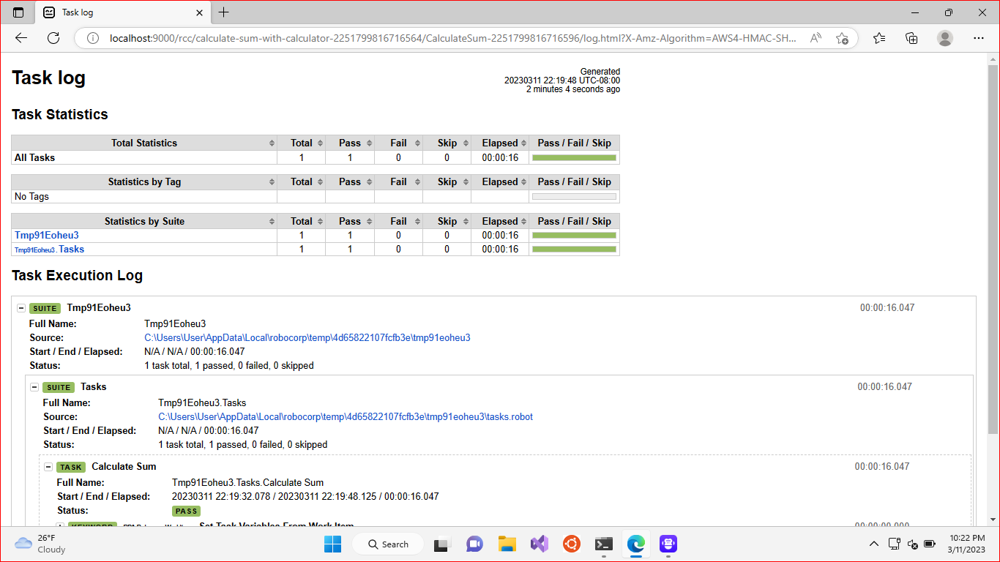

**[RCC](https://robocorp.com/docs/rcc/) is a Really Cool Command...**

In January 2023, together with Niall Deehan, we hosted a [RoboCon 2023](https://robocon.io) workshop [Business process automation with Robot Framework and Camunda Platform](https://datakurre.github.io/automation-playground/workshop/index.html). The workshop was based as much as possible on open source. Even the environment was a [pre-built Linux-desktop](https://datakurre.github.io/automation-playground/) ensuring equal experience for the participants.

But something we may not have emphasized enough, is that all the open source automation learned at the workshop, is compatible with [Camunda Platform SaaS](https://camunda.com/platform/), and even for implementing RPA on Windows!


## Open-source Windows RPA

To get started with [Robocorp RCC](https://robocorp.com/docs/rcc/overview) based open-source automation on Windows, one can choose between two alternative development experiences:

1. [VSCode with Robocorp extensions](https://robocorp.com/docs/developer-tools/visual-studio-code/extension-features) provides professional development experience for all kinds of rCC driven automation, both in [Robot Framework ](https://robotframework.org/rpa/) and in Python.

2. [Robocorp Automation Studio](https://robocorp.com/products/automation-studio) is a standalone low code development tool for implementing Robot Framework based automation.

   

[Starting with Automation Studio](https://robocorp.com/download) is the easiest and safest choice, because any project started with Automation Studio, could be later continued and developed further with VSCode.

Here's a [downloadable example RPA Calculator bot](calculate-sum.zip) based on a Automation Studio template for Windows automation. It's a dummy bot to calculate sum of two input variables by automating Windows Calculator app. Yet, it is [ready to be orchestrated using Camunda Platform](../../../2022/12/robot-framework-rcc-camunda). Just unzip the package, open its folder form Automation Studio, try it out, and zip it back for deployment.


## Camunda Platform SaaS as orchestrator

Now, that we have a bot, the next thing is to integrate it with Camunda Platform SaaS. Here is a [simple example process](calculate-sum-with-calculator.bpmn):

1) It provides user taks form for asking the input values,
2) orchestrates the RPA bot for the task, and
3) displays the results through an another user task form.

[](calculate-sum-with-calculator.bpmn)

To continue, it is required to have a client credentials for the cluster with scope **Zeebe**. Those could be use to deploy the process to the cluster using Camunda Desktop Modeler. The credentials are also required for integrating RCC bots with the running processes.


Make sure to download or save the information shown after creating new credentials. **Client secret** is only shown right after creation, but also **client id**, **cluster id** and **cluster region** are required for running the integration.

Once the process is deployed (either using the cloud or desktop modeler), at last on instance of it has been started, and the first user task completed, everything is ready for the RCC automation part.


## Running RCC integration

Integrating an RCC bot with Camunda Platform requires some preparation. But not much! The following integration is based on [parrot-rcc](https://github.com/datakurre/parrot-rcc) (an open source [pyzeebe](https://pypi.org/project/pyzeebe/) based Zeebe client), which delegates Camunda Platform tasks to be run by RCC.

The integration has prerequisite of two writble buckets at S3 compatible storage for storing **execution logs** and possible **file payloads**. For development purposes, the easiest way is to download and start [MinIO](https://min.io/docs/minio/windows/index.html) [executable](https://dl.min.io/server/minio/release/windows-amd64/minio.exe) and run it locally.

For example, with

```
.\minio.exe server C:\minio --console-address :9001
```

as in

```shell
PS C:\Users\User\Downloads> .\minio.exe server C:\minio --console-address :9001
WARNING: Detected default credentials 'minioadmin:minioadmin', we recommend that you change these values with 'MINIO_ROOT_USER' and 'MINIO_ROOT_PASSWORD' environment variables
MinIO Object Storage Server
Copyright: 2015-2023 MinIO, Inc.
License: GNU AGPLv3 <https://www.gnu.org/licenses/agpl-3.0.html>
Version: RELEASE.2023-03-09T23-16-13Z (go1.19.7 windows/amd64)

Status:         1 Online, 0 Offline.
API: http://10.0.2.15:9000  http://127.0.0.1:9000
RootUser: minioadmin
RootPass: minioadmin
Console: http://10.0.2.15:9001 http://127.0.0.1:9001
RootUser: minioadmin
RootPass: minioadmin

Command-line: https://min.io/docs/minio/linux/reference/minio-mc.html#quickstart
   $ mc.exe alias set myminio http://10.0.2.15:9000 minioadmin minioadmin

Documentation: https://min.io/docs/minio/linux/index.html
Warning: The standard parity is set to 0. This can lead to data loss.
```

By its default configuration parrot-rcc expects buckets, `rcc` for logs and `zeebe` for file payloads, to be available at the configured storage. Those may be created easily through web browser at Minio (for example at http://localhost:9001/ with the default user `minioadmin` and password `minioadmin`).


At next, [RCC must be downloaded](https://downloads.robocorp.com/rcc/releases/index.html). Similary to MinIO, RCC is just a simple binary, runnable as such, without any extra installation phase. RCC is used for both, executing `parrot-rcc`, and then by `parrot-rcc` to execute automation tasks.

The final step requires creation of two configuration files. At first, `conda.yaml`, which defines an RCC runtime environment with a known good version of parrot-rcc installed:

```yaml
channels:
  - conda-forge

dependencies:
  - python=3.9.13
  - pip=22.1.2
  - pip:
    - https://github.com/datakurre/parrot-rcc/archive/46553ce2f73d14fa46a9188802d59e645a106a19.tar.gz
```

And then, `robots.yaml`, which instructs RCC to actually execute parrot-rcc in that environment:

```yaml
tasks:
  RCC:
    shell: parrot-rcc

condaConfigFile: conda.yaml

artifactsDir: output

PATH:
  - .
PYTHONPATH:
  - .

ignoreFiles:
  - .gitignore
```

**All done!** Now, it is only required to execute `rcc run` (for `parrot-rcc`) with all the required arguments for connecting Camunda Platform SaaS and locating our zipped RPA bot. For example,

```shell
c:\Users\User\Downloads\rcc.exe run -- --rcc-executable=c:\Users\User\Downloads\rcc.exe --camunda-client-id=MY_CLIENT_ID --camunda-client-secret=MY_CLIENT_SECRET --camunda-cluster-id=CAMUNDA_CLUSTER_ID --camunda-region=CAMUNDA_CLUSTER_REGION --log-level=debug --rcc-fixed-spaces c:\Users\User\Downloads\calculate-sum.zip
```

RCC will start parrot-rcc, which reads zipped bots, connects to Camunda Platform, waits for tasks matching the bots, executes the bots and returns their output work items back to Camunda as variables in local scope of the executed tasks.


In addition to the output work item variables, the RCC integration also saves links to RPA execution logs as variables in the local scope. This should really help validating that the bot did the right thing, and debug the bot execution when something went wrong.




## Further reading

If you got interested, there's plenty of on-line material for learning more and filling the gaps left into this introduction:

* [Robocorp Quickstart Guide](https://robocorp.com/docs/quickstart-guide) is the gateway for all the official resources onRCC based automation. Just remember, that with Camunda Platform and the RCC integration shown here, you may not need to use their cloud offering at all.

* Our [RoboCon 2023 automation workshop](https://datakurre.github.io/automation-playground/) material remain available. They describe in detailed examples, how to configure BPMN tasks for RCC automation bots. Even with just Zeebe, without any Camunda cloud offerings.

* Finally, [Camunda Platform documentation](https://docs.camunda.io/), of rouces, is available for all the remaining BPMN or Camunda related questions.

Happy automation!
