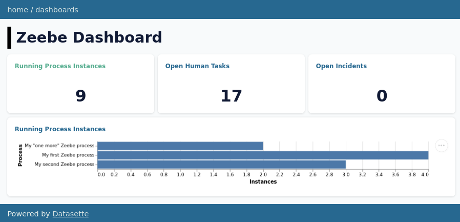
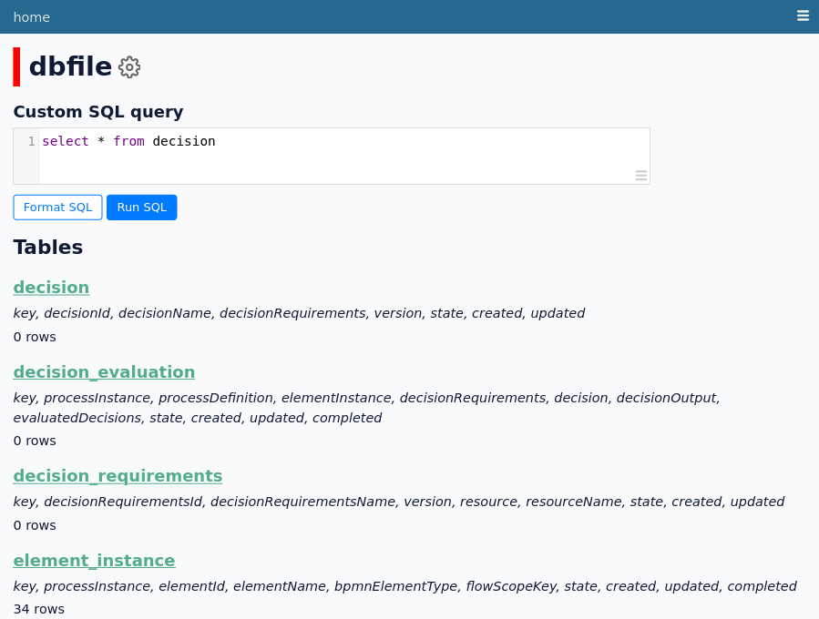
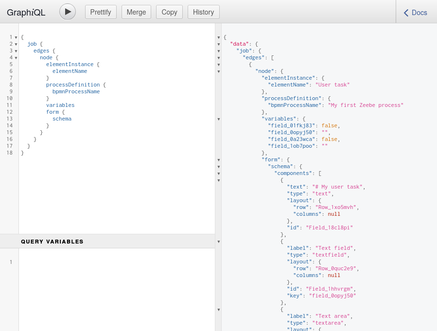
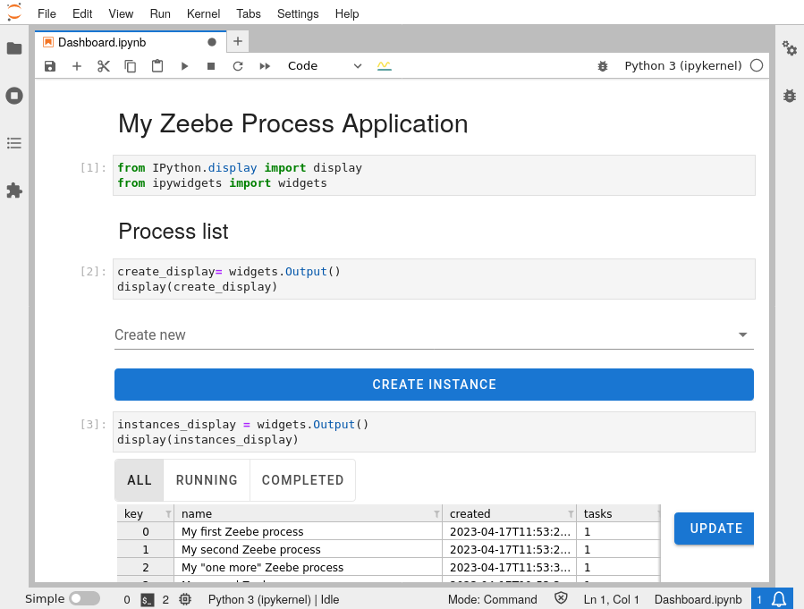
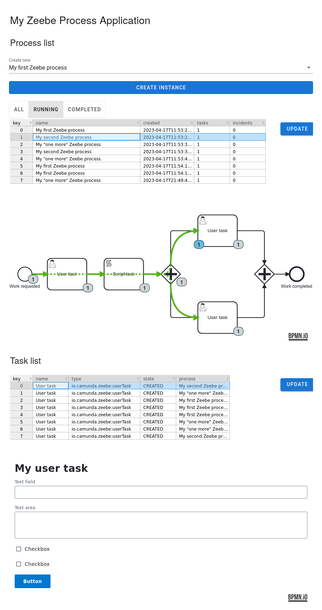

**Sour grapes...**, so let's grow our own.

[Zeebe](https://camunda.com/platform/zeebe/) is a workflow and process automation engine developed by [Camunda](https://camunda.com), which powers their current main product, [Camunda Platform 8](https://www.camunda.com/platform/). While its new architecture enables Camunda to provide turnkey cloud solutions for their customers, open source users have been left in dust. There is no [Open Source Community Edition](https://camunda.com/download/platform-7/) version of "Camunda Platform 8". Many supporting libraries are still being released with open source licenses, and [Zeebe License](https://camunda.com/legal/terms/cloud-terms-and-conditions/zeebe-license-overview-and-faq/) only limits use of Zeebe for competing solutions, but the official end-user applications and their APIs are for licensed users only.

At least the rules are clear, and we are free to look out of the box!

## Sorting out the pieces

Unlike [Camunda Platform 7](https://camunda.com/download/platform-7/), Zeebe based [Camunda Platform 8](https://www.camunda.com/platform/) offerings do not include usable out-of-the-box product without a paid license. Yet, [Zeebe](https://camunda.com/platform/zeebe/) engine itself, with its [semi-open license](https://camunda.com/legal/terms/cloud-terms-and-conditions/zeebe-license-overview-and-faq/), is good and usable enough that filling the gaps should really be worth of the effort.

The core **pieces available** to be used with free or open source licenses are

* [Zeebe](https://github.com/camunda/zeebe) engine (and its cluster gateway) itself (license does not including the right to provide a Commercial Process Automation Service)

* [zbctl](https://github.com/camunda/zeebe/blob/main/clients/go) command-line client for interacting with the engine even without custom job worker

* a collection [Zeebe exporters](https://github.com/orgs/camunda-community-hub/repositories?q=exporter) to make the engine state available for custom end-user application

* all [BPMN.io](https://github.com/bpmn-io) components for building user-interfaces with BPMN diagrams, DMN tables and Camunda Forms.

The **remaining pieces** required to make a usable Zeebe installation include

* optional custom [Zeebe interceptors](https://docs.camunda.io/docs/self-managed/zeebe-deployment/interceptors/) for e.g. authenticating Zeebe gRPC API requests.

* end-user application specific databases and Zeebe events consumer implementations for consuming the exported Zeebe event stream with required detail into application database

* implementations of the required end-user application specific APIs and the applications themselves.

To be fair, [Camunda Community Hub](https://github.com/camunda-community-hub) does include [simple monitor application](https://github.com/camunda-community-hub/zeebe-simple-monitor), [simple tasklist application](https://github.com/camunda-community-hub/zeebe-simple-tasklist) and even a [GraphQL API](https://github.com/camunda-community-hub/zeeqs) implementation. Yet, it is hard to recommend any of them to be used in production without good understanding of Zeebe architecture, and skills to further customize and develop them when required.

Simply put, to use Zeebe "for free" requires technical understanding of how it works. And the best way to understand it, is to put your hands into mud and try it out...

## KISS with Redis and SQLite

Zeebe is being advertised with its ability to scale, but most of my problems are relatively small. I'd be happy to have Zeebe as the the sole memory hungry enterprise Java app in my stack. Needless to say, the release of [Zeebe Redis Exporter](https://github.com/camunda-community-hub/zeebe-redis-exporter) got me excited. And it inspired me to try it with an another light weight solution: [SQLite](https://sqlite.org/).

SQLite is a serverless relational open-source database system, which is designed to be efficient and easy to use and is widely used in small to medium-sized applications. It has a small memory footprint and is optimized for read-heavy workloads. That sounds pretty much like the use case of a simple Zeebe end-user application database:

* only the Zeebe export stream consumer really needs to write to the database

* when the application needs to interact with the processes, it writes directly to Zeebe using its gRPC API

* and, therefore, the application really needs only read access to the exported database.

This task could not get much simpler than with Redis and SQLite, but writing [my first Zeebe export stream consumer](https://github.com/datakurre/cmnd-lite/blob/main/importer.py) was still substantial amount of work. It took a little more than 600 lines of Python code to start with, but I probably missed some events, and the importer will grow over time.

## Datasette.io for API and monitoring

SQLite ecosystem includes a real open-source gem: https://datasette.io/.

Datasette is a tool for exploring and publishing data of any shape from SQLite databases. Out-of-the box it provides powerful and easy to use database browser for the database built from the exported Zeebe events:

Also, with almost no additional configuration at all, [Datasette GraphQL plugin](https://datasette.io/plugins/datasette-graphql) makes the same database accessible with GraphQL. Of course, properly connecting tables by their foreign key relationships:

And if that was not enough, its [Datasette dashboard plugin](https://datasette.io/plugins/datasette-dashboards) adds support for monitoring dashboards with declarative JSON or YAML configuration and [Vega](https://vega.github.io/vega/) based charts:

That's a lot of features with [almost no configuration at all](https://github.com/datakurre/cmnd-lite/blob/main/metadata.yaml).

## Process applications with Notebooks

The final task was to create an end-user application for interacting with the Zeebe orchestrated processes. I've been maintaining simple [BPMN](https://pypi.org/project/jupyterlab-bpmn/) and [DMN](https://pypi.org/project/jupyterlab-dmn/) rendering plugins for [JupyterLab](https://jupyter.org/) for some time already. I realized, I was only missing [a plugin](https://pypi.org/project/jupyterlab-form-js/) for [Camunda Forms](https://bpmn.io/toolkit/form-js/) to make Jupyter notebook my process application platform.

I also had some luck with timing. [Jupyter Voilà](https://voila.readthedocs.io/) just got new alpha releases, which made it work properly with my BPMN, DMN ja form-js plugins. Voilà is the latest product from Project Jupyter, which can turn Jupyter notebooks into standalone web applications.

In my use case, Voilà turns my Jupyter notebook to a simple interactive process application – with my JupyterLab plugins, using data from Datasette GraphQL API, and interacting with Zeebe using just zbctl.

Obviously, all this gets nowhere near the feature set of the official Camunda Platform applications. But this is a start, and open source usually gets better over time...

