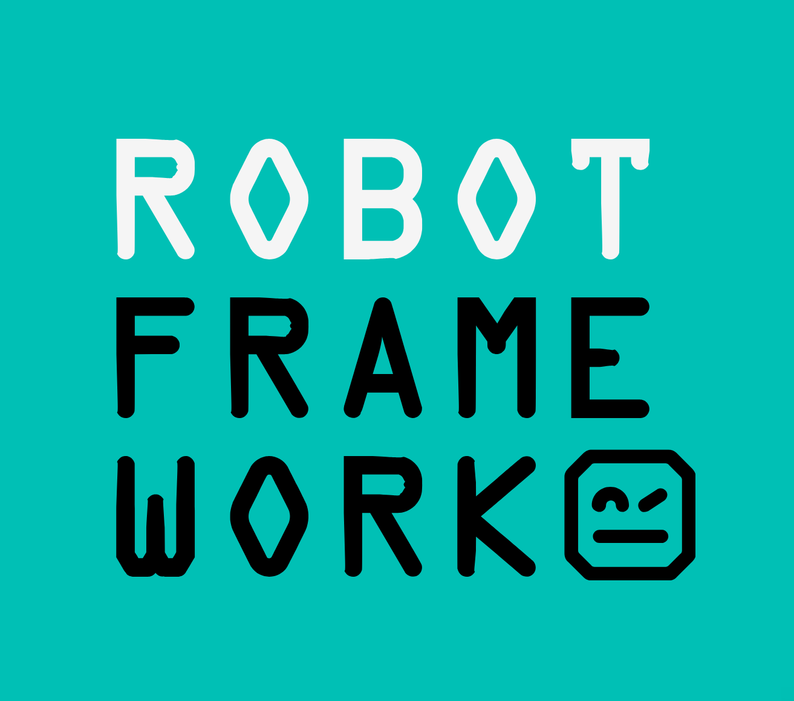
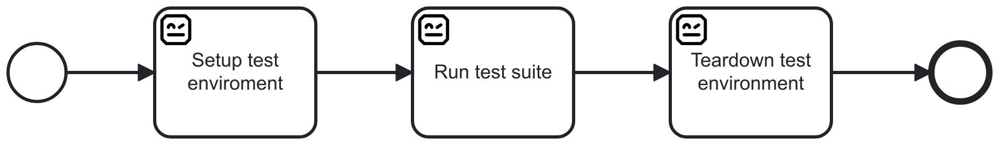
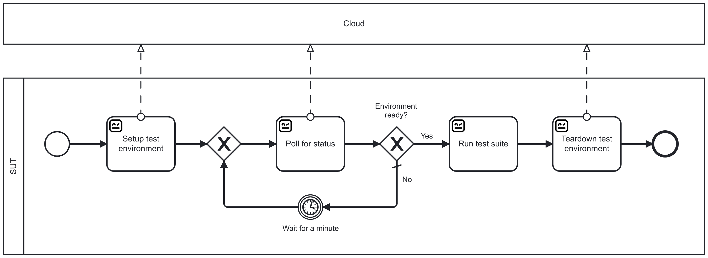
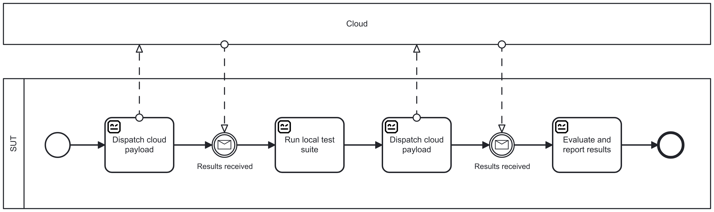
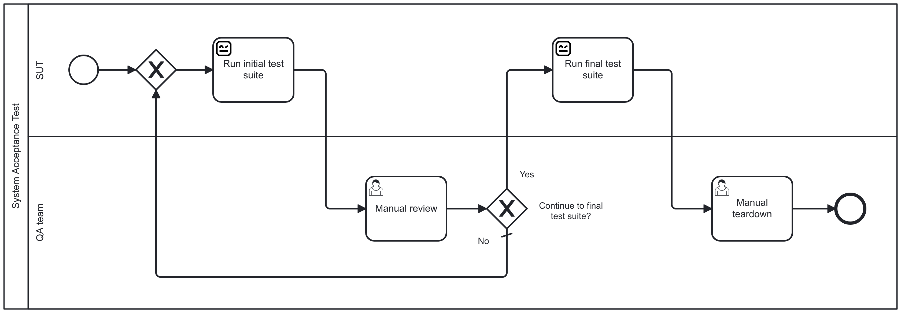
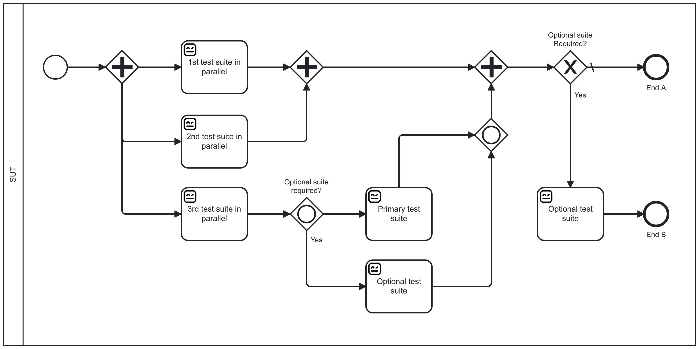
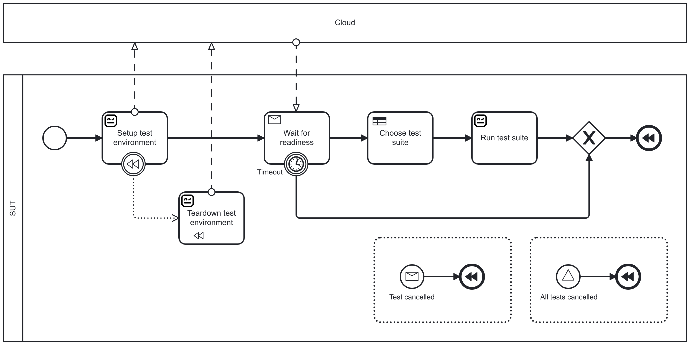

The battle between monoliths and microservices aside, in real life, even monolithic systems rarely operate in isolation; they run integrated with an ever-growing number of internal and external systems. Therefore, testing these systems in isolation is not enough. **Real system testing requires evaluating the business processes that depend on them.** Our hypothesis is that business process automation tools, combined with BPMN 2.0 as a visual and executable modeling standard with features for every special case, could significantly enhance the testing changes for those systems.

With this mindset, [Markus Stahl](https://noordsestern.medium.com/) and yours truly, are offering a workshop [Orchestrating complex end-to-end test suites with visual BPMN process models](https://robocon.io/program#live-orchestrating-complex-end-to-end-test-suites-with-visual-bpmn-process-models) on the 12th of February 2025 in Helsinki at [RoboCon.io Helsinki 2025](https://robocon.io). Interested? Register until the end of 2024 with the voucher code `END-OF-YEAR-15` for a 15 % discount (profits, if any, would support [Robot Framework Foundation](https://robotframework.org/foundation/)).

## Why BPMN?

**BPMN** stands for **Business Process Model and Notation**. It's a graphical presentation standard for specifying business processes in business process models. BPMN is **grounded in research on workflow patterns** and is designed to express any workflow a process requires. Additionally, it provides a mapping between graphical representations and execution, enabling the creation of visually clear models for any automated process. **Including test automation!**

Even traditional test flows make beautiful diagrams, but the more challenging the flow, the more BPMN excels.

**What if test suites take a long time to complete because they are waiting for external services?**

**What if they take days due to waiting for third parties to complete their tasks?**

**Or what if test suites require manual feedback or other forms of human interaction to finish?**

**What about when test flows become very complex due to parallel processes and conditional suites?**

**Yet, BPMN can make even the most complex test setups look simple and elegant:**

## Why workshop?

Didn't understand all the symbols used in the previous diagrams? Don't worry! If you're able to attend [our workshop at RoboCon 2025 Helsinki](https://robocon.io/program#live-orchestrating-complex-end-to-end-test-suites-with-visual-bpmn-process-models), everything should become clear. And if you can't make it, we'll do our best to publish all the materials shortly afterward.

But modeling is just the beginning. A powerful open-source BPMN engine may rival traditional CI orchestration tools in many use cases. And it doesn't have to stop at testing. As many test automation engineers know: if something can be automatically tested in development, it can often be automatically executed in production too.

The same open-source BPMN setup we use in the workshop for test execution can also be applied to more traditional business process and task automation. BPMN-based orchestration doesn't need to be a secret of the few. Let's democratize it!

**See you in February!** [At RoboCon 2025 Helsinki.](https://robocon.io/)

