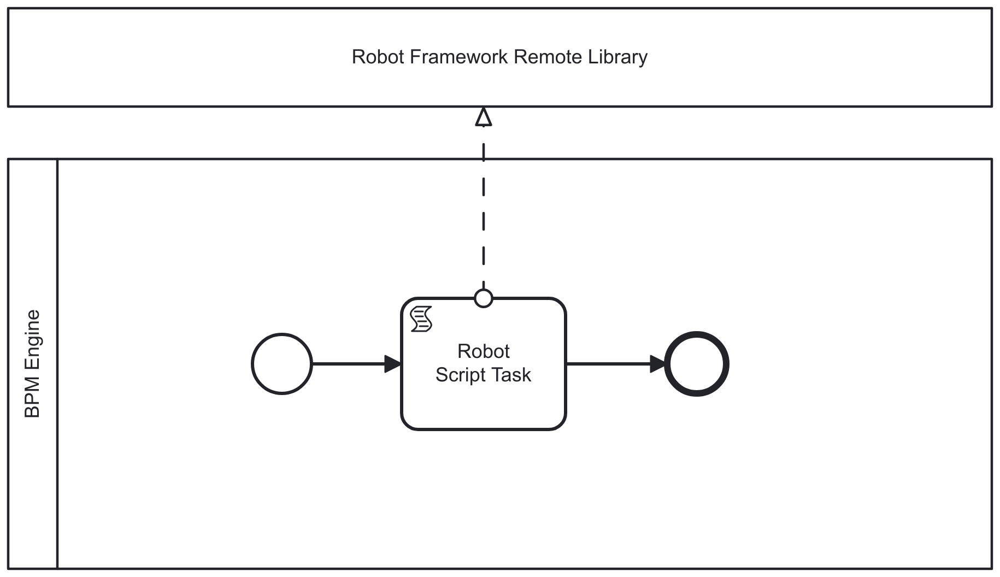

[BPMN is a standards-based flow chart method, which works even for modeling complex system test setups.](../bpmn-orhcestrated-system-tests/) It provides a clear mapping between graphical representations and execution, which enabling the creation of *executable – even self-documenting* – process models. However, choice of BPM engine may limit how Robot Framework tests can ultimately be executed. **There's a great chance that choosing open source provides the most flexible set of options.**

With this mindset, together with [Markus Stahl](https://noordsestern.medium.com/) we are offering a workshop [Orchestrating complex end-to-end test suites with visual BPMN process models](https://robocon.io/program#live-orchestrating-complex-end-to-end-test-suites-with-visual-bpmn-process-models) on the 12th of February 2025 in Helsinki at [RoboCon.io Helsinki 2025](https://robocon.io). Interested? Register until the end of 2024 with the voucher code `END-OF-YEAR-15` for a 15 % discount (profits, if any, would support [Robot Framework Foundation](https://robotframework.org/foundation/)).

At the workshop, we well cover at least of couple of the following Robot Framework orchestration options.

## Robot as a script task language

The BPMN **Script Task** is an activity executed by the BPM engine itself. The script executed in a Script Task is typically modeled, deployed, and maintained alongside the BPMN model, either embedded within the model files or provided as an external file deployed together with the model.

Whether Robot Framework as a Script Task language is a possible solution, really depends on the BPM engine implementation. Robot Framework itself is written in Python, and therefore Python based BPM like [SpiffWorkflow](https://www.spiffworkflow.org/) could probably run it natively. Java based BPM engines could easily support older Robot Framework version with [Jython](https://www.jython.org/). With a reasonable amount of more work, they should also be able to support recent versions with [GraalPy](https://www.graalvm.org/python/). [Operaton](https://operaton.org), for example, supports any "[JSR223](https://www.jcp.org/en/jsr/detail?id=223)"-integrated scripting language in its Script Task, and [GraalJS](https://www.graalvm.org/latest/reference-manual/js/) has shown that GraalVM languages could support it.

While supporting Robot Framework as a scripting language may seem tempting and fun, it comes with several limitations:

* Additional Python dependencies are restricted to those compatible with the BPM engine.

* Managing Robot Framework suites that span multiple files or even directories can become complex.

* Scaling of Script Tasks is only possible by scaling the BPM engine itself.

## Script task with RemoteLibrary service

Some limitations of the Script Task can be circumvented using a clever built-in feature of Robot Framework: [the remote library interface](https://github.com/robotframework/RemoteInterface). This is Robot Framework's native mechanism for scaling execution and customizing its runtime by providing test and task suite keywords as external services. Remote keyword libraries can also be implemented in any capable language, not only in Python.

Thanks to remote libraries, Robot Framework's Script Task support would only need to include the core Robot Framework functionality within the BPM engine. The rest of the Robot Framework ecosystem features could be provided and scaled through external microservices that implement the Robot Framework remote library interface.

Unfortunately, a lot of remote libraries could mean a lot of additional microservices to manage. And that leads us to the next option...

## Service task with dedicated worker service

The BPMN **Service Task** is a task activity that typically relies on an external service or automated application for its completion. The BPM engine merely provides an API for the worker services to poll or stream available tasks and, of course, to complete them. In an integration context, sometimes the **workers are also called connectors**.

The most obvious external Service Task-based Robot Framework orchestration solution is to set up dedicated microservices with customized dependencies for each type of Service Task. With a good BPM engine integration library and a robust CI/CD pipeline, this approach is likely the most straightforward and scalable. However, there are valid counterarguments: this could be the least flexible option and might waste resources by requiring the maintenance of numerous low-volume, always-on microservices.

Fortunately, there are ways to add flexibility and support more "low-code" solutions.

## Service task with generic worker service

The first "dynamic" service task option is to set up a few "shared" Robot Framework workers, which could then be used to run all tasks with similar runtime environment requirements. Such workers could also be configured to execute Robot Framework test and task suites deployed alongside the BPMN files, similar to the Script Task solution.

To clarify these sub-options:

a) A generic Robot Framework service could support the execution of all predefined Robot Framework test and task suites with similar runtime requirements.

b) Alternatively, a generic Robot Framework service could support runtime fetching of Robot Framework test and task suites from the BPM engine, deployed together with the BPMN orchestrating the entire process. This "low-code" option, however, would still imply similar runtime requirements for all suites executed by the same worker.

## Service task with dynamic worker service

The fifth option is a combination of almost all the above approaches. Tools for managing Python runtime environments have finally evolved to a point where they can support fast, ad hoc executions of the Python interpreter with any additional package dependencies. For several years, the best available tool was Robocorp RCC, but this year it has been superseded by [UV](https://docs.astral.sh/uv/).

UV can build a fresh Python virtual environment with additional dependencies and execute Robot Framework within it in seconds on the first run and almost instantly on subsequent runs. Additionally, it can operate fully offline from a prebuilt cache, ensuring airtight execution environments.

What this means is:

* A single UV-based worker can execute a Robot Framework test or task suite with any additional Python package dependencies.

* Robot Framework test or task suites, along with their dependency definitions, can be packaged and deployed with the worker or fetched on-demand from the BPM engine.

* The worker can dynamically download all necessary dependencies or operate more securely in offline mode using a prebuilt UV cache.

---

Of course, each of these options comes with numerous implementation details to resolve, and none of them is likely optimal for every possible use case.

After all, "one size does not fit all." Fortunately, with open source, we are in a position to make our own choices.
