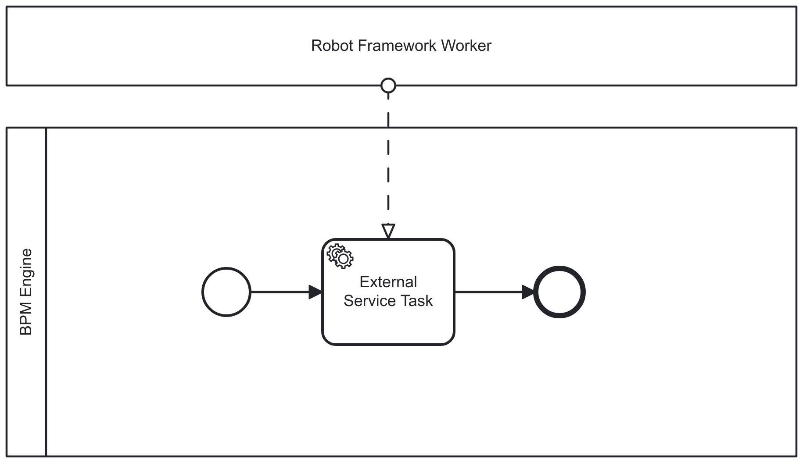

[BPMN is a standards-based flow chart method, which works even for modeling complex system test setups.](../bpmn-orhcestrated-system-tests/) It provides a clear mapping between graphical representations and execution, which enabling the creation of *executable – even self-documenting* – process models. However, choice of BPM engine may limit how Robot Framework tests can ultimately be executed. **There's a great chance that choosing open source provides the most flexible set of options.**

With this mindset, together with [Markus Stahl](https://noordsestern.medium.com/) we are offering a workshop [Orchestrating complex end-to-end test suites with visual BPMN process models](https://robocon.io/program#live-orchestrating-complex-end-to-end-test-suites-with-visual-bpmn-process-models) on the 12th of February 2025 in Helsinki at [RoboCon.io Helsinki 2025](https://robocon.io). Interested? Register until the end of 2024 with the voucher code `END-OF-YEAR-15` for a 15 % discount (profits, if any, would support [Robot Framework Foundation](https://robotframework.org/foundation/)).

At the workshop, we well cover at least of couple of the following Robot Framework orchestration options.

## Robot as a script task language

The BPMN **Script Task** is an activity executed by the BPM engine itself. The script executed in a Script Task is typically modeled, deployed, and maintained alongside the BPMN model, either embedded within the model files or provided as an external file deployed together with the model.

Whether Robot Framework as a Script Task language is a possible solution, really depends on the BPM engine implementation. Robot Framework itself is written in Python, and therefore Python based BPM like [SpiffWorkflow](https://www.spiffworkflow.org/) could probably run it natively. Java based BPM engines could easily support older Robot Framework version with [Jython](https://www.jython.org/), and with seemingly a reasonable amount of more work, the recent versions with [GraalPy](https://www.graalvm.org/python/). [Operaton](https://operaton.org), for example, supports any "[JSR223](https://www.jcp.org/en/jsr/detail?id=223)"-integrated scripting language in its Script Task.

While supporting Robot Framework as a scripting language may seem tempting and fun, it comes with several limitations:

* Additional Python dependencies are restricted to those compatible with the BPM engine.

* Managing Robot Framework suites that span multiple files can become complex.

* Scaling is only possible by scaling the engine itself.

## Script task with RemoteLibrary service

Some limitations of the Script Task can be circumvented using a clever built-in feature of Robot Framework: [the remote library interface](https://github.com/robotframework/RemoteInterface). This is Robot Framework's native mechanism for scaling execution by providing test and task suite keywords as external services.

Thanks to remote libraries, Robot Framework's Script Task support would only need to include the core Robot Framework functionality within the BPM engine. The rest of the Robot Framework ecosystem features can be provided and scaled through external microservices that implement the Robot Framework remote library interface.

Unfortunately, a lot of remote libraries mean a lot of additional microservices to manage. And that leads us to the next option...

## Service task with dedicated worker service

The BPMN **Service Task** is a task activity that typically relies on an external service or automated application for its completion. The BPM engine merely provides an API for the worker services to poll or stream available tasks and, of course, to complete them. In an integration context, sometimes the **workers are also called connectors**.

The obvious external Service Task-based Robot Framework orchestration solution is to set up dedicated microservices with the required dependencies for each type of Service Task. With good BPM engine libraries and a robust CI/CD pipeline, this is likely the most straightforward and scalable approach. However, as a debatable counter-argument, it is also the least flexible option and may waste resources by maintaining many low-volume, always-on microservices.

## Service task with generic worker service

## Service task with dynamic worker service
